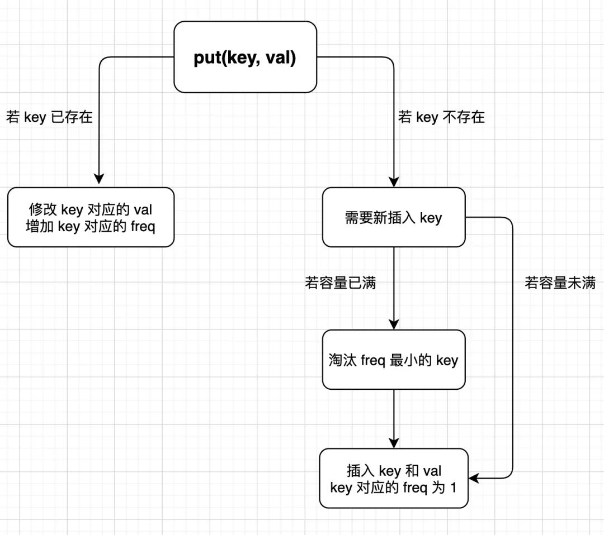

## 算法题就像搭乐高：手把手带你拆解 LFU 算法(参考链接：https://mp.weixin.qq.com/s?__biz=MzAxODQxMDM0Mw==&mid=2247486545&idx=1&sn=315ebfafa82c0dd3bcd9197eb270a7b6&scene=21#wechat_redirect)

上篇文章 算法题就像搭乐高：手把手带你拆解 LRU 算法 写了 LRU 缓存淘汰算法的实现方法，本文来写另一个著名的缓存淘汰算法：LFU 算法。

从实现难度上来说，LFU 算法的难度大于 LRU 算法，因为 LRU 算法相当于把数据按照时间排序，这个需求借助链表很自然就能实现，你一直从链表头部加入元素的话，越靠近头部的元素就是新的数据，越靠近尾部的元素就是旧的数据，我们进行缓存淘汰的时候只要简单地将尾部的元素淘汰掉就行了。

而 LFU 算法相当于是淘汰访问频次最低的数据，如果访问频次最低的数据有多条，需要淘汰最旧的数据。把数据按照访问频次进行排序，而且频次还会不断变化，这可不容易实现。

**话说回来，这种著名的算法的套路都是固定的，关键是由于逻辑较复杂，不容易写出漂亮且没有 bug 的代码**。

### 一、算法描述

要求你写一个类，接受一个capacity参数，实现get和put方法：

```
class LFUCache {
  // 构造容量为 capacity 的缓存
  public LFUCache(int capacity) {}
  // 在缓存中查询 key
  public int get(int key) {}
  // 将 key 和 val 存入缓存
  public void put(int key, int val) {}
}
```

get(key)方法会去缓存中查询键key，如果key存在，则返回key对应的val，否则返回 -1。

put(key, value)方法插入或修改缓存。如果key已存在，则将它对应的值改为val；如果key不存在，则插入键值对(key, val)。

当缓存达到容量capacity时，则应该在插入新的键值对之前，删除使用频次（后文用freq表示）最低的键值对。如果freq最低的键值对有多个，则删除其中最旧的那个。

```
// 构造一个容量为 2 的 LFU 缓存
LFUCache cache = new LFUCache(2);

// 插入两对 (key, val)，对应的 freq 为 1
cache.put(1, 10);
cache.put(2, 20);

// 查询 key 为 1 对应的 val
// 返回 10，同时键 1 对应的 freq 变为 2
cache.get(1);

// 容量已满，淘汰 freq 最小的键 2
// 插入键值对 (3, 30)，对应的 freq 为 1
cache.put(3, 30);   

// 键 2 已经被淘汰删除，返回 -1
cache.get(2); 
```

### 二、思路分析

一定先从最简单的开始，根据 LFU 算法的逻辑，我们先列举出算法执行过程中的几个显而易见的事实：

1、调用get(key)方法时，要返回该key对应的val。

2、只要用get或者put方法访问一次某个key，该key的freq就要加一。

3、如果在容量满了的时候进行插入，则需要将freq最小的key删除，如果最小的freq对应多个key，则删除其中最旧的那一个。

**好的，我们希望能够在 O(1) 的时间内解决这些需求，可以使用基本数据结构来逐个击破**:

1、使用一个HashMap存储key到val的映射，就可以快速计算get(key)。

```
HashMap<Integer, Integer> keyToVal;
```

2、使用一个HashMap存储key到freq的映射，就可以快速操作key对应的freq。

```
HashMap<Integer, Integer> keyToFreq;
```

3、这个需求应该是 LFU 算法的核心，所以我们分开说。

3.1、首先，肯定是需要freq到key的映射，用来找到freq最小的key。

3.2、将freq最小的key删除，那你就得快速得到当前所有key最小的freq是多少。想要时间复杂度 O(1) 的话，肯定不能遍历一遍去找，那就用一个变量minFreq来记录当前最小的freq吧。

3.3、可能有多个key拥有相同的freq，所以 freq对key是一对多的关系，即一个freq对应一个key的列表。

3.4、希望freq对应的key的列表是存在时序的，便于快速查找并删除最旧的key。

3.5、希望能够快速删除key列表中的任何一个key，因为如果频次为freq的某个key被访问，那么它的频次就会变成freq+1，就应该从freq对应的key列表中删除，加到freq+1对应的key的列表中。

```
HashMap<Integer, LinkedHashSet<Integer>> freqToKeys;
int minFreq = 0;
```

介绍一下这个LinkedHashSet，它满足我们 3.3，3.4，3.5 这几个要求。你会发现普通的链表LinkedList能够满足 3.3，3.4 这两个要求，但是由于普通链表不能快速访问链表中的某一个节点，所以无法满足 3.5 的要求。

**LinkedHashSet顾名思义，是链表和哈希集合的结合体。链表不能快速访问链表节点，但是插入元素具有时序；哈希集合中的元素无序，但是可以对元素进行快速的访问和删除**。

那么，它俩结合起来就兼具了哈希集合和链表的特性，既可以在 O(1) 时间内访问或删除其中的元素，又可以保持插入的时序，高效实现 3.5 这个需求。

综上，我们可以写出 LFU 算法的基本数据结构：

```
class LFUCache {
  // key到val的映射，我们后文成为KV表
  HashMap<Integer, Integer> keyToVal;
  // key到freq的映射，我们后文称为KF表
  HashMap<Integer, Integer> keyToFreq;
  // freq到key列表的映射，我们后文成为FK表
  HashMap<Integer, LinkedHashSet<Integer>> freqToKeys;
  // 记录最小的频次(复杂度O(1),采用变量存储)
  int minFreq;
  // 记录LFU缓存的最大容量
  int cap;

  public LFUCache(int capacity) {
    keyToVal = new HashMap<>();
    keyToFreq = new HashMap<>();
    freqToKeys = new HashMap<>();
    this.cap = capacity;
    this.minFreq = 0;
  }

  public int get(int key) {}

  public void put(int key, int val) {}
}
```

### 三、代码框架

LFU 的逻辑不难理解，但是写代码实现并不容易，因为你看我们要维护KV表，KF表，FK表三个映射，特别容易出错。对于这种情况，教你三个技巧：

1、不要企图上来就实现算法的所有细节，而应该自顶向下，逐步求精，先写清楚主函数的逻辑框架，然后再一步步实现细节。

2、搞清楚映射关系，如果我们更新了某个key对应的freq，那么就要同步修改KF表和FK表，这样才不会出问题。

3、画图，画图，画图，重要的话说三遍，把逻辑比较复杂的部分用流程图画出来，然后根据图来写代码，可以极大减少出错的概率。

下面我们先来实现get(key)方法，逻辑很简单，返回key对应的val，然后增加key对应的freq：

```
public int get(int key) {
  if (!keyToVal.containsKey(key)) {
    return -1;
  }
  // 增加key对应的freq
  increaseFreq(key);
  return keyToVal.get(key);
}
```

增加key对应的freq是 LFU 算法的核心，所以我们干脆直接抽象成一个函数increaseFreq，这样get方法看起来就简洁清晰了对吧。

下面来实现put(key, val)方法，逻辑略微复杂，我们直接画个图来看：



这图就是随手画的，不是什么正规的程序流程图，但是算法逻辑一目了然，看图可以直接写出put方法的逻辑：

```
public void put(int key, int val) {
  if (this.cap <= 0) return;

  /* 若key已存在，修改对应的val即可 */
  if (keyToVal.containsKey(key)) {
    keyToVal.put(key, val);
    // key 对应的 freq 加一
    increaseFreq(key);
    return;
  }

  /* key 不存在，需要插入 */
  /* 容量已满的话需要淘汰一个 freq 最小的 key */
  if (this.cap <= keyToVal.size()) {
    removeMinFreqKey();
  }

  /* 插入 key 和 val，对应的 freq 为 1 */
  // 插入 KV 表
  keyToVal.put(key, val);
  // 插入 KF 表
  keyToFreq.put(key, 1);
  // 插入 FK 表
  freqToKeys.putIfAbsent(1, new LinkedHashSet<>());
  freqToKeys.get(1).add(key);
  // 插入新 key 后最小的 freq 肯定是 1
  this.minFreq = 1;
}
```

increaseFreq和removeMinFreqKey方法是 LFU 算法的核心，我们下面来看看怎么借助KV表，KF表，FK表这三个映射巧妙完成这两个函数。

### 四、LFU 核心逻辑

首先来实现removeMinFreqKey函数：

```
private void removeMinFreqKey() {
  // freq最小的key列表
  LinkedHashSet<Integer> keyList = freqToKeys.get(this.minFreq);
  // 其中最先被插入的那个key就是该被淘汰的key
  int deletedKey = keyList.iterator().next();
  /* 更新 FK 表 */
  keyList.remove(deletedKey);
  if (keyList.isEmpty()) {
    // 如果keyList空了，则在freqToKeys删除这个this.minFreq
    freqToKeys.remove(this.minFreq);
    // 问：这里需要更新minFreq的值吗？
  }
  /* 更新 KV 表 */
  keyToVal.remove(deletedKey);
  /* 更新 KF 表 */
  keyToFreq.remove(deletedKey);
}
```

删除某个键key肯定是要同时修改三个映射表的，借助minFreq参数可以从FK表中找到freq最小的keyList，根据时序，其中第一个元素就是要被淘汰的deletedKey，操作三个映射表删除这个key即可。

但是有个细节问题，如果keyList中只有一个元素，那么删除之后minFreq对应的key列表就为空了，也就是minFreq变量需要被更新。如何计算当前的minFreq是多少呢？

实际上没办法快速计算minFreq，只能线性遍历FK表或者KF表来计算，这样肯定不能保证 O(1) 的时间复杂度。

**但是，其实这里没必要更新minFreq变量**，因为你想想removeMinFreqKey这个函数是在什么时候调用？在put方法中插入新key时可能调用。而你回头看put的代码，插入新key时一定会把minFreq更新成 1，所以说即便这里minFreq变了，我们也不需要管它。

下面来实现increaseFreq函数：

```
private void increaseFreq(int key) {
  int freq = keyToFreq.get(key);
  /* 更新 KF 表 */
  keyToFreq.put(key, freq + 1);
  /* 更新 FK 表 */
  // 将 key 从 freq 对应的列表中删除
  freqToKeys.get(freq).remove(key);
  // 将 key 加入 freq + 1 对应的列表中
  freqToKeys.putIfAbsent(freq + 1, new LinkedHashSet<>());
  freqToKeys.get(freq + 1).add(key);
  // 如果 freq 对应的列表空了，移除这个 freq
  if (freqToKeys.get(freq).isEmpty()) {
    freqToKeys.remove(freq);
    // 如果这个freq恰好是minFreq，更新minFreq
    if (freq == this.minFreq) {
      this.minFreq++;
    }
  }
}
```

更新某个key的freq肯定会涉及FK表和KF表，所以我们分别更新这两个表就行了。

和之前类似，当FK表中freq对应的列表被删空后，需要删除FK表中freq这个映射。如果这个freq恰好是minFreq，说明minFreq变量需要更新。

能不能快速找到当前的minFreq呢？这里是可以的，因为我们刚才把key的freq加了 1 嘛，所以minFreq也加 1 就行了。

至此，经过层层拆解，LFU 算法就完成了。


