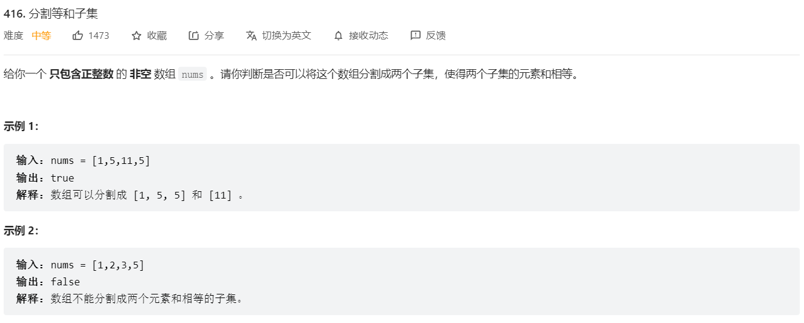

## 经典动态规划：0-1背包问题的变体（参考链接：https://mp.weixin.qq.com/s/OzdkF30p5BHelCi6inAnNg）

1.md详解了通用的0-1背包问题，今天来看看背包问题的思路能够如何运用到其他题目。

怎么将二维动态规划压缩成一维动态规划吗？这就是状态压缩，很容易的，本文也会提及这种技巧。

### 一、问题分析



算法的函数签名如下：

```
// 输入一个集合，返回是否能够分割成和相等的两个子集
bool canPartition(vector<int>& nums);
```

对于这个问题，看起来和背包没有任何关系，为什么说它是背包问题呢？

首先回忆一下背包问题大致的描述是什么：

给你一个可装载重量为W的背包和N个物品，每个物品有重量和价值两个属性。其中第i个物品的重量为wt[i]，价值为val[i]，现在让你用这个背包装物品，最多能装的价值是多少？

那么对于这个问题，我们可以先对集合求和，得出sum，把问题转化为背包问题：

**给一个可装载重量为sum/2的背包和N个物品，每个物品的重量为nums[i]。现在让你装物品，是否存在一种装法，能够恰好将背包装满？**

你看，这就是背包问题的模型，甚至比我们之前的经典背包问题还要简单一些，**下面我们就直接转换成背包问题**，开始套前文讲过的背包问题框架即可。

### 二、解法分析

**第一步要明确两点，「状态」和「选择」。**

这个前文 经典动态规划：0-1 背包问题 已经详细解释过了，状态就是「背包的容量」和「可选择的物品」，选择就是「装进背包」或者「不装进背包」。

**第二步要明确dp数组的定义。**

按照背包问题的套路，可以给出如下定义：

dp[i][j] = x表示，对于前i个物品，当前背包的容量为j时，若x为true，则说明可以恰好将背包装满，若x为false，则说明不能恰好将背包装满。

比如说，如果dp[4][9] = true，其含义为：对于容量为 9 的背包，若只是用前 4 个物品，可以有一种方法把背包恰好装满。

或者说对于本题，含义是对于给定的集合中，若只对前 4 个数字进行选择，存在一个子集的和可以恰好凑出 9。

根据这个定义，我们想求的最终答案就是dp[N][sum/2]，base case 就是dp[..][0] = true和dp[0][..] = false，因为背包没有空间的时候，就相当于装满了，而当没有物品可选择的时候，肯定没办法装满背包。

**第三步，根据「选择」，思考状态转移的逻辑。**

回想刚才的dp数组含义，可以根据「选择」对dp[i][j]得到以下状态转移：

如果不把nums[i]算入子集，**或者说你不把这第i个物品装入背包**，那么是否能够恰好装满背包，取决于上一个状态dp[i-1][j]，继承之前的结果。

如果把nums[i]算入子集，**或者说你把这第i个物品装入了背包**，那么是否能够恰好装满背包，取决于状态dp[i - 1][j-nums[i-1]]。

首先，由于i是从 1 开始的，而数组索引是从 0 开始的，所以第i个物品的重量应该是nums[i-1]，这一点不要搞混。

dp[i - 1][j-nums[i-1]]也很好理解：你如果装了第i个物品，就要看背包的剩余重量j - nums[i-1]限制下是否能够被恰好装满。

换句话说，如果j - nums[i-1]的重量可以被恰好装满，那么只要把第i个物品装进去，也可恰好装满j的重量；否则的话，重量j肯定是装不满的。

**最后一步，把伪码翻译成代码，处理一些边界情况。**

以下是 C++ 代码，完全翻译了之前的思路，并处理了一些边界情况：

```
bool canPartition(vector<int>& nums) {
  int sum = 0;
  for(int num : nums) sum += num;
  // 和为奇数时，不可能划分成两个和相等的集合
  if (sum % 2 != 0) return false;
  int n = nums.size();
  sum = sum / 2;
  vector<vector<bool>> dp(n+1, vector<bool>(sum+1, false));
  // base case
  // dp[..][0]为true，背包没有空间的时候，装满了
  for(int i = 0; i <= n; i++) {
    dp[i][0] = true;
  }
  for(int i = 1; i <= n; i++) {
    for(int j = 1; j <= sum; j++) {
      if (j - nums[i-1] < 0) {
        // 背包容量不足，不能装入第i个物品
        dp[i][j] = dp[i-1][j];
      } else {
        // 装入或者不装入背包
        dp[i][j] = dp[i-1][j] || dp[i-1][j-nums[i-1]];
      }
    }
  }
  return dp[n][sum];
}
```

### 三、进行状态压缩

再进一步，是否可以优化这个代码呢？注意到dp[i][j]都是通过上一行dp[i-1][..]转移过来的，之前的数据都不会再使用了。

所以，我们可以进行状态压缩，将二维dp数组压缩为一维，节约空间复杂度：

```
bool canPartition(vector<int>& nums) {
  int sum = 0, n = nums.size();
  for (int num : nums) sum += num;
  if (sum % 2 != 0) return false;
  sum = sum / 2;
  vector<bool> dp(sum + 1, false);
  // base case
  dp[0] = true;

  for (int i = 0; i < n; i++) 
    for (int j = sum; j >= 0; j--) 
      if (j - nums[i] >= 0) 
        dp[j] = dp[j] || dp[j - nums[i]];

  return dp[sum];
}
```

这就是状态压缩，其实这段代码和之前的解法思路完全相同，只在一行dp数组上操作，i每进行一轮迭代，dp[j]其实就相当于dp[i-1][j]，所以只需要一维数组就够用了。

**唯一需要注意的是j应该从后往前反向遍历，因为每个物品（或者说数字）只能用一次，以免之前的结果影响其他的结果。**

至此，子集切割的问题就完全解决了，时间复杂度 O(n*sum)，空间复杂度 O(sum)。 