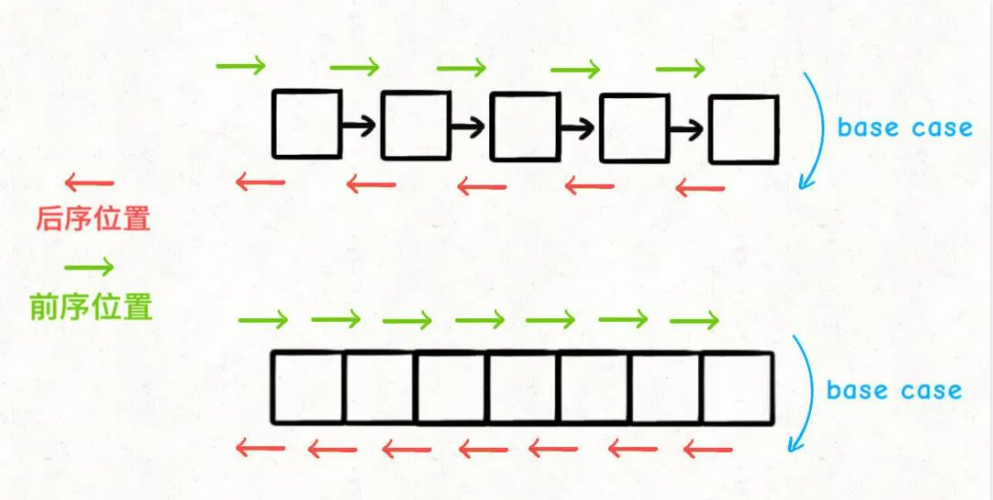
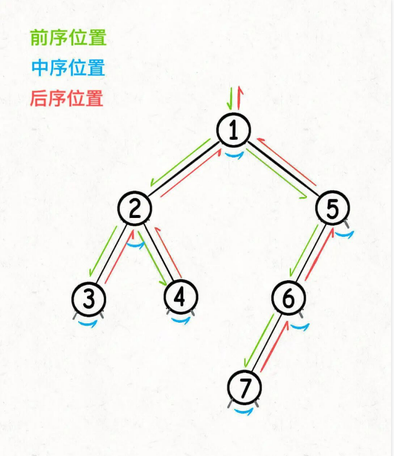
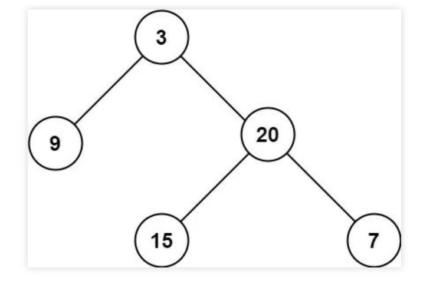
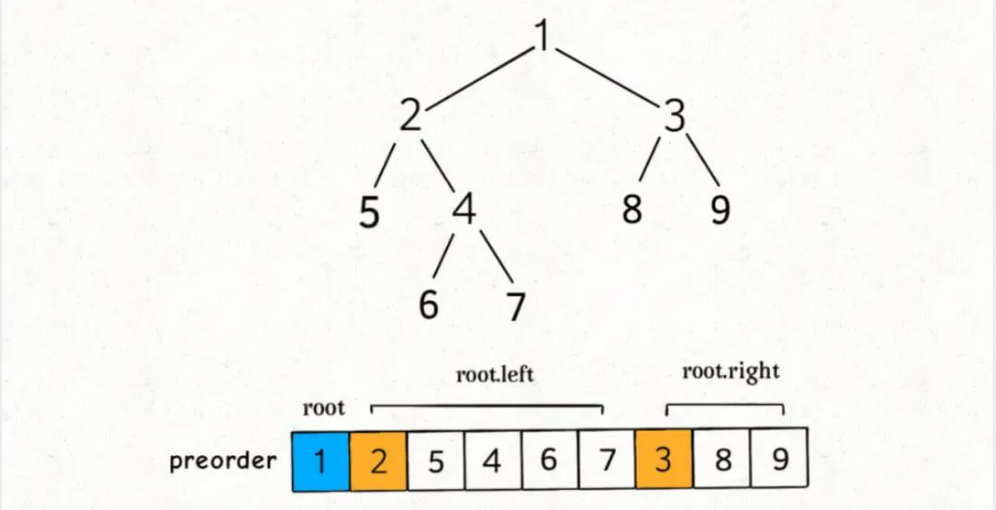
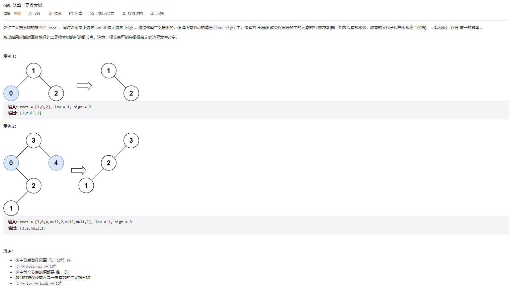
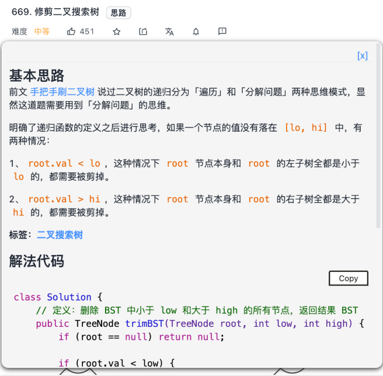

## 二叉树（纲领篇）(参考链接：https://mp.weixin.qq.com/s?__biz=MzAxODQxMDM0Mw==&mid=2247496551&idx=1&sn=c6859fe37229a39e240a3b9323106bb4&scene=21#wechat_redirect)

先在开头总结一下，二叉树解题的思维模式分两类：

**1、是否可以通过遍历一遍二叉树得到答案**？如果可以，用一个traverse(traverse: 遍历)函数配合外部变量来实现，这叫「遍历」的思维模式。

**2、是否可以定义一个递归函数，通过子问题（子树）的答案推导出原问题的答案**？如果可以，写出这个递归函数的定义，并充分利用这个函数的返回值，这叫「分解问题」的思维模式。

无论使用哪种思维模式，你都需要思考：

**如果单独抽出一个二叉树节点，它需要做什么事情？需要在什么时候（前/中/后序位置）做**？其他的节点不用你操心，递归函数会帮你在所有节点上执行相同的操作。

本文中会用题目来举例，但都是最最简单的题目，所以不用担心自己看不懂，我可以帮你从最简单的问题中提炼出所有二叉树题目的共性，并将二叉树中蕴含的思维进行升华，反手用到 动态规划，回溯算法，分治算法，图论算法 中去，这也是我一直强调框架思维的原因。

首先，我还是要不厌其烦地强调一下二叉树这种数据结构及相关算法的重要性。

### 二叉树的重要性

举个例子，比如两个经典排序算法 快速排序 和 归并排序，对于它俩，你有什么理解？（快速排序，先处理数组再递归。并归排序，先递归再处理数组）

**如果你告诉我，快速排序就是个二叉树的前序遍历，归并排序就是个二叉树的后序遍历，那么我就知道你是个算法高手了。**

为什么快速排序和归并排序能和二叉树扯上关系？我们来简单分析一下他们的算法思想和代码框架：

快速排序的逻辑是，若要对nums[lo..hi]进行排序，我们先找一个分界点p，通过交换元素使得nums[lo..p-1]都小于等于nums[p]，且nums[p+1..hi]都大于nums[p]，然后递归地去nums[lo..p-1]和nums[p+1..hi]中寻找新的分界点，最后整个数组就被排序了。

快速排序的代码框架如下：

```
void sort(int[] nums, int lo, int hi) {
  /****** 前序遍历位置 ******/
  // 通过交换元素构建分界点 p
  int p = partition(nums, lo, hi);
  /************************/
  // 有点类似于：根左右的前序遍历
  sort(nums, lo, p - 1);
  sort(nums, p + 1, hi);
}
```

先构造分界点，然后去左右子数组构造分界点，你看这不就是一个二叉树的前序遍历吗？

再说说归并排序的逻辑，若要对nums[lo..hi]进行排序，我们先对nums[lo..mid]排序，再对nums[mid+1..hi]排序，最后把这两个有序的子数组合并，整个数组就排好序了。

归并排序的代码框架如下：

```
// 定义：排序 nums[lo..hi]
void sort(int[] nums, int lo, int hi) {
  int mid = (lo + hi) / 2;
  // 排序 nums[lo..mid]
  sort(nums, lo, mid);
  // 排序 nums[mid+1..hi]
  sort(nums, mid + 1, hi);

  /****** 后序位置（左右根） ******/
  // 合并 nums[lo..mid] 和 nums[mid+1..hi]
  merge(nums, lo, mid, hi);
  /*********************/
}
```

先对左右子数组排序，然后合并（类似合并有序链表的逻辑），你看这是不是二叉树的后序遍历框架？另外，这不就是传说中的分治算法嘛，不过如此呀。

如果你一眼就识破这些排序算法的底细，还需要背这些经典算法吗？不需要。你可以手到擒来，从二叉树遍历框架就能扩展出算法了。

说了这么多，旨在说明，二叉树的算法思想的运用广泛，甚至可以说，只要涉及递归，都可以抽象成二叉树的问题。

接下来我们从二叉树的前中后序开始讲起，让你深刻理解这种数据结构的魅力。

### 深入理解前中后序

我先甩给你几个问题，请默默思考 30 秒：

1、你理解的二叉树的前中后序遍历是什么，仅仅是三个顺序不同的 List 吗？

2、请分析，后序遍历有什么特殊之处？

3、请分析，为什么多叉树没有中序遍历？

答不上来，说明你对前中后序的理解仅仅局限于教科书，不过没关系，我用类比的方式解释一下我眼中的前中后序遍历。

首先，回顾一下 学习数据结构和算法的框架思维 中说到的二叉树遍历框架：

```
void traverse(TreeNode root) {
  if (root == null) {
    return;
  }
  // 前序位置
  traverse(root.left);
  // 中序位置
  traverse(root.right);
  // 后序位置
}
```

先不管所谓前中后序，单看traverse函数，你说它在做什么事情？

其实它就是一个能够遍历二叉树所有节点的一个函数，和你遍历数组或者链表本质上没有区别：

```
/* 迭代遍历数组 */
void traverse(int[] arr) {
  for(int i = 0; i < arr.length; i++) {

  }
}
/* 递归遍历数组 */
void traverse(int[] arr, int i) {
  if (i == arr.length) {
    return;
  }
  // 前序位置
  traverse(arr, i + 1);
  // 后序位置
}
/* 迭代遍历单链表 */
void traverse(ListNode head) {
  for(ListNode p = head; p != null; p = p.next) {

  }
}
/* 递归遍历单链表 */
void traverse(ListNode head) {
  if (head == null) {
    return;
  }
  // 前序位置
  traverse(head.next);
  // 后序位置
}
```

单链表和数组的遍历可以是迭代的，也可以是递归的，**二叉树这种结构无非就是二叉链表**，由于没办法简单改写成迭代形式，所以一般说二叉树的遍历框架都是指递归的形式。

你也注意到了，只要是递归形式的遍历，都可以有前序位置和后序位置，分别在递归之前和递归之后。

**所谓前序位置，就是刚进入一个节点（元素）的时候，后序位置就是即将离开一个节点（元素）的时候**，那么进一步，你把代码写在不同位置，代码执行的时机也不同：



比如说，如果让你倒序打印一条单链表上所有节点的值，你怎么搞？

实现方式当然有很多，但如果你对递归的理解足够透彻，可以利用后序位置来操作：

```
/* 递归遍历单链表，倒序打印链表元素 */
void traverse(ListNode head) {
  if (head == null) {
    return;
  }
  traverse(head.next);
  // 后序位置
  print(head.val);
}
```

结合上面那张图，你应该知道为什么这段代码能够倒序打印单链表了吧，本质上是利用递归的堆栈帮你实现了倒序遍历的效果。

那么说回二叉树也是一样的，只不过多了一个中序位置罢了。

教科书里只会问你前中后序遍历结果分别是什么，所以对于一个只上过大学数据结构课程的人来说，他大概以为二叉树的前中后序只不过对应三种顺序不同的List<Integer>列表。

但是我想说，**前中后序是遍历二叉树过程中处理每一个节点的三个特殊时间点**，绝不仅仅是三个顺序不同的 List：

前序位置的代码在刚刚进入一个二叉树节点的时候执行；

后序位置的代码在将要离开一个二叉树节点的时候执行；

中序位置的代码在一个二叉树节点左子树都遍历完，即将开始遍历右子树的时候执行。

你注意本文的用词，我一直说前中后序「位置」，就是要和大家常说的前中后序「遍历」有所区别：你可以在前序位置写代码往一个 List 里面塞元素，那最后得到的就是前序遍历结果；但并不是说你就不可以写更复杂的代码做更复杂的事。

画成图，前中后序三个位置在二叉树上是这样：



**你可以发现每个节点都有「唯一」属于自己的前中后序位置**，所以我说前中后序遍历是遍历二叉树过程中处理每一个节点的三个特殊时间点。

这里你也可以理解为什么多叉树没有中序位置，因为二叉树的每个节点只会进行唯一一次左子树切换右子树，而多叉树节点可能有很多子节点，会多次切换子树去遍历，所以多叉树节点没有「唯一」的中序遍历位置。

说了这么多基础的，就是要帮你对二叉树建立正确的认识，然后你会发现：

**二叉树的所有问题，就是让你在前中后序位置注入巧妙的代码逻辑，去达到自己的目的，你只需要单独思考每一个节点应该做什么，其他的不用你管，抛给二叉树遍历框架，递归会在所有节点上做相同的操作**。

### 两种解题思路

前文 我的算法学习心得 说过：

**二叉树题目的递归解法可以分两类思路，第一类是遍历一遍二叉树得出答案，第二类是通过分解问题计算出答案，这两类思路分别对应着 回溯算法核心框架 和 动态规划核心框架**。

当时我是用二叉树的最大深度这个问题来举例，重点在于把这两种思路和动态规划和回溯算法进行对比，而本文的重点在于分析这两种思路如何解决二叉树的题目。

力扣第 104 题「二叉树的最大深度」就是最大深度的题目，所谓最大深度就是根节点到「最远」叶子节点的最长路径上的节点数，比如输入这棵二叉树，算法应该返回 3：



你做这题的思路是什么？显然遍历一遍二叉树，用一个外部变量记录每个节点所在的深度，取最大值就可以得到最大深度，**这就是遍历二叉树计算答案的思路**。

解法代码如下：

```
// 记录最大深度
int res = 0;
// 记录遍历倒的节点的深度
int depth = 0;

// 主函数
int maxDepth(TreeNode root) {
  traverse(root);
  return res;
}

// 二叉树遍历框架
void traverse(TreeNode root) {
  if (root == null) {
    // 到达叶子节点，更新最大深度
    res = Math.max(res, depth);
    return;
  }
  // 前序位置
  depth++;
  traverse(root.left);
  traverse(root.right);
  // 后序位置
  depth--;
}
```

这个解法应该很好理解，但为什么需要在前序位置增加depth，在后序位置减小depth？

因为前面说了，前序位置是进入一个节点的时候，后序位置是离开一个节点的时候，depth记录当前递归到的节点深度，你把traverse理解成在二叉树上游走的一个指针，所以当然要这样维护。

当然，你也很容易发现一棵二叉树的最大深度可以通过子树的最大高度推导出来，这就是分解问题计算答案的思路。

解法代码如下：

```
// 定义：输入根节点，返回这颗二叉树的最大深度
int maxDepth(TreeNode root) {
  if (root == null) {
    return 0;
  }
  // 利用定义，计算左右子树的最大深度
  int leftMax = maxDepth(root.left);
  int rightMax = maxDepth(root.right);
  // 整棵树的最大深度等于左右子树的最大深度取最大值
  // 然后再加上根节点自己
  int res = Math.max(leftMax, rightMax) + 1;

  return res;
}
```

只要明确递归函数的定义，这个解法也不难理解，但为什么主要的代码逻辑集中在后序位置？

因为这个思路正确的核心在于，你确实可以通过子树的最大高度推导出原树的高度，所以当然要首先利用递归函数的定义算出左右子树的最大深度，然后推出原树的最大深度，主要逻辑自然放在后序位置。

如果你理解了最大深度这个问题的两种思路，**那么我们再回头看看最基本的二叉树前中后序遍历**，就比如算前序遍历结果吧。

我们熟悉的解法就是用「遍历」的思路，我想应该没什么好说的：

```
List<Integer> res = new LinkedList<>();

// 返回前序遍历返回结果
List<Integer> preorderTraverse(TreeNode root) {
  traverse(root);
  return res;
}

// 二叉树遍历函数
void traverse(TreeNode root) {
  if (root == null) {
    return;
  }
  // 前序位置
  res.add(root.val);
  traverse(root.left);
  traverse(root.right);
}
```

但你是否能够用「分解问题」的思路，来计算前序遍历的结果？

换句话说，不要用像traverse这样的辅助函数和任何外部变量，单纯用题目给的preorderTraverse函数递归解题，你会不会？

我们知道前序遍历的特点是，根节点的值排在首位，接着是左子树的前序遍历结果，最后是右子树的前序遍历结果：



那这不就可以分解问题了么，**一棵二叉树的前序遍历结果 = 根节点 + 左子树的前序遍历结果 + 右子树的前序遍历结果**。

所以，你可以这样实现前序遍历算法：

```
// 定义：输入一颗二叉树的根节点，返回这棵树的前序遍历结果
List<Integer> preorderTraverse(TreeNode root) {
  var res = new LinkedList<>();
  if (root == null) {
    return res;
  }
  // 一棵二叉树的前序遍历结果 = 根节点 + 左子树的前序遍历结果 + 右子树的前序遍历结果
  res.add(root.val);
  // 左子树的前序遍历结果
  res.addAll(preorderTraverse(root.left));
  // 右子树的前序遍历结果
  res.addAll(preorderTraverse(root.right));
  return res;
}
```

中序和后序遍历也是类似的，只要把add(root.val)放到中序和后序对应的位置就行了。

这个解法短小精干，但为什么不常见呢？

一个原因是这个算法的复杂度不好把控，比较依赖语言特性。

Java 的话无论 ArrayList 还是 LinkedList，addAll方法的复杂度都是 O(N)，所以总体的最坏时间复杂度会达到 O(N^2)，除非你自己实现一个复杂度为 O(1) 的addAll方法，底层用链表的话并不是不可能。

当然，最主要的原因还是因为教科书上从来没有这么教过……

上文举了两个简单的例子，但还有不少二叉树的题目是可以同时使用两种思路来思考和求解的，这就要靠你自己多去练习和思考，不要仅仅满足于一种熟悉的解法思路。

综上，遇到一道二叉树的题目时的通用思考过程是：

1、**是否可以通过遍历一遍二叉树得到答案**？如果可以，用一个traverse函数配合外部变量来实现。

2、**是否可以定义一个递归函数，通过子问题（子树）的答案推导出原问题的答案**？如果可以，写出这个递归函数的定义，并充分利用这个函数的返回值。

3、**无论使用哪一种思维模式，你都要明白二叉树的每一个节点需要做什么，需要在什么时候（前中后序）做**。

你如果按照labuladong插件提供的思路解法过一遍二叉树的所有题目，不仅可以完全掌握递归思维，而且可以更容易理解高级的算法：





