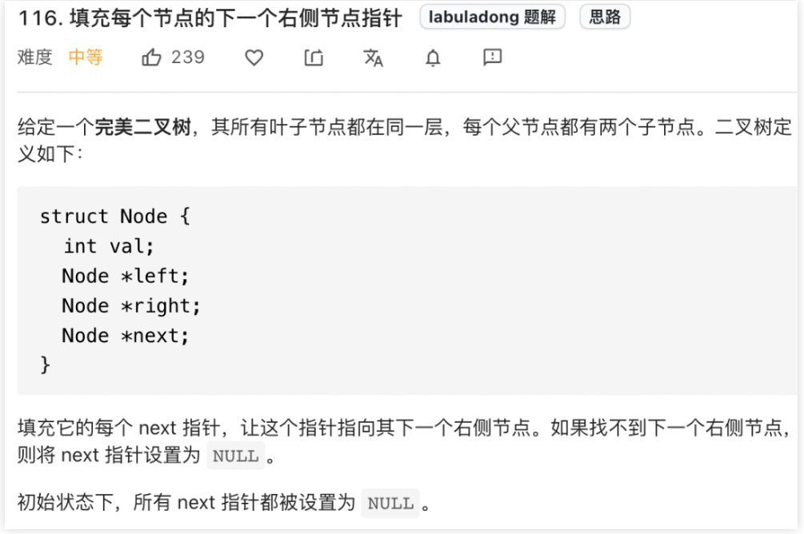
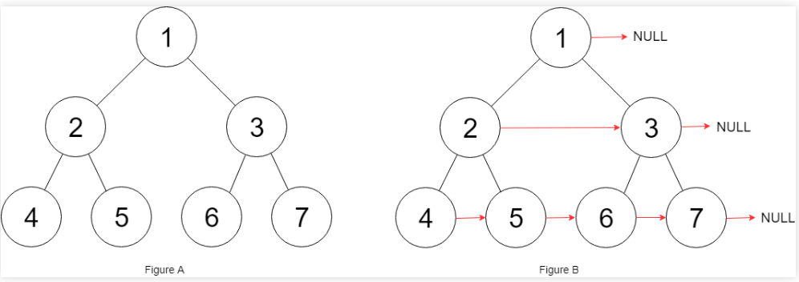
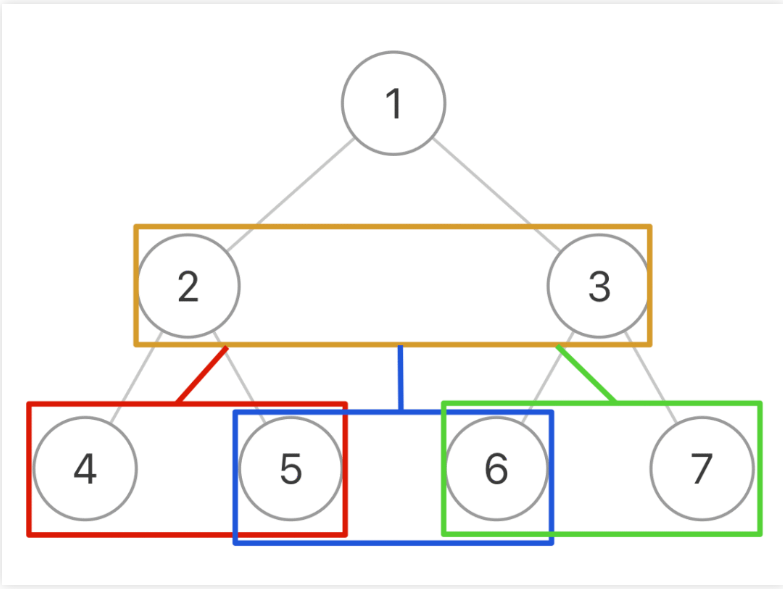

## 二叉树（思维篇）（参考链接：https://mp.weixin.qq.com/s?__biz=MzAxODQxMDM0Mw==&mid=2247496572&idx=1&sn=5399953a187fcd506f93eb8f3f8f2dc5&scene=21#wechat_redirect）

先复述一下前文总结的二叉树解题总纲：

二叉树解题的思维模式分两类：

**1、是否可以通过遍历一遍二叉树得到答案**？如果可以，用一个traverse函数配合外部变量来实现，这叫「遍历」的思维模式。

**2、是否可以定义一个递归函数，通过子问题（子树）的答案推导出原问题的答案**？如果可以，写出这个递归函数的定义，并充分利用这个函数的返回值，这叫「分解问题」的思维模式。

无论使用哪种思维模式，你都需要思考：

**如果单独抽出一个二叉树节点，它需要做什么事情？需要在什么时候（前/中/后序位置）做**？其他的节点不用你操心，递归函数会帮你在所有节点上执行相同的操作。

本文就以几道比较简单的题目为例，带你实践运用这几条总纲，理解「遍历」的思维和「分解问题」的思维有何区别和联系。

### 一、翻转二叉树

我们先从简单的题开始，看看力扣第 226 题「翻转二叉树」，输入一个二叉树根节点root，让你把整棵树镜像翻转，比如输入的二叉树如下：

```
     4
   /   \
  2     7
 / \   / \
1   3 6   9
```

算法原地翻转二叉树，使得以root为根的树变成：

```
     4
   /   \
  7     2
 / \   / \
9   6 3   1
```

不难发现，只要把二叉树上的每一个节点的左右子节点进行交换，最后的结果就是完全翻转之后的二叉树。

那么现在开始在心中默念二叉树解题总纲：

**1、这题能不能用「遍历」的思维模式解决**？

可以，我写一个traverse函数遍历每个节点，让每个节点的左右子节点颠倒过来就行了。

单独抽出一个节点，需要让它做什么？让它把自己的左右子节点交换一下。

需要在什么时候做？好像前中后序位置都可以。

综上，可以写出如下解法代码：

```
// 主函数
TreeNode invertTree(TreeNode root) {
  // 遍历二叉树，交换每个节点的子节点
  traverse(root);
  return root;
}

// 二叉树遍历函数
void traverse(TreeNode root) {
  if (root == null) {
    return;
  }

  /**** 前序位置 ****/
  // 每一个节点需要做的事就是交换它的左右子节点
  TreeNode tmp = root.left;
  root.left = root.right;
  root.right = tmp;

  // 遍历框架，去遍历左右子树的节点
  traverse(root.left);
  traverse(root.right);
}
```

你把前序位置的代码移到后序位置也可以，但是直接移到中序位置是不行的，需要稍作修改，这应该很容易看出来吧，我就不说了。

按理说，这道题已经解决了，不过为了对比，我们再继续思考下去。

**2、这题能不能用「分解问题」的思维模式解决**？

我们尝试给invertTree函数赋予一个定义：

```
// 定义：将以 root 为根的这棵二叉树翻转，返回翻转后的二叉树的根节点
TreeNode invertTree(TreeNode root);
```

然后思考，对于某一个二叉树节点x执行invertTree(x)，你能利用这个递归函数的定义做点啥？

我可以用invertTree(x.left)先把x的左子树翻转，再用invertTree(x.right)把x的右子树翻转，最后把x的左右子树交换，这恰好完成了以x为根的整棵二叉树的翻转，即完成了invertTree(x)的定义。

直接写出解法代码：

```
// 定义：将以 root 为根的这棵二叉树翻转，返回翻转后的二叉树的根节点
TreeNode invertTree(TreeNode root) {
  if (root == null) {
    return null;
  }
  // 利用函数定义，先翻转左右子树
  TreeNode left = invertTree(root.left);
  TreeNode right = invertTree(root.right);

  // 然后交换左右子树节点
  root.left = right;
  root.right = left;

  // 和定义逻辑自恰：以 root 为根的这棵二叉树已经被翻转，返回 root
  return root;
}
```

这种「分解问题」的思路，核心在于你要给递归函数一个合适的定义，然后用函数的定义来解释你的代码；如果你的逻辑成功自恰，那么说明你这个算法是正确的。

好了，这道题就分析到这，「遍历」和「分解问题」的思路都可以解决，看下一道题。

### 第二题、填充节点的右侧指针

这是力扣第 116 题「填充每个二叉树节点的右侧指针」，看下题目：



函数签名如下：

```
Node connect(Node root);
```



而且题目说了，输入是一棵「完美二叉树」，形象地说整棵二叉树是一个正三角形，除了最右侧的节点next指针会指向null，其他节点的右侧一定有相邻的节点。

这道题怎么做呢？来默念二叉树解题总纲：

**1、这题能不能用「遍历」的思维模式解决**？

很显然，一定可以。

每个节点要做的事也很简单，把自己的next指针指向右侧节点就行了。

也许你会模仿上一道题，直接写出如下代码：

```
// 二叉树遍历函数
void traverse(Node root) {
  // root.left == null 下一层为空，所以也返回出去
  if (root == null || root.left == null) {
    return;
  }
  // 把左边节点的next指针指向右子节点
  root.left.next = root.right;

  // 继续遍历
  traverse(root.left);
  traverse(root.right);
}
```

但是，这段代码其实有很大问题，因为它只能把相同父节点的两个节点穿起来，再看看这张图：


节点 5 和节点 6 不属于同一个父节点，那么按照这段代码的逻辑，它俩就没办法被穿起来，这是不符合题意的，但是问题出在哪里？

**传统的traverse函数是遍历二叉树的所有节点，但现在我们想遍历的其实是两个相邻节点之间的「空隙」**。

所以我们可以在二叉树的基础上进行抽象，你把图中的每一个方框看做一个节点：



**这样，一棵二叉树被抽象成了一棵三叉树，三叉树上的每个节点就是原先二叉树的两个相邻节点**。

现在，我们只要实现一个traverse函数来遍历这棵三叉树，每个「三叉树节点」需要做的事就是把自己内部的两个二叉树节点穿起来：

```
// 主函数
Node connect(Node root) {
  if (root == null) return null;
  // 遍历「三叉树」，连接相邻节点
  traverse(root.left, root.right);
  return root;
}

// 三叉树遍历框架
void traverse(Node node1, Node node2) {
  if (node1 == null || node2 == null) {
    return;
  }
  /**** 前序位置 ****/
  // 将传入的两个节点穿起来
  node1.next = node2;

  // 连接相同父节点的两个子节点
  traverse(node1.left, node1.right);
  traverse(node2.left, node2.right);
  // 连接跨越父节点的两个子节点
  traverse(node1.right, node2.left);
}
```

这样，traverse函数遍历整棵「三叉树」，将所有相邻节的二叉树节点都连接起来，也就避免了我们之前出现的问题，把这道题完美解决。

**2、这题能不能用「分解问题」的思维模式解决**？

嗯，好像没有什么特别好的思路，所以这道题无法使用「分解问题」的思维来解决。


