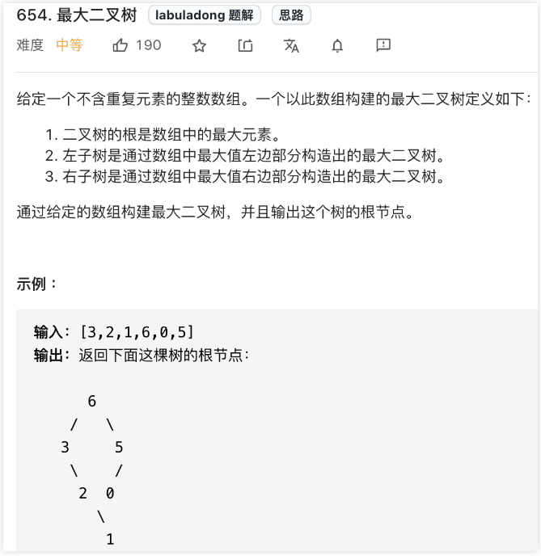
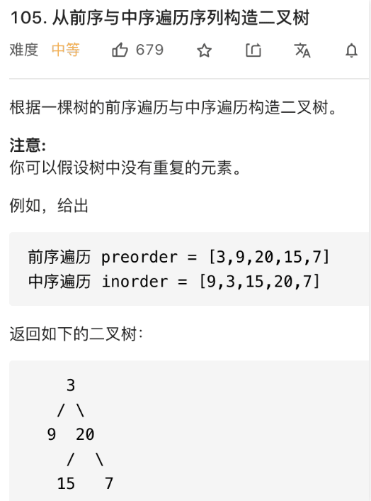
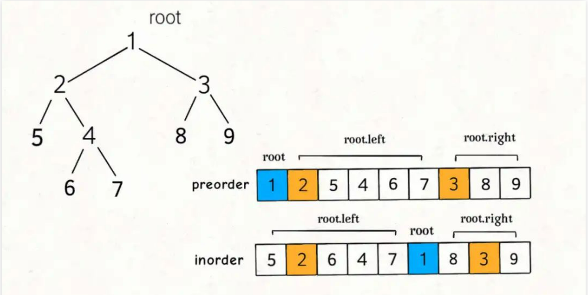
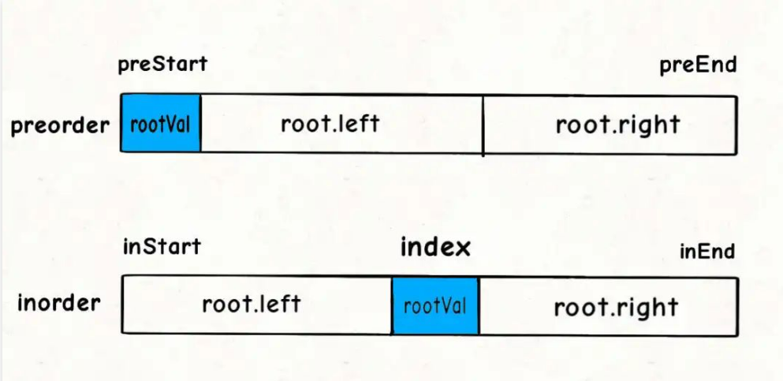
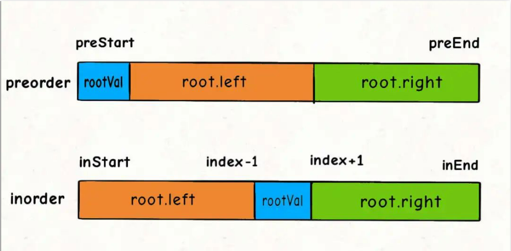
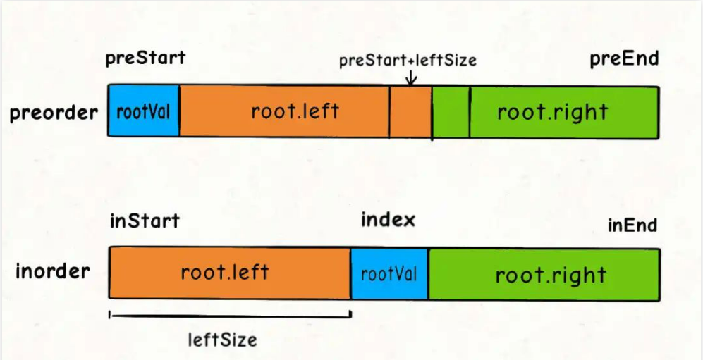

## 二叉树（构造篇）（参考链接：https://mp.weixin.qq.com/s?__biz=MzAxODQxMDM0Mw==&mid=2247496574&idx=1&sn=87d6f6bb23c7bdc30828797a361ac8c1&scene=21#wechat_redirect）

本文是承接 二叉树（纲领篇） 的第二篇文章，先复述一下前文总结的二叉树解题总纲：

> 二叉树解题的思维模式分两类：
> 1. **是否可以通过遍历一遍二叉树得到答案**？如果可以，用一个traverse函数配合外部变量来实现，这叫「遍历」的思维模式。
> 2. **是否可以定义一个递归函数，通过子问题（子树）的答案推导出原问题的答案**？如果可以，写出这个递归函数的定义，并充分利用这个函数的返回值，这叫「分解问题」的思维模式。  
> 无论使用哪种思维模式，你都需要思考：  
> **如果单独抽出一个二叉树节点，它需要做什么事情？需要在什么时候（前/中/后序位置）做**？其他的节点不用你操心，递归函数会帮你在所有节点上执行相同的操作。

第一篇文章 二叉树（思维篇） 讲了「遍历」和「分解问题」两种思维方式，本文讲二叉树的构造类问题。

**二叉树的构造问题一般都是使用「分解问题」的思路：构造整棵树 = 根节点 + 构造左子树 + 构造右子树**。

接下来直接看题。

### 构造最大二叉树

先来道简单的，这是力扣第 654 题「最大二叉树」，题目如下：



函数签名如下：

```
TreeNode constructMaximumBinaryTree(int[] nums);
```

每个二叉树节点都可以认为是一棵子树的根节点，对于根节点，首先要做的当然是把想办法把自己先构造出来，然后想办法构造自己的左右子树。

所以，我们要遍历数组把找到最大值maxVal，从而把根节点root做出来，然后对maxVal左边的数组和右边的数组进行递归构建，作为root的左右子树。

按照题目给出的例子，输入的数组为[3,2,1,6,0,5]，对于整棵树的根节点来说，其实在做这件事：

```
TreeNode constructMaximumBinaryTree([3,2,1,6,0,5]) {
  // 找到数组中的最大值
  TreeNode root = new TreeNode(6);
  // 递归调用构造左右子树
  root.left = constructMaximumBinaryTree([3,2,1]);
  root.right = constructMaximumBinaryTree([0,5]);
  return root;
}
```

再详细一点，就是如下伪码：

```
TreeNode constructMaximumBinaryTree(int[] nums) {
  if (nums is empty) return null;
  // 找到数组中的最大值
  int maxVal = Integer.MIN_VALUE;
  int index = 0;
  for(int i = 0; i < nums.length; i++) {
    if (nums[i] > maxVal) {
      maxVal = nums[i];
      index = i;
    }
  }

  TreeNode root = new TreeNode(maxVal);
  // 递归调用构造左右子树
  root.left = constructMaximumBinaryTree([0..index-1]);
  root.right = constructMaximumBinaryTree([index+1..nums.length-1]);
  return root;
}
```

**当前nums中的最大值就是根节点，然后根据索引递归调用左右数组构造左右子树即可**。

明确了思路，我们可以重新写一个辅助函数build，来控制nums的索引：

```
/* 主函数 */
TreeNode constructMaximumBinaryTree(int[] nums) {
  return build(nums, 0, nums.length - 1);
}

// 传数组下标范围，而不切割数组，是个不错的思路
// 定义：将Nums[0..hi]构成符合条件的树，返回根节点
TreeNode build(int[] nums, int lo, int hi) {
  // lo == hi的时候说明有一个元素
  if (hi < lo) {
    return null;
  }

  // 找到数组中的最大值和对应的索引
  int index = -1, maxVal = Integer.MIN_VALUE;
  for(int i = lo; i <= hi; i++) {
    if (nums[i] > maxVal) {
      maxVal = nums[i];
      index = i;
    }
  }

  // 先构造根节点
  TreeNode root = new TreeNode(maxVal);
  // 递归调用构造左右子树
  root.left = build(nums, lo, index - 1);
  root.right = build(nums, index + 1, hi);
  return root;
}
```

至此，这道题就做完了，还是挺简单的对吧，下面看两道更困难一些的。

### 通过前序和中序遍历结果构造二叉树

力扣第 105 题「从前序和中序遍历序列构造二叉树」就是这道经典题目，面试笔试中常考：



函数签名如下：

```
TreeNode buildTree(int[] preorder, int[] inorder);
```

废话不多说，直接来想思路，首先思考，根节点应该做什么。

**类似上一题，我们肯定要想办法确定根节点的值，把根节点做出来，然后递归构造左右子树即可**。

我们先来回顾一下，前序遍历和中序遍历的结果有什么特点？

```
void traverse(TreeNode root) {
  // 前序遍历
  preorder.add(root.val);
  traverse(root.left);
  traverse(root.right);
}

void traverse(TreeNode root) {
  traverse(root.left);
  // 中序遍历
  inorder.add(root.val);
  traverse(root.right);
}
```

前文 二叉树就那几个框架 写过，这样的遍历顺序差异，导致了preorder和inorder数组中的元素分布有如下特点：



找到根节点是很简单的，前序遍历的第一个值preorder[0]就是根节点的值。

关键在于如何通过根节点的值，将preorder和postorder数组划分成两半，构造根节点的左右子树？

换句话说，对于以下代码中的?部分应该填入什么：

```
/* 主函数 */
public TreeNode buildTree(int[] preorder, int[] inorder) {
  // 根据函数定义，用preorder和inorder构造二叉树
  return build(preorder, 0, preorder.length - 1, inorder, 0, inorder.length - 1);
}

/* 
  build 函数的定义：
  若前序遍历数组为 preorder[preStart..preEnd]，
  中序遍历数组为 inorder[inStart..inEnd]，
  构造二叉树，返回该二叉树的根节点 
*/
TreeNode build(int[] preorder, preStart, preEnd, int[] inorder, int inStart, int inEnd) {
  // root节点对应的值就是前序遍历数组的第一个元素
  int rootVal = preorder[preStart];
  // root 在中序遍历数组中的索引
  int index = 0;
  for(int i = inStart; i <= inEnd; i++) {
    if (inorder[i] == rootVal) {
      index = i;
      break;
    }
  }

  TreeNode root = new TreeNode(rootVal);
  // 递归构建左右子树
  root.left = build(preorder, ?, ?, inorder, ?, ?);
  root.right = build(preorder, ?, ?, inorder, ?, ?);
  return root;
}
```

对于代码中的rootVal和index变量，就是下图这种情况：



另外，也有读者注意到，通过 for 循环遍历的方式去确定index效率不算高，可以进一步优化。

**因为题目说二叉树节点的值不存在重复，所以可以使用一个 HashMap 存储元素到索引的映射，这样就可以直接通过 HashMap 查到rootVal对应的index(如果无重复需要一直查询某个数组元素的下标我们可以用map将item为key，index为val存起来，这样减少查询的时间复杂度)**：

```
// 存储inorder中值到索引的映射
HashMap<Integer, Integer> valToIndex = new HashMap<>();
public TreeNode buildTree(int[] preorder, int[] inorder) {
  for(int i = 0; i < inorder.length; i++) {
    valToIndex.put(inorder[i], i);
  }
  // 根据函数定义，用preorder和inorder构造二叉树
  return build(preorder, 0, preorder.length - 1, inorder, 0, inorder.length - 1);
}

TreeNode build(int[] preorder, preStart, preEnd, int[] inorder, int inStart, int inEnd) {
  // root节点对应的值就是前序遍历数组的第一个元素
  int rootVal = preorder[preStart];
  // 避免for循环寻找rootVal
  int index = valToIndex.get(rootVal);
  // ...
}
```

现在我们来看图做填空题，下面这几个问号处应该填什么：

```
root.left = build(preorder, ?, ?,
                  inorder, ?, ?);

root.right = build(preorder, ?, ?,
                   inorder, ?, ?);
```

对于左右子树对应的inorder数组的起始索引和终止索引比较容易确定：



```
root.left = build(preorder, ?, ?,
                  inorder, inStart, index - 1);

root.right = build(preorder, ?, ?,
                   inorder, index + 1, inEnd);
```

对于preorder数组呢？如何确定左右数组对应的起始索引和终止索引？

这个可以通过左子树的节点数推导出来，假设左子树的节点数为leftSize，那么preorder数组上的索引情况是这样的：



看着这个图就可以把preorder对应的索引写进去了：

```
int leftSize = index - inStart;

root.left = build(preorder, preStart + 1, preStart + leftSize,
                  inorder, inStart, index - 1);
root.right = build(preorder, preStart + leftSize + 1, preEnd,
                  inorder, index + 1, inEnd);
```

至此，整个算法思路就完成了，我们再补一补 base case 即可写出解法代码：

```
TreeNode build(int[] preorder, int preStart, int preEnd, 
               int[] inorder, int inStart, int inEnd) {
  // base case
  if (preEnd < preStart) {
    return null;
  }
  // root节点对应的值就是前序遍历数组的第一个元素
  int rootVal = preorder[preStart];
  // rootVal在中序遍历数组中的索引
  int index = valToIndex.get(rootVal);

  int leftSize = index - inStart;

  // 先构造出当前根节点
  TreeNode root = new TreeNode(rootVal);
  // 递归调用构造左右子树
  root.left = build(preorder, preStart + 1, preStart + leftSize, inorder, inStart, index - 1);
  root.right = build(preorder, preStart + leftSize + 1, preEnd, inorder, index + 1, inEnd);
  return root;
}
```

我们的主函数只要调用build函数即可，你看着函数这么多参数，解法这么多代码，似乎比我们上面讲的那道题难很多，让人望而生畏，实际上呢，这些参数无非就是控制数组起止位置的，画个图就能解决了。