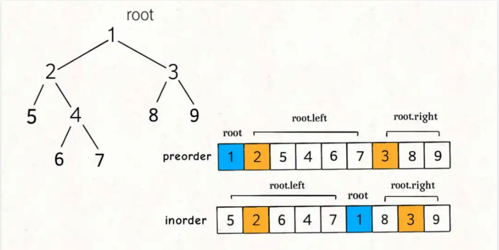
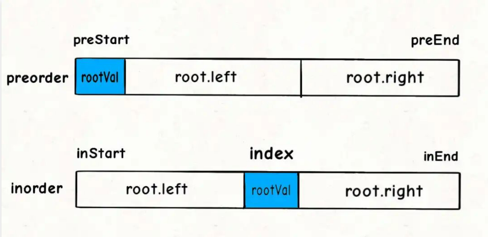
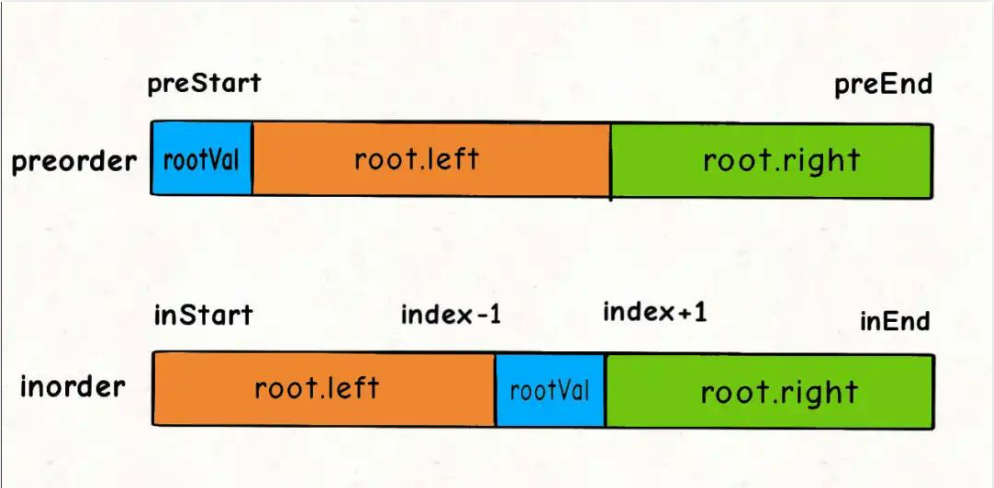
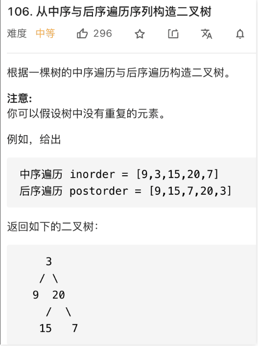
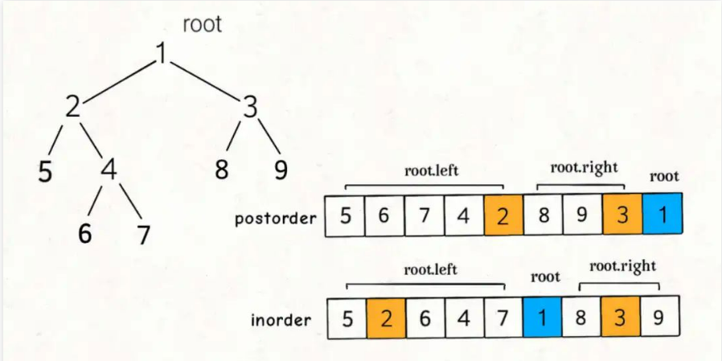
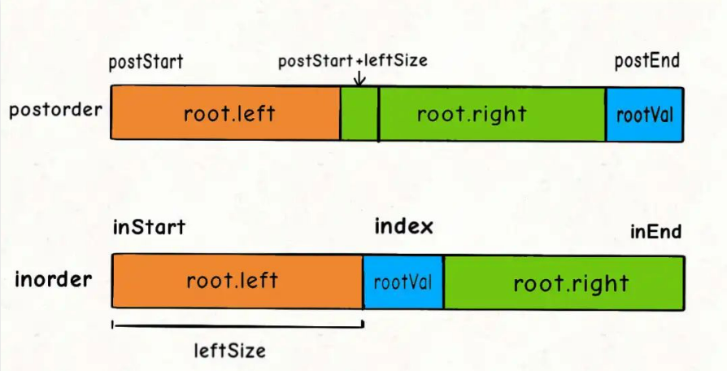
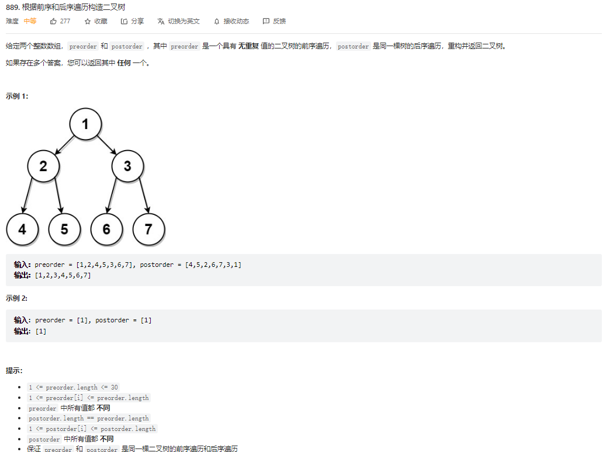
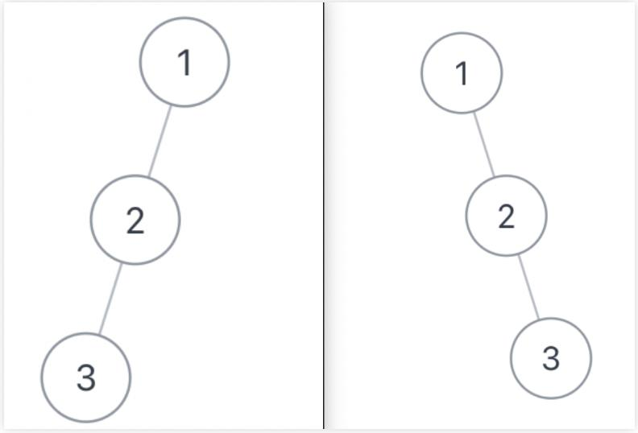
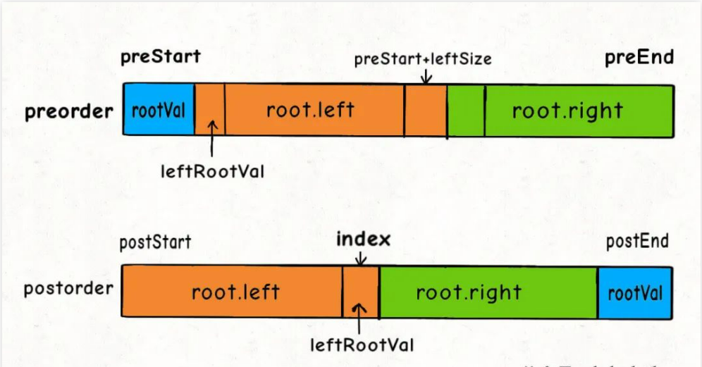

## 二叉树（构造篇）（参考链接：https://mp.weixin.qq.com/s?__biz=MzAxODQxMDM0Mw==&mid=2247496574&idx=1&sn=87d6f6bb23c7bdc30828797a361ac8c1&scene=21#wechat_redirect）

本文是承接 二叉树（纲领篇） 的第二篇文章，先复述一下前文总结的二叉树解题总纲：

> 二叉树解题的思维模式分两类：
> 1. **是否可以通过遍历一遍二叉树得到答案**？如果可以，用一个traverse函数配合外部变量来实现，这叫「遍历」的思维模式。
> 2. **是否可以定义一个递归函数，通过子问题（子树）的答案推导出原问题的答案**？如果可以，写出这个递归函数的定义，并充分利用这个函数的返回值，这叫「分解问题」的思维模式。  
> 无论使用哪种思维模式，你都需要思考：  
> **如果单独抽出一个二叉树节点，它需要做什么事情？需要在什么时候（前/中/后序位置）做**？其他的节点不用你操心，递归函数会帮你在所有节点上执行相同的操作。

第一篇文章 二叉树（思维篇） 讲了「遍历」和「分解问题」两种思维方式，本文讲二叉树的构造类问题。

**二叉树的构造问题一般都是使用「分解问题」的思路：构造整棵树 = 根节点 + 构造左子树 + 构造右子树**。

接下来直接看题。

### 构造最大二叉树

先来道简单的，这是力扣第 654 题「最大二叉树」，题目如下：


函数签名如下：

```
TreeNode constructMaximumBinaryTree(int[] nums);
```

每个二叉树节点都可以认为是一棵子树的根节点，对于根节点，首先要做的当然是把想办法把自己先构造出来，然后想办法构造自己的左右子树。

所以，我们要遍历数组把找到最大值maxVal，从而把根节点root做出来，然后对maxVal左边的数组和右边的数组进行递归构建，作为root的左右子树。

按照题目给出的例子，输入的数组为[3,2,1,6,0,5]，对于整棵树的根节点来说，其实在做这件事：

```
TreeNode constructMaximumBinaryTree([3,2,1,6,0,5]) {
  // 找到数组中的最大值
  TreeNode root = new TreeNode(6);
  // 递归调用构造左右子树
  root.left = constructMaximumBinaryTree([3,2,1]);
  root.right = constructMaximumBinaryTree([0,5]);
  return root;
}
```

再详细一点，就是如下伪码：

```
TreeNode constructMaximumBinaryTree(int[] nums) {
  if (nums is empty) return null;
  // 找到数组中的最大值
  int maxVal = Integer.MIN_VALUE;
  int index = 0;
  for(int i = 0; i < nums.length; i++) {
    if (nums[i] > maxVal) {
      maxVal = nums[i];
      index = i;
    }
  }

  TreeNode root = new TreeNode(maxVal);
  // 递归调用构造左右子树
  root.left = constructMaximumBinaryTree([0..index-1]);
  root.right = constructMaximumBinaryTree([index+1..nums.length-1]);
  return root;
}
```

**当前nums中的最大值就是根节点，然后根据索引递归调用左右数组构造左右子树即可**。

明确了思路，我们可以重新写一个辅助函数build，来控制nums的索引：

```
/* 主函数 */
TreeNode constructMaximumBinaryTree(int[] nums) {
  return build(nums, 0, nums.length - 1);
}

// 传数组下标范围，而不切割数组，是个不错的思路
// 定义：将Nums[0..hi]构成符合条件的树，返回根节点
TreeNode build(int[] nums, int lo, int hi) {
  // lo == hi的时候说明有一个元素
  if (hi < lo) {
    return null;
  }

  // 找到数组中的最大值和对应的索引
  int index = -1, maxVal = Integer.MIN_VALUE;
  for(int i = lo; i <= hi; i++) {
    if (nums[i] > maxVal) {
      maxVal = nums[i];
      index = i;
    }
  }

  // 先构造根节点
  TreeNode root = new TreeNode(maxVal);
  // 递归调用构造左右子树
  root.left = build(nums, lo, index - 1);
  root.right = build(nums, index + 1, hi);
  return root;
}
```

至此，这道题就做完了，还是挺简单的对吧，下面看两道更困难一些的。

### 通过前序和中序遍历结果构造二叉树

力扣第 105 题「从前序和中序遍历序列构造二叉树」就是这道经典题目，面试笔试中常考：


函数签名如下：

```
TreeNode buildTree(int[] preorder, int[] inorder);
```

废话不多说，直接来想思路，首先思考，根节点应该做什么。

**类似上一题，我们肯定要想办法确定根节点的值，把根节点做出来，然后递归构造左右子树即可**。

我们先来回顾一下，前序遍历和中序遍历的结果有什么特点？

```
void traverse(TreeNode root) {
  // 前序遍历
  preorder.add(root.val);
  traverse(root.left);
  traverse(root.right);
}

void traverse(TreeNode root) {
  traverse(root.left);
  // 中序遍历
  inorder.add(root.val);
  traverse(root.right);
}
```

前文 二叉树就那几个框架 写过，这样的遍历顺序差异，导致了preorder和inorder数组中的元素分布有如下特点：



找到根节点是很简单的，前序遍历的第一个值preorder[0]就是根节点的值。

关键在于如何通过根节点的值，将preorder和postorder数组划分成两半，构造根节点的左右子树？

换句话说，对于以下代码中的?部分应该填入什么：

```
/* 主函数 */
public TreeNode buildTree(int[] preorder, int[] inorder) {
  // 根据函数定义，用preorder和inorder构造二叉树
  return build(preorder, 0, preorder.length - 1, inorder, 0, inorder.length - 1);
}

/* 
  build 函数的定义：
  若前序遍历数组为 preorder[preStart..preEnd]，
  中序遍历数组为 inorder[inStart..inEnd]，
  构造二叉树，返回该二叉树的根节点 
*/
TreeNode build(int[] preorder, preStart, preEnd, int[] inorder, int inStart, int inEnd) {
  // root节点对应的值就是前序遍历数组的第一个元素
  int rootVal = preorder[preStart];
  // root 在中序遍历数组中的索引
  int index = 0;
  for(int i = inStart; i <= inEnd; i++) {
    if (inorder[i] == rootVal) {
      index = i;
      break;
    }
  }

  TreeNode root = new TreeNode(rootVal);
  // 递归构建左右子树
  root.left = build(preorder, ?, ?, inorder, ?, ?);
  root.right = build(preorder, ?, ?, inorder, ?, ?);
  return root;
}
```

对于代码中的rootVal和index变量，就是下图这种情况：



另外，也有读者注意到，通过 for 循环遍历的方式去确定index效率不算高，可以进一步优化。

**因为题目说二叉树节点的值不存在重复，所以可以使用一个 HashMap 存储元素到索引的映射，这样就可以直接通过 HashMap 查到rootVal对应的index(如果无重复需要一直查询某个数组元素的下标我们可以用map将item为key，index为val存起来，这样减少查询的时间复杂度)**：

```
// 存储inorder中值到索引的映射
HashMap<Integer, Integer> valToIndex = new HashMap<>();
public TreeNode buildTree(int[] preorder, int[] inorder) {
  for(int i = 0; i < inorder.length; i++) {
    valToIndex.put(inorder[i], i);
  }
  // 根据函数定义，用preorder和inorder构造二叉树
  return build(preorder, 0, preorder.length - 1, inorder, 0, inorder.length - 1);
}

TreeNode build(int[] preorder, preStart, preEnd, int[] inorder, int inStart, int inEnd) {
  // root节点对应的值就是前序遍历数组的第一个元素
  int rootVal = preorder[preStart];
  // 避免for循环寻找rootVal
  int index = valToIndex.get(rootVal);
  // ...
}
```

现在我们来看图做填空题，下面这几个问号处应该填什么：

```
root.left = build(preorder, ?, ?,
                  inorder, ?, ?);

root.right = build(preorder, ?, ?,
                   inorder, ?, ?);
```

对于左右子树对应的inorder数组的起始索引和终止索引比较容易确定：



```
root.left = build(preorder, ?, ?,
                  inorder, inStart, index - 1);

root.right = build(preorder, ?, ?,
                   inorder, index + 1, inEnd);
```

对于preorder数组呢？如何确定左右数组对应的起始索引和终止索引？

这个可以通过左子树的节点数推导出来，假设左子树的节点数为leftSize，那么preorder数组上的索引情况是这样的：


看着这个图就可以把preorder对应的索引写进去了：

```
int leftSize = index - inStart;

root.left = build(preorder, preStart + 1, preStart + leftSize,
                  inorder, inStart, index - 1);
root.right = build(preorder, preStart + leftSize + 1, preEnd,
                  inorder, index + 1, inEnd);
```

至此，整个算法思路就完成了，我们再补一补 base case 即可写出解法代码：

```
TreeNode build(int[] preorder, int preStart, int preEnd, 
               int[] inorder, int inStart, int inEnd) {
  // base case
  if (preEnd < preStart) {
    return null;
  }
  // root节点对应的值就是前序遍历数组的第一个元素
  int rootVal = preorder[preStart];
  // rootVal在中序遍历数组中的索引
  int index = valToIndex.get(rootVal);

  int leftSize = index - inStart;

  // 先构造出当前根节点
  TreeNode root = new TreeNode(rootVal);
  // 递归调用构造左右子树
  root.left = build(preorder, preStart + 1, preStart + leftSize, inorder, inStart, index - 1);
  root.right = build(preorder, preStart + leftSize + 1, preEnd, inorder, index + 1, inEnd);
  return root;
}
```

我们的主函数只要调用build函数即可，你看着函数这么多参数，解法这么多代码，似乎比我们上面讲的那道题难很多，让人望而生畏，实际上呢，这些参数无非就是控制数组起止位置的，画个图就能解决了。

### 通过后序和中序遍历结果构造二叉树

类似上一题，这次我们利用后序和中序遍历的结果数组来还原二叉树，这是力扣第 106 题「从后序和中序遍历序列构造二叉树」：



函数签名如下：

```
TreeNode buildTree(int[] inorder, int[] postorder);
```

类似的，看下后序和中序遍历的特点：

```
void traverse(TreeNode root) {
  traverse(root.left);
  traverse(root.right);
  // 后序遍历
  postorder.add(root.val);
}

void traverse(TreeNode root) {
  traverse(root.left);
  // 中序遍历
  inorder.add(root.val);
  traverse(root.right);
}
```

这样的遍历顺序差异，导致了preorder和inorder数组中的元素分布有如下特点：



这道题和上一题的关键区别是，后序遍历和前序遍历相反，根节点对应的值为postorder的最后一个元素。

整体的算法框架和上一题非常类似，我们依然写一个辅助函数build：

```
// 存储inorder中值到索引的映射
HashMap<Integer, Integer> valToIndex = new HashMap<>();

TreeNode buildTree(int[] inorder, int[] postorder) {
  for(int i = 0; i < inorder.length; i++) {
    valToIndex.put(inorder[i], i);
  }
  return build(inorder, 0, inorder.length - 1, postorder, 0, postorder.length - 1);
}

/* 
  build 函数的定义：
  后序遍历数组为 postorder[postStart..postEnd]，
  中序遍历数组为 inorder[inStart..inEnd]，
  构造二叉树，返回该二叉树的根节点 
*/
TreeNode build(int[] inorder, int inStart, int inEnd,
               int[] postorder, int postStart, int postEnd) {
  // root节点对应的值就是后序遍历数组的最后一个元素
  int rootVal = postorder[postEnd];
  // rootVal在中序遍历数组中的索引
  int index = valToIndex.get(rootVal);

  TreeNode root = new TreeNode(rootVal);

  // 递归构造左右子树
  root.left = build(inorder, ?, ?, postorder, ?, ?);
  root.right = build(inorder, ?, ?, postorder, ?, ?);
  return root;
}
```

现在postoder和inorder对应的状态如下：



我们可以按照上图将问号处的索引正确填入：

```
int leftSize = index - inStart;

root.left = build(inorder, inStart, index - 1, postorder, preStart, postStart + leftSize - 1);
root.right = build(inorder, index + 1, inEnd, postorder, postStart + leftSize, postEnd - 1);
```

综上，可以写出完整的解法代码：

```
TreeNode build(int[] inorder, int inStart, int inEnd,
               int[] postorder, int postStart, int postEnd) {
  if (inStart > inEnd) {
    return null;
  }

  // root节点对应的值就是后序遍历数组的最后一个元素
  int rootVal = postorder[postEnd];
  // rootVal在中序遍历数组中的索引
  int index = valToIndex.get(rootVal);
  // 左子树的节点个数
  int leftSize = index - inStart;
  TreeNode root = new TreeNode(rootVal);
  // 递归构造左右子树
  root.left = build(inorder, inStart, index - 1, postorder, postStart, postStart + leftSize - 1);
  root.right = build(inorder, index + 1, inEnd, postorder, postStart + leftSize, postEnd - 1);
  return root;
}
```

有了前一题的铺垫，这道题很快就解决了，无非就是rootVal变成了最后一个元素，再改改递归函数的参数而已，只要明白二叉树的特性，也不难写出来。

### 通过后序和前序遍历结果构造二叉树

这是力扣第 889 题「根据前序和后序遍历构造二叉树」，给你输入二叉树的前序和后序遍历结果，让你还原二叉树的结构。



函数签名如下：

```
TreeNode constructFromPrePost(int[] preorder, int[] postorder);
```

这道题和前两道题有一个本质的区别：

**通过前序中序，或者后序中序遍历结果可以确定一棵原始二叉树，但是通过前序后序遍历结果无法确定原始二叉树**。

题目也说了，如果有多种可能的还原结果，你可以返回任意一种。

为什么呢？我们说过，构建二叉树的套路很简单，先找到根节点，然后找到并递归构造左右子树即可。

前两道题，可以通过前序或者后序遍历结果找到根节点，然后根据中序遍历结果确定左右子树（题目说了树中没有val相同的节点）。

这道题，你可以确定根节点，但是无法确切的知道左右子树有哪些节点。

举个例子，比如给你这个输入：

```
preorder = [1,2,3], postorder = [3,2,1]
```

下面这两棵树都是符合条件的，但显然它们的结构不同：



不过话说回来，用后序遍历和前序遍历结果还原二叉树，解法逻辑上和前两道题差别不大，也是通过控制左右子树的索引来构建：

**1、首先把前序遍历结果的第一个元素或者后序遍历结果的最后一个元素确定为根节点的值**。

**2、然后把前序遍历结果的第二个元素作为左子树的根节点的值**。

**3、在后序遍历结果中寻找左子树根节点的值，从而确定了左子树的索引边界，进而确定右子树的索引边界，递归构造左右子树即可**。



详情见代码。

```
class Solution {
  // 存储postorder中值到索引的映射
  HashMap<Integer, Integer> valToIndex = new HashMap<>();

  public TreeNode constructFromPrePost(int[] preorder, int[] postorder) {
    for(int i = 0; i < postorder.length; i++) {
      valToIndex.put(postorder[i], i);
    }
    return build(preorder, 0, preorder.length - 1, postorder, 0, postorder.length - 1);
  }

  // 定义：根据 preorder[preStart..preEnd] 和 postorder[postStart..postEnd]
  // 构建二叉树，并返回根节点。
  TreeNode build(int[] preorder, int preStart, int preEnd,
                  int[] postorder, int postStart, int postEnd) {
    if (preStart > preEnd) {
      return null;
    }
    // 通过前序和后序遍历数组，当出现preStart == preEnd的时候
    if (preStart == preEnd) {
        return new TreeNode(preorder[preStart]);
    }

    // root节点对应的值就是前序遍历数组的第一个元素
    int rootVal = preorder[preStart];
    // root.left的值是前序遍历第二个元素
    // 通过前序和后序遍历构造二叉树的关键在于通过左子树的根节点
    // 确定preorder和postorder中左右子树的元素区间
    int leftRootVal = preorder[preStart + 1];
    // leftRootVal在后序遍历数组中的索引
    int index = valToIndex.get(leftRootVal);
    // 左子树的元素个数
    int leftSize = index - postStart + 1; // 这里加1是因为包含leftRootVal
    
    // 先构造出当前的根节点
    TreeNode root = new TreeNode(rootVal);
    // 递归构建左右子树
    // 根据左子树的根节点索引和元素个数推导出左右子树的索引边界
    root.left = build(preorder, preStart + 1, preStart + leftSize,
                postorder, postStart, index);
    root.right = build(preorder, preStart + leftSize + 1, preEnd,
                postorder, index + 1, postEnd - 1);
    return root;
  }
}
```

代码和前两道题非常类似，我们可以看着代码思考一下，为什么通过前序遍历和后序遍历结果还原的二叉树可能不唯一呢？

关键在这一句：

```
int leftRootVal = preorder[preStart + 1];
```

我们假设前序遍历的第二个元素是左子树的根节点，但实际上左子树有可能是空指针，那么这个元素就应该是右子树的根节点。由于这里无法确切进行判断，所以导致了最终答案的不唯一。

至此，通过前序和后序遍历结果还原二叉树的问题也解决了。

最后呼应下前文，**二叉树的构造问题一般都是使用「分解问题」的思路：构造整棵树 = 根节点 + 构造左子树 + 构造右子树**。先找出根节点，然后根据根节点的值找到左右子树的元素，进而递归构建出左右子树。

最后总结：
```
// 通过前序和后序遍历数组，当出现preStart == preEnd的时候，就说明是最后一个叶子节点，因为我们接下来找left树的rootVal的时候，preStart + 1，
// 这时候其实就越界了，所以我们当出现preStart == preEnd就去创建最后一个叶子节点即可
// 通过前序中序或者后序中序数组构建的时候，我们是通过前序或后序的第一个或最后一个元素找到中序遍历数组的rootVal对应的下标，然后递归遍历构造子树的时候，如果出现preStart == preEnd，也无所谓，这时候，preStart就是根节点，然后重新划分区域的时候root.left和root.right接受的范围肯定就不对了。
if (preStart == preEnd) {
  return new TreeNode(preorder[preStart]);
}
```