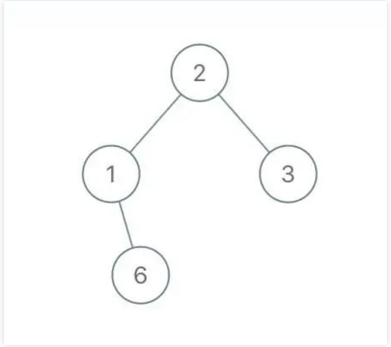
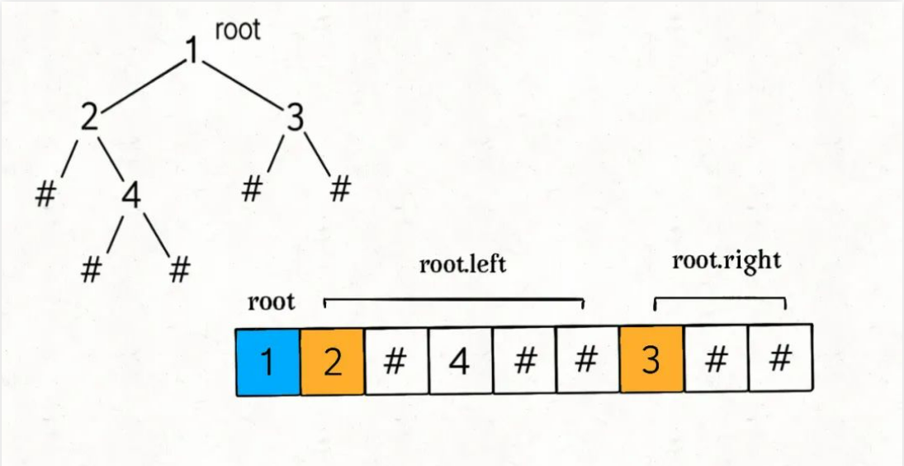
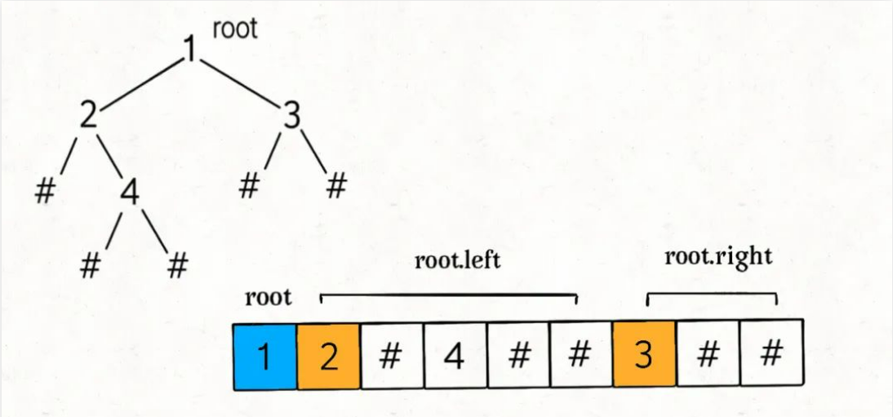
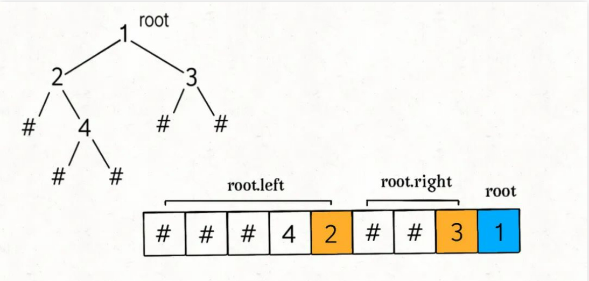
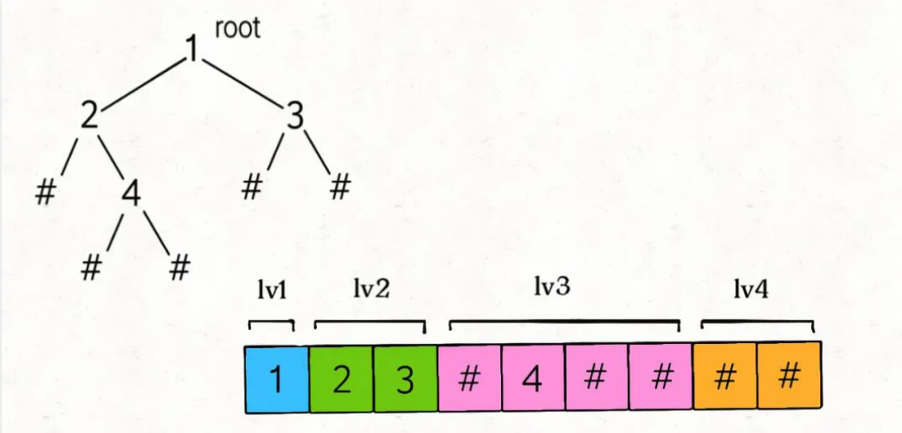

## 二叉树（序列化篇）（参考链接：https://mp.weixin.qq.com/s?__biz=MzAxODQxMDM0Mw==&mid=2247496591&idx=1&sn=d56c42ee940e4b651b644f9d36eba829&scene=21#wechat_redirect）

本文是承接 二叉树（纲领篇） 的第三篇文章，前文 二叉树（构造篇） 带你学习了二叉树构造技巧，本文加大难度，让你对二叉树同时进行「序列化」和「反序列化」。

要说序列化和反序列化，得先从 JSON 数据格式说起。

JSON 的运用非常广泛，比如我们经常将变成语言中的结构体序列化成 JSON 字符串，存入缓存或者通过网络发送给远端服务，消费者接受 JSON 字符串然后进行反序列化，就可以得到原始数据了。

这就是序列化和反序列化的目的，以某种特定格式组织数据，使得数据可以独立于编程语言。

那么假设现在有一棵用 Java 实现的二叉树，我想把它通过某些方式存储下来，然后用 C++ 读取这棵并还原这棵二叉树的结构，怎么办？这就需要对二叉树进行序列化和反序列化了。

直接看题吧。

### 一、题目描述

力扣第 297 题「二叉树的序列化与反序列化」就是给你输入一棵二叉树的根节点root，要求你实现如下一个类：

```
public class Codec {

  // 把一棵二叉树序列化成字符串
  public String serialize(TreeNode root) {}

  // 把字符串反序列化成二叉树
  public TreeNode deserialize(String data) {}
}
```

我们可以用serialize方法将二叉树序列化成字符串，用deserialize方法将序列化的字符串反序列化成二叉树，至于以什么格式序列化和反序列化，这个完全由你决定。

比如说输入如下这样一棵二叉树：



serialize方法也许会把它序列化成字符串2,1,#,6,3,#,#，其中#表示null指针，那么把这个字符串再输入deserialize方法，依然可以还原出这棵二叉树。

也就是说，这两个方法会成对儿使用，你只要保证他俩能够自洽就行了。

想象一下，二叉树结该是一个二维平面内的结构，而序列化出来的字符串是一个线性的一维结构。**所谓的序列化不过就是把结构化的数据「打平」，本质就是在考察二叉树的遍历方式**。

二叉树的遍历方式有哪些？递归遍历方式有前序遍历，中序遍历，后序遍历；迭代方式一般是层级遍历。本文就把这些方式都尝试一遍，来实现serialize方法和deserialize方法。

### 二、前序遍历解法

前文 学习数据结构和算法的框架思维(https://mp.weixin.qq.com/s?__biz=MzAxODQxMDM0Mw==&mid=2247484852&idx=1&sn=85b50b8b0470bb4897e517955f4e5002&scene=21#wechat_redirect) 说过了二叉树的几种遍历方式，前序遍历框架如下：

```
void traverse(TreeNode root) {
  if (root == null) return;

  // 前序位置的代码
  traverse(root.left);
  traverse(root.right);
}
```

真的很简单，在递归遍历两棵子树之前写的代码就是前序遍历代码，那么请你看一看如下伪码：

```
LinkedList<Integer> res;
void traverse(TreeNode root) {
  if (root == null) {
    // 暂且用数字-1，代表空指针null
    res.addLast(-1);
    return;
  }

  /****** 前序位置 ******/
  res.addLast(root.val);
  /***********************/
  traverse(root.left);
  traverse(root.right);
}
```

调用traverse函数之后，你是否可以立即想出这个res列表中元素的顺序是怎样的？比如如下二叉树（#代表空指针 null），可以直观看出前序遍历做的事情：



那么res = [1,2,-1,4,-1,-1,3,-1,-1]，这就是将二叉树「打平」到了一个列表中，其中 -1 代表 null。

那么，将二叉树打平到一个字符串中也是完全一样的：

```
// 代表分隔符的字符
Sring SEP = ",";
// 代表null空指针的字符
String NULL = "#";
// 用于拼接字符串
StringBuilder sb = new StringBuilder();

/* 将二叉树打平为字符串 */
void traverse(TreeNode root, StringBuilder sb) {
  if (root == null) {
    sb.append(NULL).append(SEP);
    return;
  }

  /****** 前序位置 ******/
  sb.append(root.val).append(SEP);
  /***********************/

  traverse(root.left, sb);
  traverse(root.right, sb);
}
```

StringBuilder可以用于高效拼接字符串，所以也可以认为是一个列表，用,作为分隔符，用#表示空指针 null，调用完traverse函数后，sb中的字符串应该是1,2,#,4,#,#,3,#,#,。

至此，我们已经可以写出序列化函数serialize的代码了：

```
String SEP = ",";
String NULL = "#";

/* 主函数，将二叉树序列化为字符串 */
String serialize(TreeNode root) {
  StringBuilder sb = new StringBuilder();
  serialize(root, sb);
  return sb.toString(); // 将当前StringBuilder对象转换为String对象。
}

/* 辅助函数，将二叉树存入 StringBuilder */
void serialize(TreeNode root, StringBuilder sb) {
  if (root == null) {
    sb.append(NULL).append(SEP);
    return;
  }

  /****** 前序位置 ******/
  sb.append(root.val).append(SEP);
  /***********************/

  serialize(root.left, sb);
  serialize(root.right, sb);
}
```

现在，思考一下如何写deserialize函数，将字符串反过来构造二叉树。

首先我们可以把字符串转化成列表：

```
String data = "1,2,#,4,#,#,3,#,#,";
String[] nodes = data.split(",");
```

这样，nodes列表就是二叉树的前序遍历结果，问题转化为：如何通过二叉树的前序遍历结果还原一棵二叉树？

> PS：前文 东哥带你刷二叉树（构造篇），至少要得到前、中、后序遍历中的两种互相配合才能还原二叉树，那是因为前文的遍历结果没有记录空指针的信息。这里的node列表包含了空指针的信息，所以只使用node列表就可以还原二叉树。

根据我们刚才的分析，nodes列表就是一棵打平的二叉树：



那么，反序列化过程也是一样，**先确定根节点root，然后遵循前序遍历的规则，递归生成左右子树即可**：

```
/* 主函数，将字符串反序列化为二叉树结构 */
TreeNode deserialize(String data) {
  // 将字符串转换成列表
  LinkedList nodes = new LinkedList<>();
  for(String s : data.split(SEP)) {
    nodes.addLast(s);
  }
  return deserialize(nodes);
}

/* 辅助函数，通过 nodes 列表构造二叉树 */
TreeNode deserialize(LinkedList<String> nodes) {
  // nodes为空了则返回null，你要是生成一棵树应该return null，如果是'#'，这种情况遍历左右子树的时候数组肯定为空了所以需要返回null，你要是只是遍历收集元素，这里直接return;即可
  if (nodes.isEmpty()) return null;

  /****** 前序位置 ******/
  // 列表最左侧就是根节点
  String first = nodes.removeFirst();
  // 如果first为#，则说明是空节点(null)
  if (first.equals(NULL)) return null;
  TreeNode root = new TreeNode(Integer.parseInt(first));
  /***********************/

  root.left = deserialize(nodes);
  root.right = deserialize(nodes);

  return root;
}
```

我们发现，根据树的递归性质，nodes列表的第一个元素就是一棵树的根节点，所以只要将列表的第一个元素取出作为根节点，剩下的交给递归函数去解决即可

### 三、后序遍历解法

二叉树的后序遍历框架：

```
void traverse(TreeNode root) {
  if (root == null) return;
  traverse(root.left);
  traverse(root.right);

  // 后序位置的代码
}
```

明白了前序遍历的解法，后序遍历就比较容易理解了，我们首先实现serialize序列化方法，只需要稍微修改辅助方法即可：

```
/* 辅助函数，将二叉树存入 StringBuilder */
void serialize(TreeNode root, StringBuilder sb) {
  if (root == null) {
    sb.append(NULL).append(SEP);
    return;
  }

  serialize(root.left, sb);
  serialize(root.right, sb);

  /****** 后序位置 ******/
  sb.append(root.val).append(SEP);
  /***********************/
}
```

我们把对StringBuilder的拼接操作放到了后序遍历的位置，后序遍历导致结果的顺序发生变化：



关键点在于，如何实现后序遍历的deserialize方法呢？是不是也简单地将反序列化的关键代码无脑放到后序遍历的位置就行了呢：

```
// 错误的
/* 辅助函数，通过 nodes 列表构造二叉树 */
TreeNode deserialize(LinkedList<String> nodes) {
  if (nodes.isEmpty()) return null;

  root.left = deserialize(nodes);
  root.right = deserialize(nodes);

  /****** 后序位置 ******/
  String first = nodes.removeFirst();
  if (first.equals(NULL)) return null;
  TreeNode root = new TreeNode(Integer.parseInt(first));
  /***********************/

  return root;
}
```

显然上述代码是错误的，变量都没声明呢，就开始用了？生搬硬套肯定是行不通的，回想刚才我们前序遍历方法中的deserialize方法，第一件事情在做什么？

deserialize**方法首先寻找root节点的值，然后递归计算左右子节点**。那么我们这里也应该顺着这个基本思路走，后序遍历中，root节点的值能不能找到？

再看一眼刚才的图：


在后序遍历结果中，root的值是列表的最后一个元素。我们应该从后往前取出列表元素，先用最后一个元素构造root，然后递归调用生成root的左右子树。

**注意，根据上图，从后往前在nodes列表中取元素，一定要先构造root.right子树，后构造root.left子树**。

看完整代码：

```
/* 主函数，将字符串反序列化为二叉树结构 */
TreeNode deserialize(String data) {
  LinkedList<String> nodes = new LinkedList<>();
  for (String s : data.split(SEP)) {
    nodes.addLast(s);
  }
  return deserialize(nodes);
}

/* 辅助函数，通过 nodes 列表构造二叉树 */
TreeNode deserialize(LinkedList<String> nodes) {
  if (nodes.isEmpty()) return null;
  // 从后往前取出元素
  String last = nodes.removeLast();
  if (last.equals(NULL)) return null;
  TreeNode root = new TreeNode(Integer.parseInt(last));
  // 先构造右子树，后构造左子树
  root.right = deserialize(nodes);
  root.left = deserialize(nodes);

  return root;
}
```

至此，后序遍历实现的序列化、反序列化方法也都实现了。

### 四、中序遍历解法

**先说结论，中序遍历的方式行不通，因为无法实现反序列化方法deserialize**。

序列化方法serialize依然容易，只要把字符串的拼接操作放到中序遍历的位置就行了：

```
/* 辅助函数，将二叉树存入 StringBuilder */
void serialize(TreeNode root, StringBuilder sb) {
  if (root == null) {
    sb.append(NULL).append(SEP);
    return;
  }

  serialize(root.left, sb);
  /******* 中序位置 *******/
  sb.append(root.val).append(SEP);
  /***********************/
  serialize(root.right, sb);
}
```

但是，我们刚才说了，要想实现反序列方法，首先要构造root节点。前序遍历得到的nodes列表中，第一个元素是root节点的值；后序遍历得到的nodes列表中，最后一个元素是root节点的值。

你看上面这段中序遍历的代码，root的值被夹在两棵子树的中间，也就是在nodes列表的中间，我们不知道确切的索引位置，所以无法找到root节点，也就无法进行反序列化。

### 五、层级遍历解法

首先，先写出层级遍历二叉树的代码框架：

```
void traverse(TreeNode root) {
  if (root == null) return;
  // 初始化队列，将 root 加入队列
  Queue<TreeNode> q = new LinkedList<>();
  q.offer(root);

  while (!q.isEmpty()) {
    TreeNode cur = q.poll();

    /* 层级遍历代码位置 */
    System.out.println(root.val);
    /*****************/

    if (cur.left != null) {
      q.offer(cur.left);
    }
    if (cur.right != null) {
      q.offer(cur.right);
    }
  }
}
```

**上述代码是标准的二叉树层级遍历框架，从上到下，从左到右打印每一层二叉树节点的值，可以看到，队列q中不会存在 null 指针**。

不过我们在反序列化的过程中是需要记录空指针 null 的，所以可以把标准的层级遍历框架略作修改：

```
void traverse(TreeNode root) {
  if (root == null) return;
  // 初始化队列，将 root 加入队列
  Queue<TreeNode> q = new LinkedList<>();
  q.offer(root);

  while (!q.isEmpty()) {
    TreeNode cur = q.poll();

    /* 层级遍历代码位置 */
    if (cur == null) continue;
    System.out.println(root.val);
    /*****************/

    q.offer(cur.left);
    q.offer(cur.right);
  }
}
```

这样也可以完成层级遍历，只不过我们把对空指针的检验从「将元素加入队列」的时候改成了「从队列取出元素」的时候。

那么我们完全仿照这个框架即可写出序列化方法：

```
String SEP = ",";
String NULL = "#";

/* 将二叉树序列化为字符串 */
String serialize(TreeNode root) {
  if (root == null) return "";
  StringBuilder sb = new StringBuilder();
  // 初始化队列，将 root 加入队列
  Queue<TreeNode> q = new LinkedList<>();
  q.offer(root);

  while (!q.isEmpty()) {
    TreeNode cur = q.poll();

    /* 层级遍历代码位置 */
    if (cur == null) {
      sb.append(NULL).append(SEP);
      continue;
    }
    sb.append(cur.val).append(SEP);
    /*****************/

    q.offer(cur.left);
    q.offer(cur.right);
  }

  return sb.toString();
}
```

层级遍历序列化得出的结果如下图：



可以看到，每一个非空节点都会对应两个子节点，**那么反序列化的思路也是用队列进行层级遍历，同时用索引i记录对应子节点的位置**：

```
/* 将字符串反序列化为二叉树结构 */
TreeNode deserialize(String data) {
  if (data.isEmpty()) return null;
  String[] nodes = data.split(SEP);
  // 第一个元素就是root的值
  TreeNode root = new TreeNode(Integer.parseInt(nodes[0]));

  // 队列q记录父节点，将root加入队列
  Queue<TreeNode> q = new LinkedList<>();
  q.offer(root);
  
  for(int i = 1; i < nodes.length;) {
    // 队列中存的都是父节点
    TreeNode parent = q.poll();
    // 父节点对应的左侧子节点的值
    String left = nodes[i++];
    if (!left.equals(NULL)) {
      // 如果left不为#
      parent.left = new TreeNode(Integer.parseInt(left));
      // 然后将parent.left加入到队列
      q.offer(parent.left);
    } else {
      parent.left = null;
    }
    // 父节点对应的右侧子节点的值
    String right = nodes[i++];
    if (!right.equals(NULL)) {
      // 如果right不为#
      parent.right = new TreeNode(Integer.parseInt(right));
      // 然后将parent.right加入到队列
      q.offer(parent.right);
    } else {
      parent.right = null;
    }
  }
  return root;
}
```