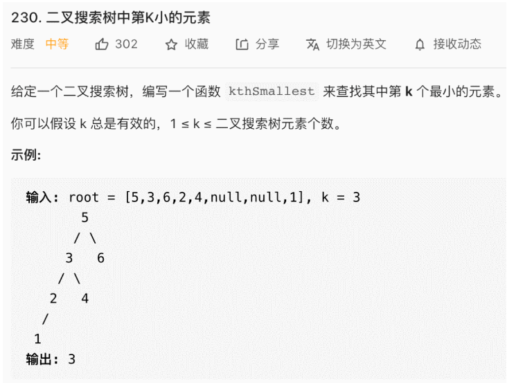

## 二叉搜索树（特性篇）（参考链接：https://mp.weixin.qq.com/s/ioyqagZLYrvdlZyOMDjrPw）

> 读完本文，可以去力扣解决如下题目：230. BST第K小的元素（Medium）538. 二叉搜索树转化累加树（Medium）1038. BST 转累加树（Medium）

二叉搜索树（Binary Search Tree，后文简写 BST）

首先，BST 的特性大家应该都很熟悉了：

1、对于 BST 的每一个节点node，左子树节点的值都比node的值要小，右子树节点的值都比node的值大。

2、对于 BST 的每一个节点node，它的左侧子树和右侧子树都是 BST。

二叉搜索树并不算复杂，但我觉得它构建起了数据结构领域的半壁江山，直接基于 BST 的数据结构有 AVL 树，红黑树等等，拥有了自平衡性质，可以提供 logN 级别的增删查改效率；还有 B+ 树，线段树等结构都是基于 BST 的思想来设计的。

**从做算法题的角度来看 BST，除了它的定义，还有一个重要的性质：BST 的中序遍历结果是有序的（升序）!!!**。

也就是说，如果输入一棵 BST，以下代码可以将 BST 中每个节点的值升序打印出来：

```
void traverse(TreeNode root) {
  if (root == null) return;
  traverse(root.left);
  // 中序遍历代码位置
  print(root.val);
  traverse(root.right);
}
```

根据这个性质，我们来做两道算法题

### 寻找第 K 小的元素

首先是力扣第 230 题「二叉搜索树中第K小的元素」，看下题目：



这个需求很常见吧，一个直接的思路就是升序排序，然后找第k个元素呗。BST 的中序遍历其实就是升序排序的结果，找第k个元素肯定不是什么难事。

按照这个思路，可以直接写出代码：

```
int kthSmallest(TreeNode root, int k) {
  // 利用BST的中序遍历特性
  traverse(root, k);
  return res;
}

// 记录结果
int res = 0;
// 记录当前元素的排名
// 我们从0开始，由于k是从1开始的，所以第一次遇到空节点left后，rank++就是1再与k去比较
int rank = 0;
void traverse(TreeNode root, int k) {
  if (root == null) {
    return;
  }
  traverse(root.left, k);
  /* 中序遍历代码位置 */
  rank++;
  if (k == rank) {
    // 找到第k小的元素
    res = root.val;
    return;
  }
  /*****************/
  traverse(root.right, k);
}
```

这道题就做完了，不过呢，还是要多说几句，因为**这个解法并不是最高效的解法，而是仅仅适用于这道题**。（因为递归基本会遍历完所有的节点，除了rank==k那个return的后面的root.right分支）