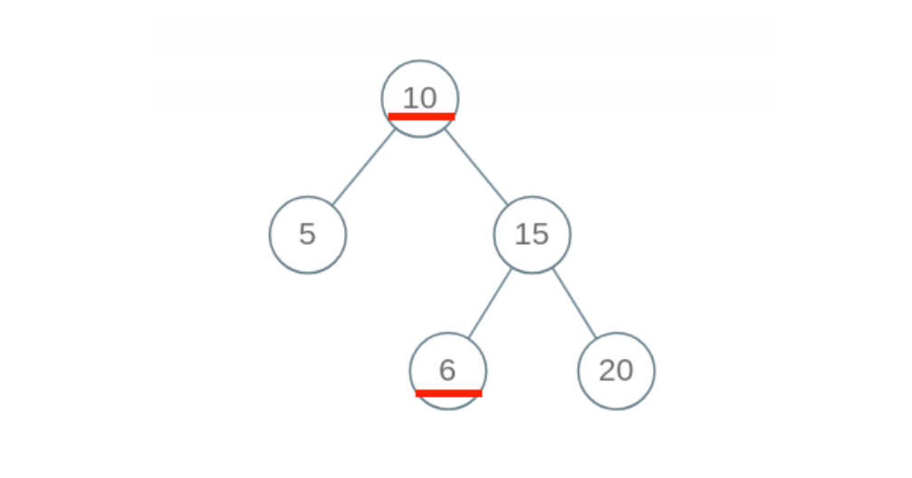
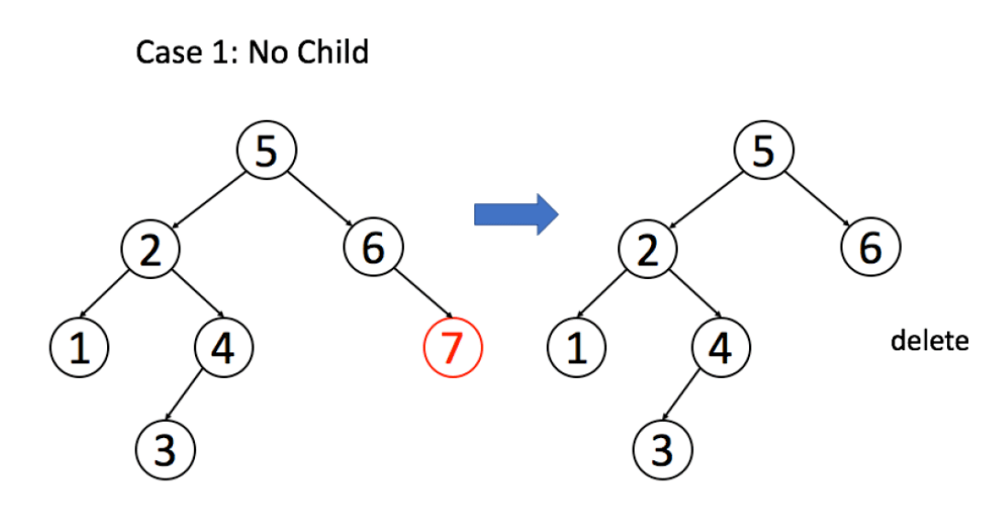
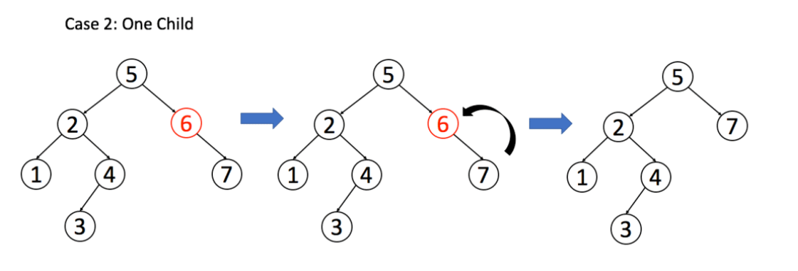
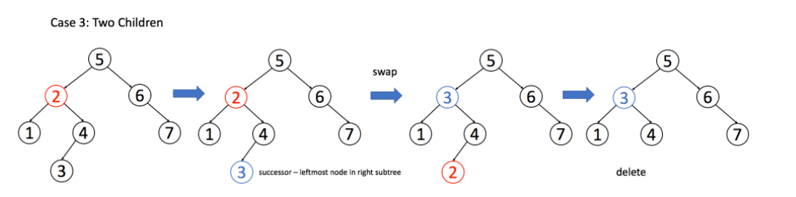

## 二叉搜索树（基操篇）（参考链接：https://mp.weixin.qq.com/s/SuGAvV9zOi4viaeyjWhzDw）

我们前文 手把手刷二叉搜索树（第一期）（https://mp.weixin.qq.com/s?__biz=MzAxODQxMDM0Mw==&mid=2247488101&idx=1&sn=6041ddda5f20ccde8a7036d3e3a1482c&chksm=9bd7ec6daca0657b2ab20a936437e2c8206384c3b1485fe91747ad796fa3a5b08556b2f4911e&scene=21#wechat_redirect） 主要是利用二叉搜索树「中序遍历有序」的特性来解决了几道题目，本文来实现 BST 的基础操作：判断 BST 的合法性、增、删、查。其中「删」和「判断合法性」略微复杂。

### 一、判断 BST 的合法性

这里是有坑的哦，我们按照刚才的思路，每个节点自己要做的事不就是比较自己和左右孩子吗？看起来应该这样写代码：

```
boolean isValidBST(TreeNode root) {
  if (root == null) return true;
  if (root.left != null && root.val <= root.left.val) 
    return false;
  if (root.right != null && root.val >= root.right.val) 
    return false;
  return isValidBST(root.left)
      && isValidBST(root.right);
}
```

但是这个算法出现了错误，BST 的每个节点应该要小于右边子树的所有节点，下面这个二叉树显然不是 BST，因为节点 10 的右子树中有一个节点 6，但是我们的算法会把它判定为合法 BST：



**出现问题的原因在于，对于每一个节点root，代码值检查了它的左右孩子节点是否符合左小右大的原则；但是根据 BST 的定义，root的整个左子树都要小于root.val，整个右子树都要大于root.val**。

问题是，对于某一个节点root，他只能管得了自己的左右子节点，怎么把root的约束传递给左右子树呢？

请看正确的代码：

```
boolean isValidBST(TreeNode root) {
  return isValidBST(root, null, null);
}

/* 限定以 root 为根的子树节点必须满足 max.val > root.val > min.val */
boolean isValidBST(TreeNode root, TreeNode min, TreeNode max) {
  // base case
  if (root == null) return true;
  // 若root.val不符合max和min的限制，说明不是合法BST
  if (min != null && root.val <= min.val) return false;
  if (max != null && root.val >= max.val) return false;
  // 限定左子树的最大值是root.val，右子树的最小值是root.val
  return isValidBST(root.left, min, root)
      && isValidBST(root.right, root, max);
}
```

**我们通过使用辅助函数，增加函数参数列表，在参数中携带额外信息，将这种约束传递给子树的所有节点，这也是二叉树算法的一个小技巧吧**。

### 在 BST 中搜索一个数

如果是在二叉树中寻找元素，可以这样写代码：

```
boolean isInBST(TreeNode root, int target) {
  if (root == null) return false;
  if (root.val == target) return true;
  // 当前节点没找到就递归地去左右子树寻找
  return isInBST(root.left, target) 
      || isInBST(root.right, target);
}
```

**这样写完全正确，但这段代码相当于穷举了所有节点，适用于所有普通二叉树**。那么应该如何充分利用信息，把 BST 这个「左小右大」的特性用上？

很简单，其实不需要递归地搜索两边，类似二分查找思想，根据target和root.val的大小比较，就能排除一边。我们把上面的思路稍稍改动：

```
boolean isInBST(TreeNode root, int target) {
  if (root == null) return false;
  if (root.val == target) {
    return true;
  } 
  if (root.val < target) {
    return isInBST(root.right, target);
  }
  if (root.val > target) {
    return isInBST(root.left, target);
  }
  // root该做的事做完了，顺带把框架也完成了，妙
}
```

于是，我们对原始框架进行改造，抽象出一套针对 BST 的遍历框架：

```
void BST(TreeNode root, int target) {
  if (root.val == target)
    // 找到目标，做点什么
  if (root.val < target)
    BST(root.right, target);
  if (root.val > target)
    BST(root.left, target);
}
```

这个代码框架其实和二叉树的遍历框架差不多，无非就是利用了 BST 左小右大的特性而已。

### 在 BST 中插入一个数

对数据结构的操作无非遍历 + 访问，遍历就是「找」，访问就是「改」。具体到这个问题，插入一个数，就是先找到插入位置，然后进行插入操作。

上一个问题，我们总结了 BST 中的遍历框架，就是「找」的问题。直接套框架，加上「改」的操作即可。**一旦涉及「改」，函数就要返回TreeNode类型，并且对递归调用的返回值进行接收**。

```
TreeNode insertIntoBST(TreeNode root, int val) {
  // 找到空位置插入新节点
  if (root == null) return new TreeNode(val);
  // if (root.val == val)
  //     BST 中一般不会插入已存在元素
  if (root.val < val)
    root.right = insertIntoBST(root.right, val);
  if (root.val > val)
    root.left = insertIntoBST(root.left, val);
  return root;
}
```

### 三、在 BST 中删除一个数

这个问题稍微复杂，跟插入操作类似，先「找」再「改」，先把框架写出来再说：

```
TreeNode deleteNode(TreeNode root, int key) {
  if (root.val == key) {
    // 找到啦，进行删除
  } else if (root.val > key) {
    // 去左子树找
    root.left = deleteNode(root.left, key);
  } else if (root.val < key) {
    // 去右子树找
    root.right = deleteNode(root.right, key);
  }
  return root;
}
```

找到目标节点了，比方说是节点A，如何删除这个节点，这是难点。因为删除节点的同时不能破坏 BST 的性质。有三种情况，用图片来说明。

**情况 1**：A恰好是末端节点，两个子节点都为空，那么它可以当场去世了。



```
if (root.left == null && root.right == null)
    return null;
```

**情况 2**：A只有一个非空子节点，那么它要让这个孩子接替自己的位置。



```
// 排除了情况1之后
if (root.left == null) return root.right;
if (root.right == null) return root.left;
```

**情况 3**：A有两个子节点，麻烦了，为了不破坏 BST 的性质，A必须找到左子树中最大的那个节点，或者**右子树中最小的那个节点来接替自己**。我们以第二种方式讲解。



```
if (root.left != null && root.right != null) {
  // 找到右子树的最小节点
  TreeNode minNode = getMin(root.right);
  // 把root改成minNode
  root.val = minNode.val;
  // 转而去删除minNode
  root.right = deleteNode(root.right, minNode.val);
}
```

三种情况分析完毕，填入框架，简化一下代码：

```
TreeNode deleteNode(TreeNode root, int key) {
  if (root == null) return null;
  if (root.val == key) {
    // 这两个if把情况1和2都正确处理了
    if (root.left == null) return root.right;
    if (root.right == null) return root.left;
    // 处理情况3
    TreeNode minNode = getMin(root.right);
    // 把root改成minNode
    root.val = minNode.val;
    // 转而去删除minNode
    root.right = deleteNode(root.right, minNode.val);
  } else if (root.val > key) {
    root.left = deleteNode(root.left, key);
  } else if (root.val < key) {
    root.right = deleteNode(root.right, key);
  }
  return root;
}

TreeNode getMin(TreeNode node) {
  // BST最左边的就是最小的
  while(node.left != null) node = node.left;
  return node;
}
```

删除操作就完成了。注意一下，这个删除操作并不完美，因为我们一般不会通过root.val = minNode.val修改节点内部的值来交换节点，而是通过一系列略微复杂的链表操作交换root和minNode两个节点。

因为具体应用中，val域可能会是一个复杂的数据结构，修改起来非常麻烦；而链表操作无非改一改指针，而不会去碰内部数据。

不过这里我们暂时忽略这个细节，旨在突出 BST 基本操作的共性，以及借助框架逐层细化问题的思维方式。

### 最后总结

通过这篇文章，我们总结出了如下几个技巧：

1、如果当前节点会对下面的子节点有整体影响，可以通过辅助函数增长参数列表，借助参数传递信息。

2、在二叉树递归框架之上，扩展出一套 BST 代码框架：

```
void BST(TreeNode root, int target) {
  if (root.val == target)
    // 找到目标，做点什么
  if (root.val < target) 
    BST(root.right, target);
  if (root.val > target)
    BST(root.left, target);
}
```

3、根据代码框架掌握了 BST 的增删查改操作。

