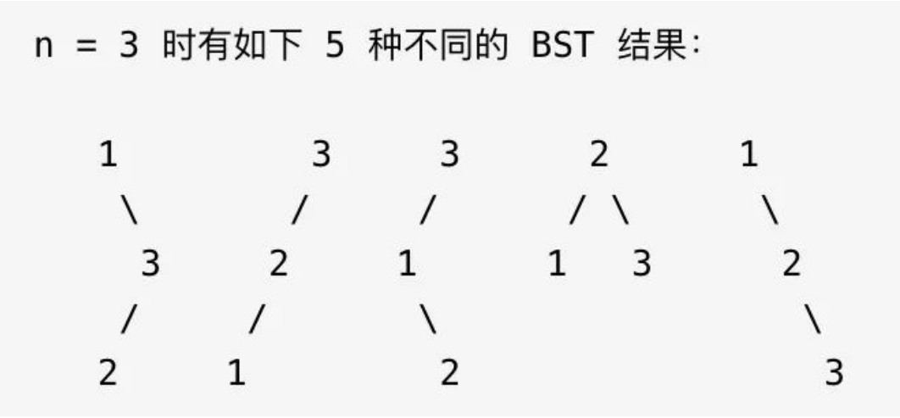

## 二叉搜索树（构造篇）（参考链接：https://mp.weixin.qq.com/s?__biz=MzAxODQxMDM0Mw==&mid=2247490696&idx=1&sn=798a350fcca16c89572caf65323dbec7&scene=21#wechat_redirect）

之前写了两篇手把手刷 BST 算法题的文章，第一篇(5.md) 讲了中序遍历对 BST 的重要意义，第二篇(6.md) 写了 BST 的基本操作。

本文就来写手把手刷 BST 系列的第三篇，循序渐进地讲两道题，如何计算所有合法 BST。

第一道题是力扣第 96 题「不同的二叉搜索树」，给你输入一个正整数n，请你计算，存储{1,2,3...,n}这些值共有有多少种不同的 BST 结构。

函数签名如下：

```
int numTrees(int n);
```

比如说输入n = 3，算法返回 5，因为共有如下 5 种不同的 BST 结构存储{1,2,3}：



这就是一个正宗的穷举问题，那么什么方式能够正确地穷举合法 BST 的数量呢？

我们前文说过，不要小看「穷举」，这是一件看起来简单但是比较有技术含量的事情，问题的关键就是不能数漏，也不能数多，你咋整？

之前 1.md，2.md 说过，二叉树算法的关键就在于明确根节点需要做什么，其实 BST 作为一种特殊的二叉树，核心思路也是一样的。

举个例子，比如给算法输入n = 5，也就是说用{1,2,3,4,5}这些数字去构造 BST。

首先，这棵 BST 的根节点总共有几种情况？

显然有 5 种情况对吧，因为每个数字都可以作为根节点。

比如说我们固定3作为根节点，这个前提下能有几种不同的 BST 呢？

根据 BST 的特性，根节点的左子树都比根节点的值小，右子树的值都比根节点的值大。

所以如果固定3作为根节点，左子树节点就是{1,2}的组合，右子树就是{4,5}的组合。

**左子树的组合数和右子树的组合数乘积**就是3作为根节点时的 BST 个数。

我们这是说了3为根节点这一种特殊情况，其实其他的节点也是一样的。

那你可能会问，我们可以一眼看出{1,2}和{4,5}有几种组合，但是怎么让算法进行计算呢？

其实很简单，只需要递归就行了，我们可以写这样一个函数：

```
// 定义：闭区间 [lo, hi] 的数字能组成 count(lo, hi) 种 BST
int count(int lo, int hi);
```

根据这个函数的定义，结合刚才的分析，可以写出代码：


