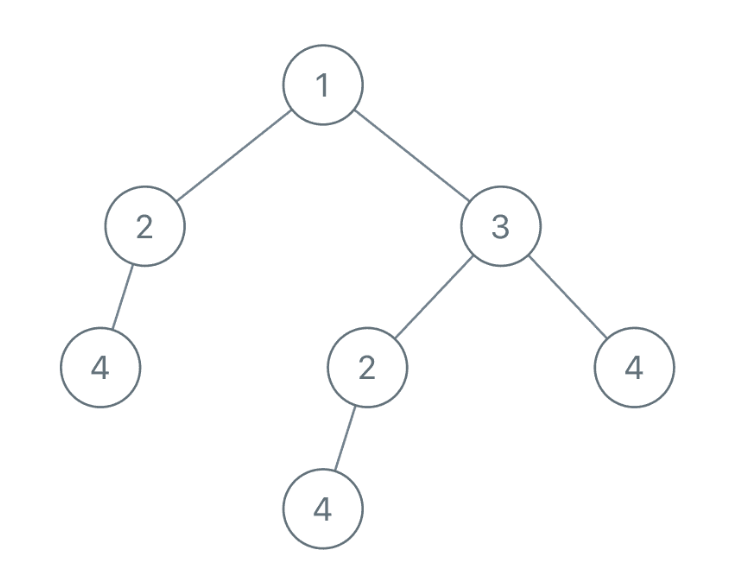
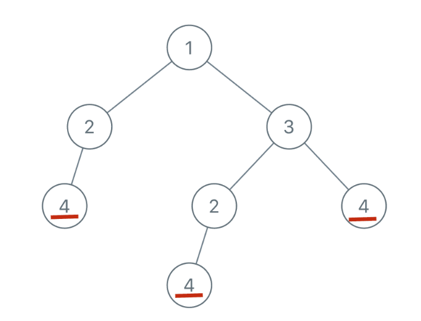
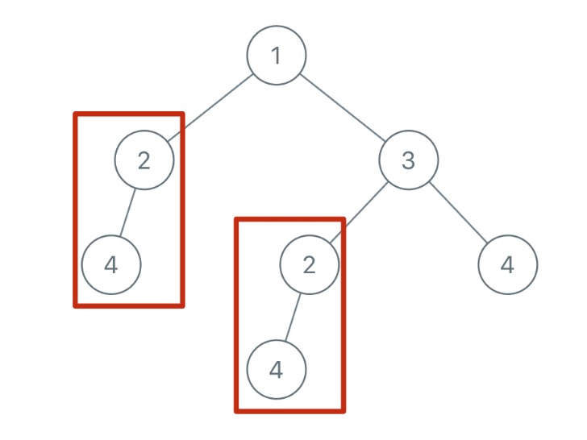
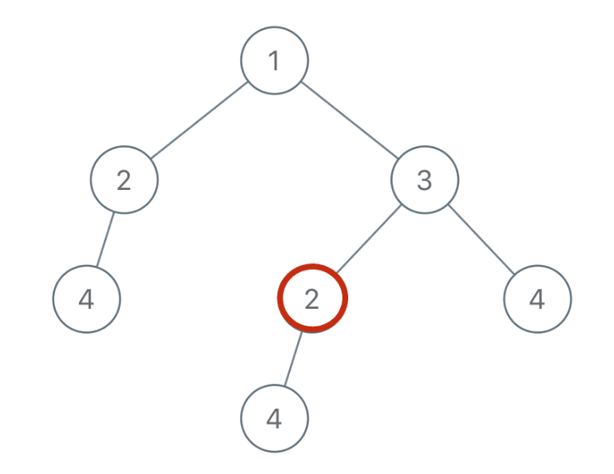

## 二叉树（后序篇）(参考链接: https://mp.weixin.qq.com/s/LJbpo49qppIeRs-FbgjsSQ)

> ps：紧跟4.md

**如何判断我们应该用前序还是中序还是后序遍历的框架**？

那么本文就针对这个问题，不贪多，给你掰开揉碎只讲一道题。

还是那句话，根据题意，思考一个二叉树节点需要做什么，到底用什么遍历顺序就清楚了。

看题，这是力扣第 652 题「寻找重复子树」：


函数签名如下：

```
List<TreeNode> findDuplicateSubtrees(TreeNode root);
```

我来简单解释下题目，输入是一棵二叉树的根节点root，返回的是一个列表，里面装着若干个二叉树节点，这些节点对应的子树在原二叉树中是存在重复的。

说起来比较绕，举例来说，比如输入如下的二叉树：



首先，节点 4 本身可以作为一棵子树，且二叉树中有多个节点 4：



类似的，还存在两棵以 2 为根的重复子树：



那么，我们返回的List中就应该有两个TreeNode，值分别为 4 和 2（具体是哪个节点都无所谓）。

这题咋做呢？**还是老套路，先思考，对于某一个节点，它应该做什么**。

比如说，你站在图中这个节点 2 上：



如果你想知道以自己为根的子树是不是重复的，是否应该被加入结果列表中，你需要知道什么信息？

**你需要知道以下两点**：

**1、以我为根的这棵二叉树（子树）长啥样**？

**2、以其他节点为根的子树都长啥样**？

这就叫知己知彼嘛，我得知道自己长啥样，还得知道别人长啥样，然后才能知道有没有人跟我重复，对不对？

好，那我们一个一个来解决，先来思考，**我如何才能知道以自己为根的二叉树长啥样**？

其实看到这个问题，就可以判断本题要使用「后序遍历」框架来解决：

```
void traverse(TreeNode root) {
    traverse(root.left);
    traverse(root.right);
    /* 解法代码的位置 */
}
```

为什么？很简单呀，我要知道以自己为根的子树长啥样，是不是得先知道我的左右子树长啥样，再加上自己，就构成了整棵子树的样子？

如果你还绕不过来，我再来举个非常简单的例子：计算一棵二叉树有多少个节点。这个代码应该会写吧：

```
int count(TreeNode root) {
    if (root == null) {
        return 0;
    }
    // 先算出左右子树有多少节点
    int left = count(root.left);
    int right = count(root.right);
    /* 后序遍历代码位置 */
    // 加上自己，就是整棵二叉树的节点数
    int res = left + right + 1;
    return res;
}
```

这不就是标准的后序遍历框架嘛，和我们本题在思路上没啥区别对吧。

现在，明确了要用后序遍历，那应该怎么描述一棵二叉树的模样呢？我们前文 序列化和反序列化二叉树(https://mp.weixin.qq.com/s?__biz=MzAxODQxMDM0Mw==&mid=2247485871&idx=1&sn=bcb24ea8927995b585629a8b9caeed01&chksm=9bd7f7a7aca07eb1b4c330382a4e0b916ef5a82ca48db28908ab16563e28a376b5ca6805bec2&scene=21#wechat_redirect) 其实写过了，二叉树的前序/中序/后序遍历结果可以描述二叉树的结构。

所以，我们可以通过拼接字符串的方式把二叉树序列化，看下代码：

```
String traverse(TreeNode root) {
    // 对于空节点，可以用一个特殊字符表示
    if (root == null) {
        return "#";
    }
    // 将左右子树序列化成字符串
    String left = traverse(root.left);
    String right = traverse(root.right);
    /* 后序遍历代码位置 */
    // 左右子树加上自己，就是以自己为根的二叉树序列化结果
    String subTree = left + "," + right + "," + root.val;
    return subTree;
}
```

我们用非数字的特殊符#表示空指针，并且用字符,分隔每个二叉树节点值，这属于序列化二叉树的套路了，不多说。

注意我们subTree是按照左子树、右子树、根节点这样的顺序拼接字符串，也就是后序遍历顺序。你完全可以按照前序或者中序的顺序拼接字符串，因为这里只是为了描述一棵二叉树的样子，什么顺序不重要。

**这样，我们第一个问题就解决了，对于每个节点，递归函数中的subTree变量就可以描述以该节点为根的二叉树**。

**现在我们解决第二个问题，我知道了自己长啥样，怎么知道别人长啥样**？这样我才能知道有没有其他子树跟我重复对吧。

这很简单呀，我们借助一个外部数据结构，让每个节点把自己子树的序列化结果存进去，这样，对于每个节点，不就可以知道有没有其他节点的子树和自己重复了么？

初步思路可以使用HashSet记录子树，代码如下：

```
// 记录所有子树
HashSet<string> memo = new HashSet<>();
// 记录重复的子树根节点
LinkedList<TreeNode> res = new LinkedList<>();

String traverse(TreeNode root) {
    if (root == null) {
        return "#";
    }
    String left = traverse(root.left);
    String right = traverse(root.right);
    String subTree = left + "," + right + "," + root.val;
    
    if (memo.contains(subTree)) {
        // 有人和我重复
        res.add(root);
    } else {
        // 暂时没人跟我重复，把自己加入集合
        memo.add(subTree);
    }
    return subTree;
}
```

但是呢，这有个问题，如果出现多棵重复的子树，结果集res中必然出现重复，而题目要求不希望出现重复。

为了解决这个问题，可以把HashSet升级成HashMap，额外记录每棵子树的出现次数：

```
// 记录所有子树以及出现的次数
HashMap<String, Integer> memo = new HashMap<>();
// 记录重复的子树根节点
LinkedList<TreeNode> res = new LinkedList<>();

/* 主函数 */
List<TreeNode> List<TreeNode> findDuplicateSubtrees(TreeNode root) {
    traverse(root);
    return res;
}

/* 辅助函数 */
String traverse(TreeNode root) {
    if (root == null) {
        return "#";
    }
    String left = traverse(root.left);
    String right = traverse(root.right);
    String subTree = left + "," + right + "," + root.val;
    // 统计subTree出现的次数，没出现则默认为0
    int freq = memo.getOrDefault(subTree, 0);
    // 如果freq为0，则说明没出现过，需要将subTree存到memo中
    // 如果出现的次数为1次，我们需要将root放到res里，
    // 如果出现的次数 > 1，我们不能将root放到res里，因为出现为1次的时候已经将root放到了res里，否则会造成重复
    if (freq == 1) {
        res.add(root);
    }
    // 给子树对应的出现次数+1
    memo.put(subTree, freq + 1);
    return subTree;
}
```

这样，这道题就完全解决了，题目本身算不上难，但是思路拆解下来还是挺有启发性的吧？