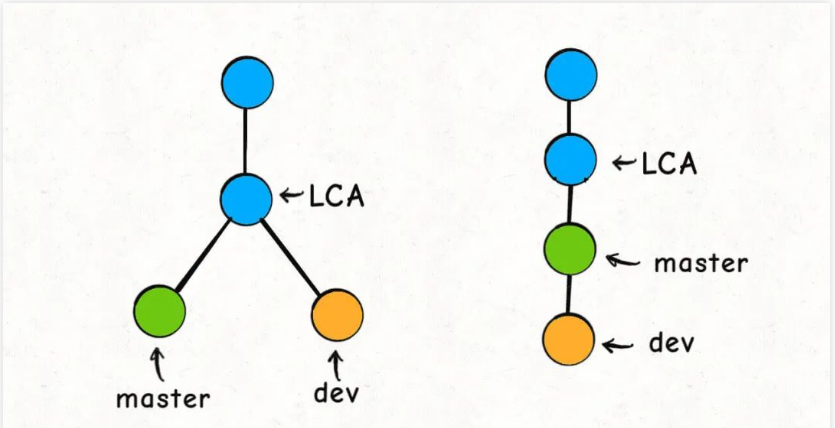
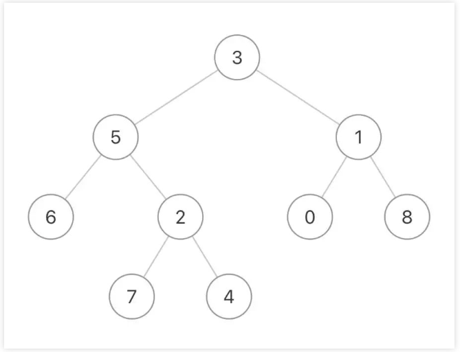
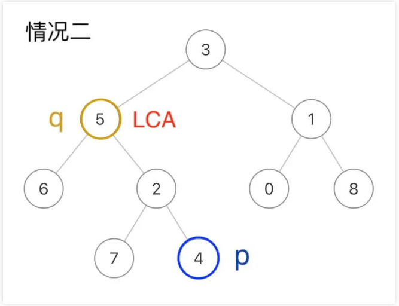
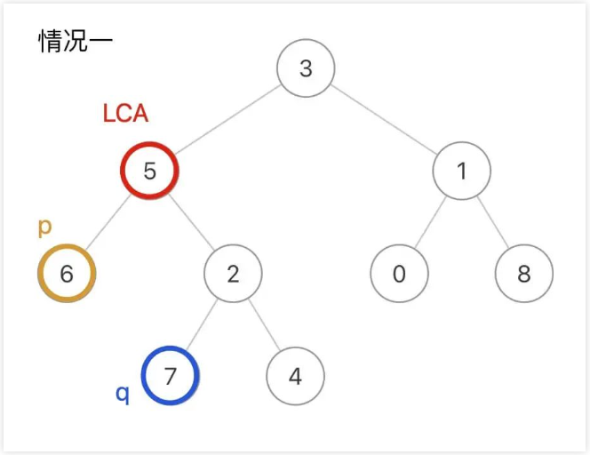
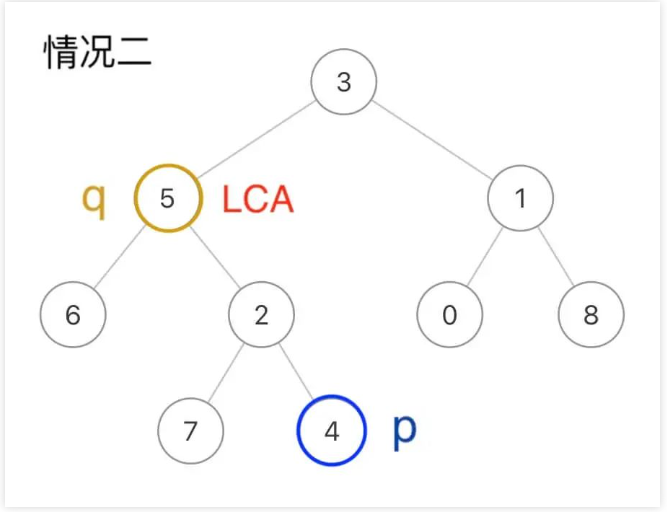

## Git原理之最近公共祖先（参考链接：https://mp.weixin.qq.com/s/njl6nuid0aalZdH5tuDpqQ）

> 读完本文，可以去力扣解决如下题目：236. 二叉树的最近公共祖先（中等）1644. 二叉树的最近公共祖先 II（中等）1650. 二叉树的最近公共祖先 III（中等）1676. 二叉树的最近公共祖先 IV（中等）235. 二叉搜索树的最近公共祖先（简单）

如果说笔试的时候经常遇到各种动归回溯的骚操作，那么面试会倾向于一些比较经典的问题，难度不算大，而且也比较实用。

本文就用 Git 引出一个经典的算法问题：最近公共祖先（Lowest Common Ancestor，简称 LCA）。

git pull 这个命令我们经常会用，它默认是使用 merge 方式将远端别人的修改拉到本地；如果带上参数 git pull -r，就会使用 rebase 的方式将远端修改拉到本地。

这二者最直观的区别就是：merge 方式合并的分支会看到很多「分叉」，而 rebase 方式合并的分支就是一条直线。但无论哪种方式，如果存在冲突，Git 都会检测出来并让你手动解决冲突。

那么问题来了，Git 是如何合并两条分支并检测冲突的呢？

以 rebase 命令为例，比如下图的情况，我站在 dev 分支执行 git rebase master，然后 dev 就会接到 master 分支之上：



这个过程中，Git 是这么做的：

首先，找到这两条分支的最近公共祖先LCA，然后从master节点开始，重演LCA到dev的commit的修改，如果这些修改和LCA到master的commit有冲突，就会提示你手动解决冲突，最后的结果就是把dev的分支完全接到master上面。

那么，Git 是如何找到两条不同分支的最近公共祖先的呢？这就是一个经典的算法问题了，下面我来由浅入深讲一讲。

### 寻找一个元素

先不管最近公共祖先问题，我请你实现一个简单的算法：

给你输入一棵**没有重复元素**的二叉树根节点root和一个目标值val，请你写一个函数寻找树中值为val的节点。

函数签名如下：

```
TreeNode find(TreeNode root, int val);
```

这个函数应该很容易实现对吧，比如我这样写代码：

```
// 定义：在以 root 为根的二叉树中寻找值为 val 的节点
TreeNode find(TreeNode root, int val) {
    // base case
    if (root == null) {
        return null;
    }
    // 看看root.val是不是要找的
    if (root.val == val) {
        return root;
    }
    // root不是目标节点，那就去左子树找
    TreeNode left = find(root.left, val);
    if (left != null) {
        return left;
    }
    // 左子树找不着，那就去右子树找
    TreeNode right = find(root.right, val);
    if (right != null) {
        return right;
    }
    // 实在找不到了
    return null;
}
```

这段代码应该不用我多解释了，但我基于这段代码做一些简单的改写，请你分析一下我的改动会造成什么影响。

首先，我修改一下 return 的位置：

```
TreeNode find(TreeNode root, int val) {
    if (root == null) {
        return null;
    }
    // 前序位置
    if (root.val == val) {
        return root;
    }
    // root 不是目标节点，去左右子树寻找
    TreeNode left = find(root.left, val);
    TreeNode right = find(root.right, val);
    // 看看哪边找到了
    return left != null ? left : right;
}
```

这段代码也可以达到目的，但是实际运行的效率会低一些，原因也很简单，如果你能够在左子树找到目标节点，还有没有必要去右子树找了？没有必要。但这段代码还是会去右子树找一圈，所以效率相对差一些。

更进一步，我把对root.val的判断从前序位置移动到后序位置：

```
TreeNode find(TreeNode root, int val) {
    if (root == null) {
        return null;
    }
    // 先去左右子树寻找
    TreeNode left = find(root.left, val);
    TreeNode right = find(root.right, val);
    // 后序位置，看看 root 是不是目标节点
    if (root.val == val) {
        return root;
    }
    // root 不是目标节点，再去看看哪边的子树找到了
    return left != null ? left : right;
}
```

这段代码相当于你先去左右子树找，然后才检查root，依然可以到达目的，但是效率会进一步下降。**因为这种写法必然会遍历二叉树的每一个节点**。

对于之前的解法，你在前序位置就检查root，如果输入的二叉树根节点的值恰好就是目标值val，那么函数直接结束了，其他的节点根本不用搜索。

但如果你在后序位置判断，那么就算根节点就是目标节点，你也要去左右子树遍历完所有节点才能判断出来。

最后，我再改一下题目，现在不让你找值为val的节点，而是寻找值为val1或val2的节点，函数签名如下：

```
TreeNode find(TreeNode root, int val1, int val2);
```

这和我们第一次实现的find函数基本上是一样的，而且你应该知道可以有多种写法，我选择这样写代码：

```
// 定义：在以root为根的二叉树中寻找值为val1或val2的节点
TreeNode find(TreeNode root, int val1, int val2) {
    // base case
    if (root == null) {
        return null;
    }
    // 前序位置，看看root是不是目标值
    if (root.val == val1 || root.val == val2) {
        return root;
    }
    // 去左右子树寻找
    TreeNode left = find(root.left, val1, val2);
    TreeNode right = find(root.right, val1, val2);
    // 后序位置，已经知道左右子树是否存在目标值
    return left != null ? left : right;
}
```

**为什么要写这样一个奇怪的find函数呢？因为最近公共祖先系列问题的解法都是把这个函数作为框架的**。

下面一道一道题目来看。

### 秒杀五道题目

先来看看力扣第 236 题「二叉树的最近公共祖先」：

给你输入一棵**不含重复值**的二叉树，以及**存在于树中的**两个节点p和q，请你计算p和q的最近公共祖先节点。

> PS：后文我用LCA（Lowest Common Ancestor）作为最近公共祖先节点的缩写

比如输入这样一棵二叉树：



如果p是节点6，q是节点7，那么它俩的LCA就是节点5：


当然，p和q本身也可能是LCA，比如这种情况q本身就是LCA节点：



两个节点的最近公共祖先其实就是这两个节点向根节点的「延长线」的交汇点，那么对于任意一个节点，它怎么才能知道自己是不是p和q的最近公共祖先？

**如果一个节点能够在它的左右子树中分别找到p和q，则该节点为LCA节点**。

这就要用到之前实现的find函数了，只需在后序位置添加一个判断逻辑，即可改造成寻找最近公共祖先的解法代码：

```
TreeNode lowestCommonAncestor(TreeNode root, TreeNode p, TreeNode q) {
    return find(root, p.val, q.val);
}

// 在二叉树中寻找val1和val2的最近公共祖先节点
TreeNode find(TreeNode root, int val1, int val2) {
    if (root == null) {
        return null;
    }
    // 前序位置检查root.val
    if (root.val == val1 || root.val == val2) {
        // 如果遇到目标值，则直接返回
        return root;
    }
    // 检查左右子树
    TreeNode left = find(root.left, val1, val2);
    TreeNode right = find(root.right, val1, val2);
    // 后序位置，已经知道左右子树是否存在目标值
    if (left != null && right != null) {
        return root;
    }
    return left != null ? left : right;
}
```

在find函数的后序位置，如果发现left和right都非空，就说明当前节点是LCA节点，即解决了第一种情况：



在find函数的前序位置，如果找到一个值为val1或val2的节点则直接返回，恰好解决了第二种情况：(像下图，我们遇到了5直接返回 在3中left为5，right为null,所以依然返回了5)



因为题目说了p和q一定存在于二叉树中(这点很重要），所以即便我们遇到q就直接返回，根本没遍历到p，也依然可以断定p在q底下，q就是LCA节点。

这样，标准的最近公共祖先问题就解决了，接下来看看这个题目有什么变体。