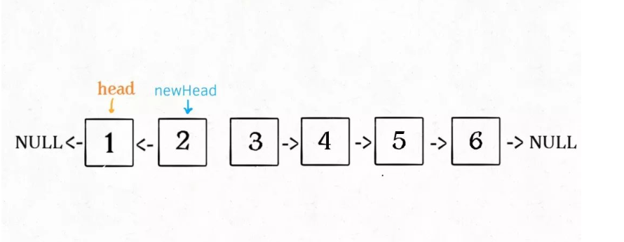

## 递归思维：k 个一组反转链表 (参考链接：https://mp.weixin.qq.com/s?__biz=MzAxODQxMDM0Mw==&mid=2247484597&idx=1&sn=c603f1752e33cb2701e371d84254aee2&scene=21#wechat_redirect)

上篇我们学习了递归反转链表，今天学习一下迭代反转链表。加油！！！

本文要解决「K 个一组反转链表」，不难理解：


这个问题经常在面经中看到，而且 LeetCode 上难度是 Hard，它真的有那么难吗？

对于基本数据结构的算法问题其实都不难，只要结合特点一点点拆解分析，一般都没啥难点。下面我们就来拆解一下这个问题。

### 一、分析问题

首先，链表是一种兼具递归和迭代性质的数据结构，认真思考一下可以发现这个问题具有递归性质。

什么叫递归性质？直接上图理解，比如说我们对这个链表调用 reverseKGroup(head, 2)，即以 2 个节点为一组反转链表：


如果我设法把前 2 个节点反转，那么后面的那些节点怎么处理？后面的这些节点也是一条链表，而且规模（长度）比原来这条链表小，这就叫子问题。


我们可以直接递归调用 reverseKGroup(head, 2)，因为子问题和原问题的结构完全相同，这就是所谓的递归性质。

发现了递归性质，就可以得到大致的算法流程：

**1、先反转以 head 开头的 k 个元素**。



**2、将第 k + 1 个元素作为 head 递归调用 reverseKGroup 函数**。


**3、将上述两个过程的结果连接起来**。


整体思路就是这样了，最后一点值得注意的是，递归函数都有个 base case，对于这个问题是什么呢？

题目说了，**如果最后的元素不足 k 个，就保持不变。这就是 base case**，待会会在代码里体现。

### 二、代码实现

首先，我们要实现一个 reverse 函数反转一个区间之内的元素。在此之前我们再简化一下，给定链表头结点，如何反转整个链表？

```
// 反转以 a 为头结点的链表
ListNode reverse(ListNode a) {
    ListNode pre, cur, nxt;
    pre = null; cur = a; nxt = a;
    while(cur != null) {
        nxt = cur.next;
        cur.next = pre;
        pre = cur;
        cur = nxt;
    }
    // 返回反转后的头结点
    return pre;
}
```

这次使用迭代思路来实现的，借助动画理解应该很容易。


「反转以 a 为头结点的链表」其实就是「反转 a 到 null 之间的结点」，那么如果让你「反转 a 到 b 之间的结点」，你会不会？

只要更改函数签名，并把上面的代码中 null 改成 b 即可：

```
/** 反转区间 [a, b) 的元素，注意是左闭右开 */
ListNode reverse(ListNode a, ListNode b) {
    ListNode pre, cur, nxt;
    pre = null; cur = a; nxt = a;
     // while 终止的条件改一下就行了
    while (cur != b) {
        nxt = cur.next;
        cur.next = pre;
        pre = cur;
        cur = nxt;
    }
    // 返回反转后的头结点
    return pre;
}
```

现在我们迭代实现了反转部分链表的功能，接下来就按照之前的逻辑编写 reverseKGroup 函数即可：

```
ListNode reverseKGroup(ListNode head, int k) {
    if (head == null) return null;
    // 区间[a, b)包含k个待反转元素
    ListNode a, b;
    a = b = head;
    // 比如k为2，1->2->3->4->5->null
    // 我们遍历从0开始，i < k 即k = 0、1，每次b = b.next，循环两次 b为3->4->...
    // k为2所以[a, b)为什么b是开区间，因为我们只需要反转1->2就行，因为1 2就是2个元素
    for(int i = 0; i < k; i++) {
        // 不足k个，不需要反转，base case
        // 比如上面的1->2->3->4->5->null，第一次[a, b)为13，然后紧接着35 然后从5开始反转2个，这时候b = b.next b变为了null
        // 说明数量不足，我们直接返回head也就是5->null
        if (b == null) return head; 
        b = b.next;
    }
    // 反转从[a, b)
    var newHead = reverse(a, b);
    // 继续往后递归，因为上面a-b已经反转了，所以我们让a.next = 后面的就可以
    a.next = reverseKGroup(b, k);
    return newHead;
}
```

解释一下 for 循环之后的几句代码，注意 reverse 函数是反转区间 [a, b)，所以情形是这样的：


递归部分就不展开了，整个函数递归完成之后就是这个结果，完全符合题意：


