## 双指针技巧秒杀七道链表题目(单链表的六大解题套路，你都见过么？参考链接：https://mp.weixin.qq.com/s?__biz=MzAxODQxMDM0Mw==&mid=2247492022&idx=1&sn=35f6cb8ab60794f8f52338fab3e5cda5&scene=21#wechat_redirect)

本文就总结一下单链表的基本技巧，每个技巧都对应着至少一道算法题：

1、合并两个有序链表

2、合并k个有序链表

3、寻找单链表的倒数第k个节点

4、寻找单链表的中点

5、判断单链表是否包含环并找出环起点

6、判断两个单链表是否相交并找出交点

这些解法都用到了双指针技巧，所以说对于单链表相关的题目，双指针的运用是非常广泛的，下面我们就来一个一个看。

### 合并两个有序链表

这是最基本的链表技巧，力扣第 21 题「合并两个有序链表」就是这个问题：

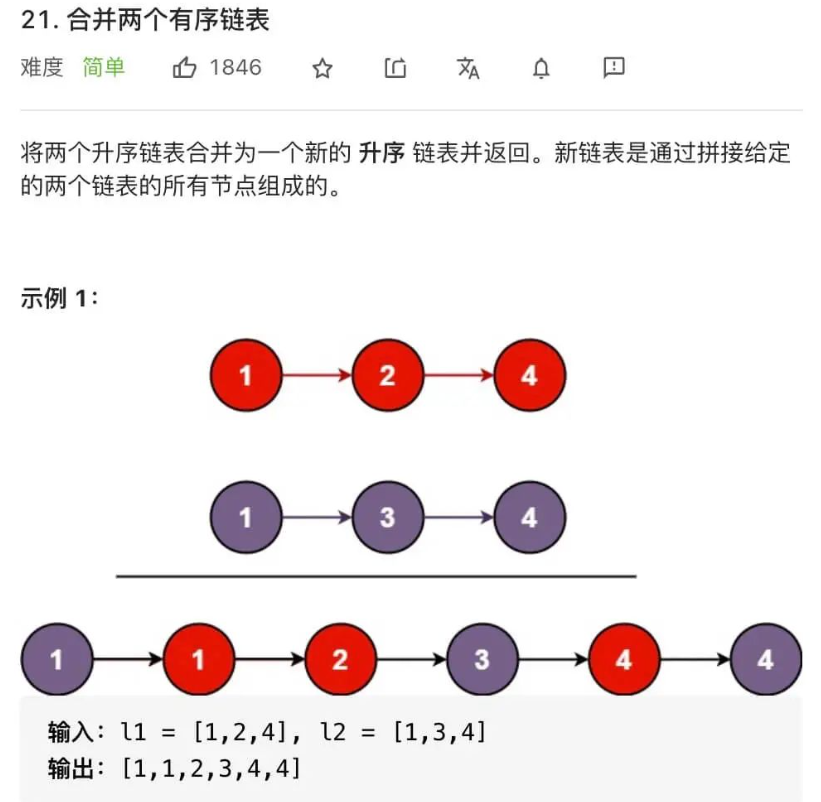

给你输入两个有序链表，请你把他俩合并成一个新的有序链表，函数签名如下：

```
ListNode mergeTwoLists(ListNode l1, ListNode l2);
```

这题比较简单，我们直接看解法：

```
ListNode mergeTwoLists(ListNode l1, ListNode l2) {
    // 虚拟头节点
    ListNode dummy = new ListNode(-1), p = dummy;
    ListNode p1 = l1, p2 = l2;
    
    while(p1 != null && p2 != null) {
        // 比较 p1 和 p2 两个指针
        // 将值较小的的节点接到 p 指针
        if (p1.val > p2.val) {
            p.next = p2;
            p2 = p2.next;
        } else {
            p.next = p1;
            p1 = p1.next;
        }
        // p 指针不断前进
        p = p.next;
    }
    // 剩下的直接拼接上去
    if (p1 != null) {
        p.next = p1;
    }
    if (p2 != null) {
        p.next = p2;
    }
    return dummy.next;
}
```

我们的 while 循环每次比较p1和p2的大小，把较小的节点接到结果链表上：

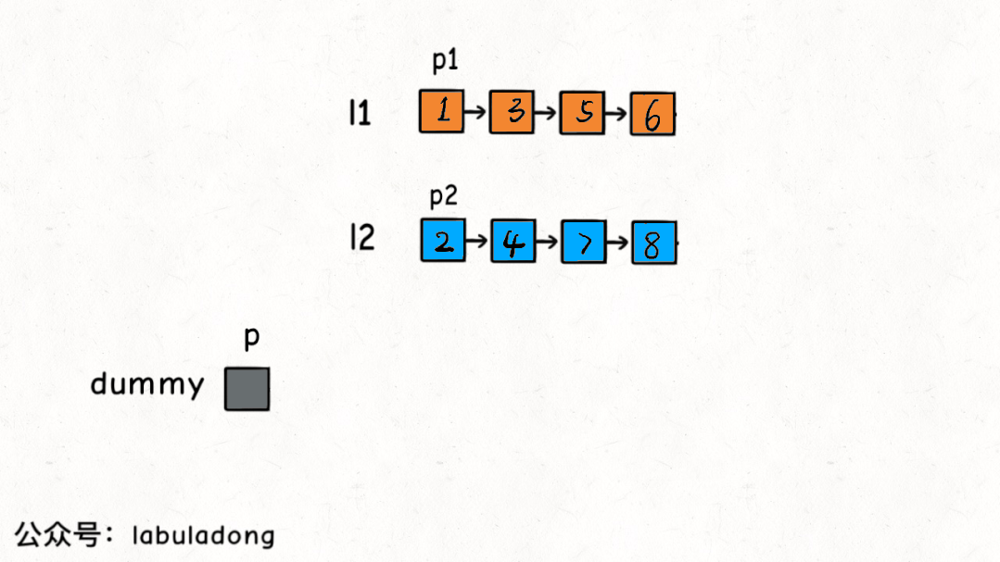

这个算法的逻辑类似于「拉拉链」，l1, l2类似于拉链两侧的锯齿，指针p就好像拉链的拉索，将两个有序链表合并。

**代码中还用到一个链表的算法题中是很常见的「虚拟头节点」技巧，也就是dummy节点**。你可以试试，如果不使用dummy虚拟节点，代码会复杂很多，而有了dummy节点这个占位符，可以避免处理空指针的情况，降低代码的复杂性。

### 合并 k 个有序链表

看下力扣第 23 题「合并K个升序链表」：

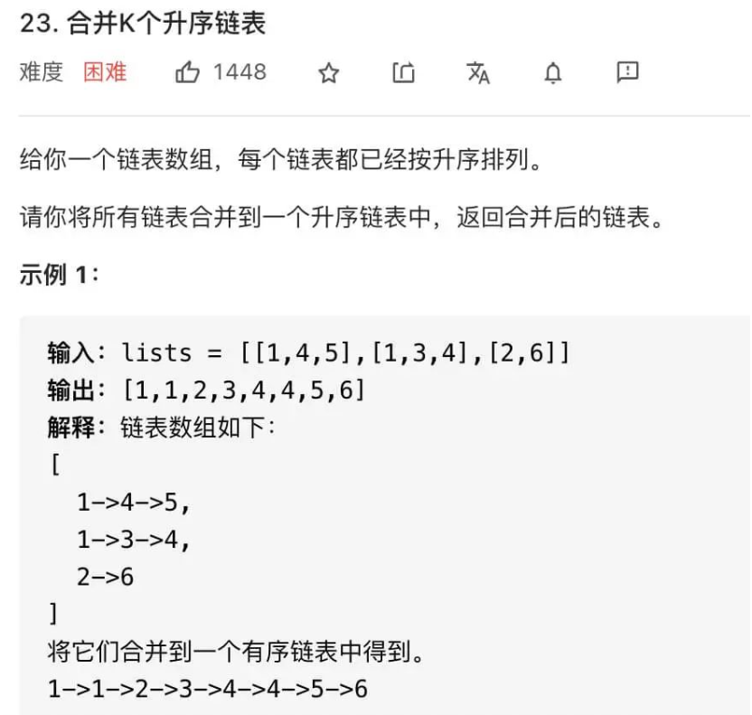

函数签名如下：

```
ListNode mergeKLists(ListNode[] lists);
```

合并k个有序链表的逻辑类似合并两个有序链表，难点在于，如何快速得到k个节点中的最小节点，接到结果链表上？

这里我们就要用到 优先级队列（二叉堆）(https://mp.weixin.qq.com/s?__biz=MzAxODQxMDM0Mw==&mid=2247484495&idx=1&sn=bbfeba9bb5cfd50598e2a4d08c839ee9&scene=21#wechat_redirect) 这种数据结构，把链表节点放入一个最小堆，就可以每次获得k个节点中的最小节点：

```
ListNode mergeKLists(ListNode[] lists) {
    if (lists.length == 0) return null;
    // 虚拟头节点
    ListNode dummy = new ListNode(-1), p = dummy;
    // 优先队列，最小堆
    PriorityQueue<ListNode> pq = new PriorityQueue<>(lists.length, (a, b) => (a.val - b.val));
    // 将k个链表的头节点加入最小堆
    for(ListNode head : lists) {
        if (head != null) {
            pq.add(head);
        }
    }
    while(pq.isEmpty()) {
        // 获取最小节点，接到结果链表里
        ListNode node = pq.poll();
        p.next = node;
        if (node.next != null) {
            // 如果node.next不为null，将node.next继续放到pq里
            pq.add(node.next);
        }
        // p指针不断前进
        p = p.next;
    }
    return dummy.next;
}
```

这个算法是面试常考题，它的时间复杂度是多少呢？

优先队列pq中的元素个数最多是k，所以一次poll或者add方法的时间复杂度是O(logk)；所有的链表节点都会被加入和弹出pq，**所以算法整体的时间复杂度是O(Nlogk)，其中k是链表的条数，N是这些链表的节点总数**。

> ps: pq的长度为lists.length(k)，每次poll或者add，重新排列的时间复杂度是O(logk)，然后假设有N个链表的节点数，所有的时间复杂度为O(Nlogk)。

### 单链表的倒数第 k 个节点

从前往后寻找单链表的第k个节点很简单，一个 for 循环遍历过去就找到了，但是如何寻找从后往前数的第k个节点呢？

那你可能说，假设链表有n个节点，倒数第k个节点就是正数第n - k个节点，不也是一个 for 循环的事儿吗？

是的，但是算法题一般只给你一个ListNode头结点代表一条单链表，你不能直接得出这条链表的长度n，而需要先遍历一遍链表算出n的值，然后再遍历链表计算第n - k个节点。

也就是说，这个解法需要遍历两次链表才能得到出倒数第k个节点。

那么，我们能不能**只遍历一次链表**，就算出倒数第k个节点？可以做到的，如果是面试问到这道题，面试官肯定也是希望你给出只需遍历一次链表的解法。

这个解法就比较巧妙了，假设k = 2，思路如下：

首先，我们先让一个指针p1指向链表的头节点head，然后走k步：

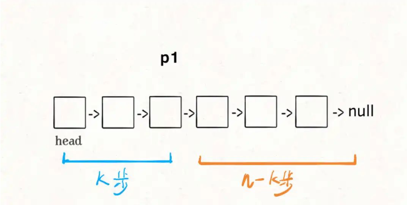

现在的p1，只要再走n - k步，就能走到链表末尾的空指针了对吧？

趁这个时候，再用一个指针p2指向链表头节点head：

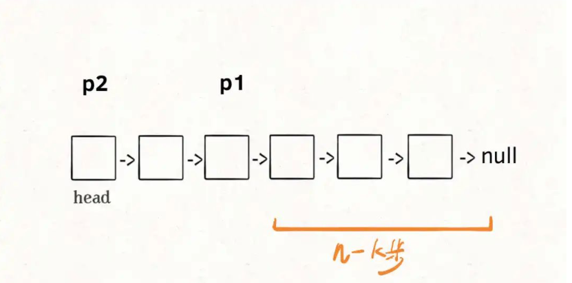

接下来就很显然了，让p1和p2同时向前走，p1走到链表末尾的空指针时走了n - k步，p2也走了n - k步，也就恰好到达了链表的倒数第k个节点：

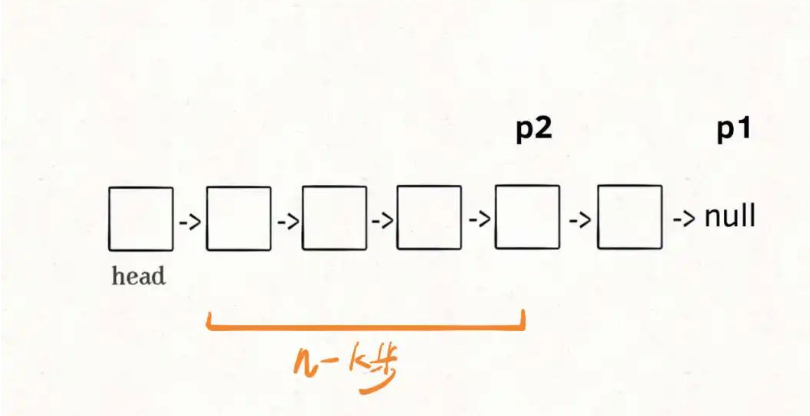

这样，只遍历了一次链表，就获得了倒数第k个节点p2。

> !!!ps: 关于链表的一些总结:(n个节点从head走n步走到链表结尾null，如果我们要找倒数第2个节点(下图中的4)，其实正数走n-k步也就是4步就可以了)

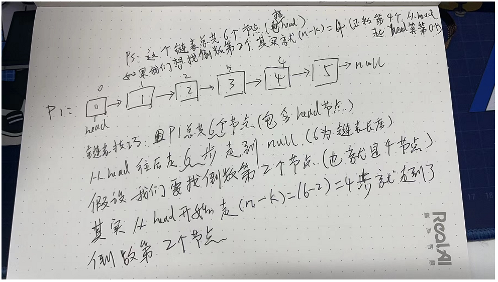

上述逻辑的代码如下：

```
// 返回链表的倒数第 k 个节点
ListNode findFromEnd(ListNode head, int k) {
    ListNode p1 = head;
    // p1先走k步
    for(int i = 0; i < k; i++) {
        p1 = p1.next;
    }
    // 重新定义p2指针
    ListNode p2 = head;
    // p1和p2同时走n-k步
    while(p1 != null) {
        p1 = p1.next;
        p2 = p2.next;
    }
    // 当p1走了n-k步就走到了Null结尾，然后p2走了n-k步就是倒数第k个元素
    return p2;
}
```

当然，如果用 big O 表示法来计算时间复杂度，无论遍历一次链表和遍历两次链表的时间复杂度都是O(N)，但上述这个算法更有技巧性。

很多链表相关的算法题都会用到这个技巧，比如说力扣第 19 题「删除链表的倒数第 N 个结点」：

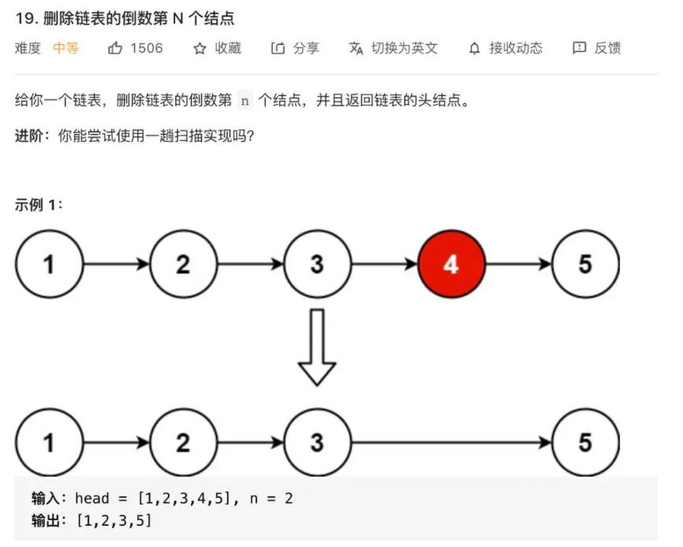

我们直接看解法代码：

```
// 主函数
public ListNode removeNthFromEnd(ListNode head, int n) {
    // 虚拟头节点（为了能够从dummy节点开始走n步（n为包含头节点的链表数）走到Null）
    ListNode dummy = new ListNode(-1);
    dummy.next = head;
    // 删除倒数第n个，要先找到倒数第n+1个节点
    ListNode x = findFromEnd(dummy, n + 1);
    x.next = x.next.next;
    return dummy.next;
}

private ListNode findFromEnd(ListNode head, int k) {
    // 代码见上文
}
```

这个逻辑就很简单了，要删除倒数第n个节点，就得获得倒数第n + 1个节点的引用，可以用我们实现的findFromEnd来操作。

不过注意我们又使用了虚拟头结点的技巧，也是为了防止出现空指针的情况，比如说链表总共有 5 个节点，题目就让你删除倒数第 5 个节点，也就是第一个节点，
那按照算法逻辑，应该首先找到倒数第 6 个节点。但第一个节点前面已经没有节点了，这就会出错。

但有了我们虚拟节点dummy的存在，就避免了这个问题，能够对这种情况进行正确的删除。

### 单链表的中点

力扣第 876 题「链表的中间结点」就是这个题目，问题的关键也在于我们无法直接得到单链表的长度n，常规方法也是先遍历链表计算n，再遍历一次得到第n / 2个节点，也就是中间节点。

如果想一次遍历就得到中间节点，也需要耍点小聪明，使用「快慢指针」的技巧：

我们让两个指针slow和fast分别指向链表头结点head。

**每当慢指针slow前进一步，快指针fast就前进两步，这样，当fast走到链表末尾时，slow就指向了链表中点**。

上述思路的代码实现如下：

```
ListNode middleNode(ListNode head) {
    // 快慢指针初始化指向Head
    ListNode slow = head, fast = head;
    // 快指针走到末尾时停止
    while(fast != null && fast.next != null) {
        // 慢指针走一步，快指针走两步
        fast = fast.next.next;
        slow = slow.next;
    }
    // 慢指针指向中点
    return slow;
}
```

需要注意的是，如果链表长度为偶数，也就是说中点有两个的时候，我们这个解法返回的节点是靠后的那个节点。

另外，这段代码稍加修改就可以直接用到判断链表成环的算法题上。

### 判断链表是否包含环

判断单链表是否包含环属于经典问题了，解决方案也是用快慢指针：

每当慢指针slow前进一步，快指针fast就前进两步。

如果fast最终遇到空指针，说明链表中没有环；如果fast最终和slow相遇，那肯定是fast超过了slow一圈，说明链表中含有环。

只需要把寻找链表中点的代码稍加修改就行了：

```
boolean hasCycle(ListNode head) {
    // 快慢指针初始化指向head
    ListNode slow = head, fast = head;
    // 快指针走到末尾时停止
    while(fast != null && fast.next != null) {
        // 慢指针走一步，快指针走两步
        slow = slow.next;
        fast = fast.next.next;
        if (fast == slow) {
            return true;
        }
    }
    // 不包含环
    return false;
}
```

当然，这个问题还有进阶版：如果链表中含有环，如何计算这个环的起点？

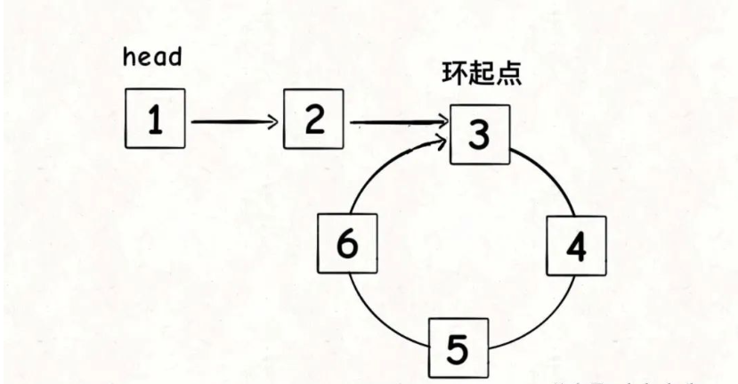

这里简单提一下解法：

```
ListNode detectCycle(ListNode head) {
    ListNode fast, slow;
    fast = slow = head;
    while(fast != null && fast.next != null) {
        slow = slow.next;
        fast = fast.next.next;
        // 找到快慢指针相交点后结束循环
        if (slow == false) break; 
    }
    if (fast == null || fast.next == null) {
        // fast遇到空指针说明没有环
        return null;
    }
    // 重新指向头节点(slow或者fast都可以)
    slow = head;
    // 快慢指针同步前进，相交点就是环起点
    while(fast != slow) {
        slow = slow.next;
        fast = fast.next;
    }
    return slow;
}
```

可以看到，当快慢指针相遇时，让其中任一个指针指向头节点，然后让它俩以相同速度前进，再次相遇时所在的节点位置就是环开始的位置。

我们假设快慢指针相遇时，慢指针slow走了k步，那么快指针fast一定走了2k步：

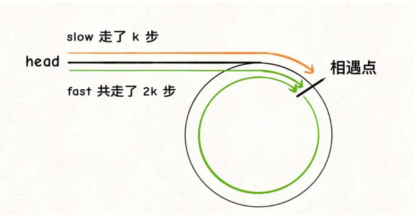

**fast一定比slow多走了k步，这多走的k步其实就是fast指针在环里转圈圈，所以k的值就是环长度的「整数倍」**。

**假设相遇点距环的起点的距离为m，那么结合上图的 slow 指针，环的起点距头结点head的距离为k - m，也就是说如果从head前进k - m步就能到达环起点**。

**巧的是，如果从相遇点继续前进k - m步，也恰好到达环起点。因为结合上图的 fast 指针，从相遇点开始走k步可以转回到相遇点，那走k - m步肯定就走到环起点了**：

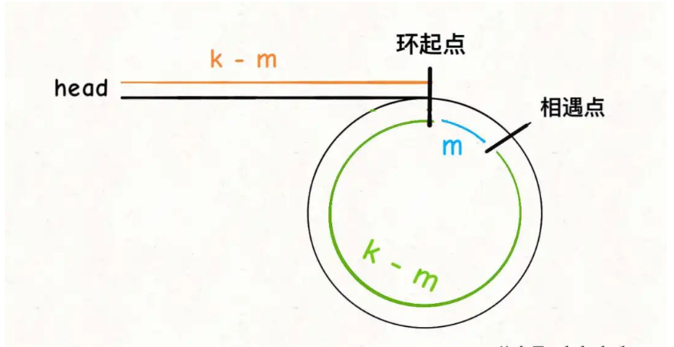

**所以，只要我们把快慢指针中的任一个重新指向head，然后两个指针同速前进，k - m步后一定会相遇，相遇之处就是环的起点了**。

### 两个链表是否相交

这个问题有意思，也是力扣第 160 题「相交链表」函数签名如下：

```
ListNode getIntersectionNode(ListNode headA, ListNode headB);
```

给你输入两个链表的头结点headA和headB，这两个链表可能存在相交。

如果相交，你的算法应该返回相交的那个节点；如果没相交，则返回 null。

比如题目给我们举的例子，如果输入的两个链表如下图：

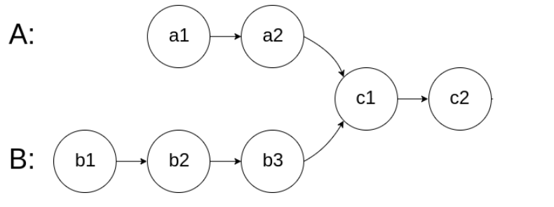

那么我们的算法应该返回c1这个节点。

这个题直接的想法可能是用HashSet记录一个链表的所有节点，然后和另一条链表对比，但这就需要额外的空间。

如果不用额外的空间，只使用两个指针，你如何做呢？

难点在于，由于两条链表的长度可能不同，两条链表之间的节点无法对应

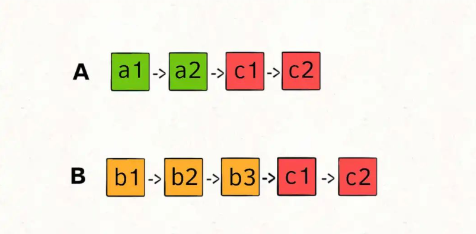

如果用两个指针p1和p2分别在两条链表上前进，并不能同时走到公共节点，也就无法得到相交节点c1。

**所以，解决这个问题的关键是，通过某些方式，让p1和p2能够同时到达相交节点c1**。

所以，我们可以让p1遍历完链表A之后开始遍历链表B，让p2遍历完链表B之后开始遍历链表A，这样相当于「逻辑上」两条链表接在了一起。

如果这样进行拼接，就可以让p1和p2同时进入公共部分，也就是同时到达相交节点c1：

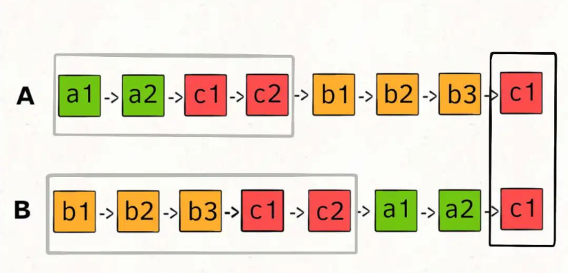

那你可能会问，如果说两个链表没有相交点，是否能够正确的返回 null 呢？

这个逻辑可以覆盖这种情况的，相当于c1节点是 null 空指针嘛，可以正确返回 null。

按照这个思路，可以写出如下代码：

```
ListNode getIntersectionNode(ListNode headA, ListNode headB) {
    // p1 指向 A 链表头结点，p2 指向 B 链表头结点
    ListNode p1 = headA, p2 = headB;
    while(p1 != p2) {
        // p1 走一步，如果走到 A 链表末尾，转到 B 链表
        if (p1 != null) {
            p1 = p1.next;
        } else {
            // 如果走到头了让p1指向headB
            p1 = headB;
        }
        // p2 走一步，如果走到 B 链表末尾，转到 A 链表
        if (p2 != null) {
            p2 = p2.next;
        } else {
            // 如果走到头了让p1指向headB
            p2 = headA;
        }
    }
    return p1;
}
```

这样，这道题就解决了，空间复杂度为O(1)，时间复杂度为O(N)。


