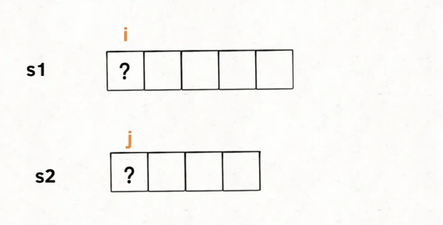
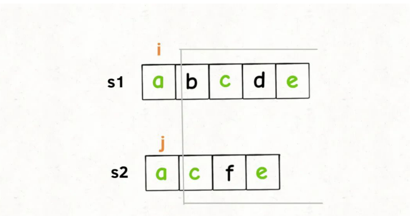
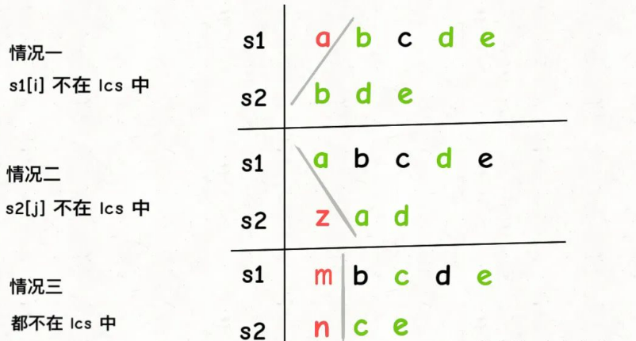
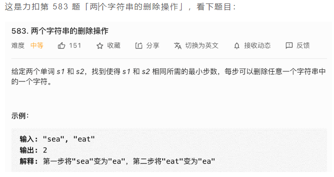
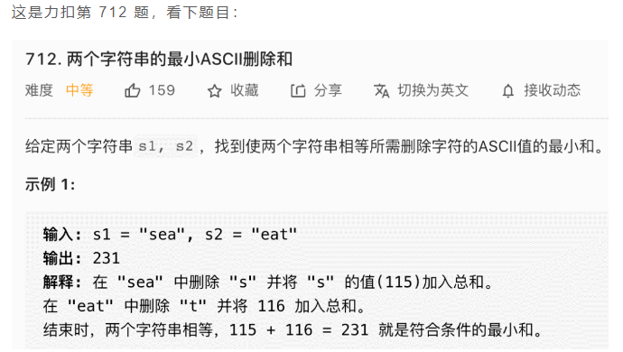

## 最长公共子序列
读完本文，可以去力扣解决如下题目：
+ 1143 最长公共子序列（Medium）
+ 583 两个字符串的删除操作（Medium）
+ 712 两个字符串的最小ASCII删除和（Medium）


不知道大家做算法题有什么感觉，我总结出来做算法题的技巧就是，把大的问题细化到一个点，先研究在这个小的点上如何解决问题，然后再通过递归/迭代的方式扩展到整个问题。

比如说我们前文 手把手带你刷二叉树第三期，解决二叉树的题目，我们就会把整个问题细化到某一个节点上，想象自己站在某个节点上，需要做什么，然后套二叉树递归框架就行了。

动态规划系列问题也是一样，尤其是子序列相关的问题。本文从「最长公共子序列问题」展开，总结三道子序列问题，解这道题仔细讲讲这种子序列问题的套路，你就能感受到这种思维方式了。

## 最长公共子序列

计算最长公共子序列（Longest Common Subsequence，简称 LCS）是一道经典的动态规划题目，大家应该都见过：

给你输入两个字符串s1和s2，请你找出他们俩的最长公共子序列，返回这个子序列的长度。

力扣第 1143 题就是这道题，函数签名如下：

```
int longestCommonSubsequence(String s1, String s2);
```

比如说输入s1 = "zabcde", s2 = "acez"，它俩的最长公共子序列是lcs = "ace"，长度为 3，所以算法返回 3。

如果没有做过这道题，一个最简单的暴力算法就是，把s1和s2的所有子序列都穷举出来，然后看看有没有公共的，然后在所有公共子序列里面再寻找一个长度最大的。

显然，这种思路的复杂度非常高，你要穷举出所有子序列，这个复杂度就是指数级的，肯定不实际。

正确的思路是不要考虑整个字符串，而是细化到s1和s2的每个字符。前文 子序列解题模板 中总结的一个规律：

**对于两个字符串求子序列的问题，都是用两个指针i和j分别在两个字符串上移动，大概率是动态规划思路。**

最长公共子序列的问题也可以遵循这个规律，我们可以先写一个dp函数：

```
// 定义：计算 s1[i..] 和 s2[j..] 的最长公共子序列长度
int dp(String s1, int i, String s2, int j)
```

这个dp函数的定义是：dp(s1, i, s2, j)计算s1[i..]和s2[j..]的最长公共子序列长度。

根据这个定义，那么我们想要的答案就是dp(s1, 0, s2, 0)，且 base case 就是i == len(s1)或j == len(s2)时，因为这时候s1[i..]或s2[j..]就相当于空串了，最长公共子序列的长度显然是 0：

```
int longestCommonSubsequence(String s1, String s2) {
  return dp(s1, 0, s2, 0);
}

/* 主函数 */
int dp(String s1, int i, String s2, int j) {
  // base case
  if (i == s1.length() || j == s2.length()) {
    return 0;
  }
  // ...
```

**接下来，咱不要看s1和s2两个字符串，而是要具体到每一个字符，思考每个字符该做什么。**



我们只看s1[i]和s2[j]，如果s1[i] == s2[j]，说明这个字符一定在lcs中：



这样，就找到了一个lcs中的字符，根据dp函数的定义，我们可以完善一下代码：

```
// 定义：计算 s1[i..] 和 s2[j..] 的最长公共子序列长度
int dp(String s1, int i, String s2, int j) {
  if (s1.charAt(i) == s2.charAt(j)) {
    // s1[i] 和 s2[j] 必然在 lcs 中，
    // 加上 s1[i+1..] 和 s2[j+1..] 中的 lcs 长度，就是答案
    return 1 + dp(s1, i + 1, s2, j + 1)
  } else {
    // ...
  }
}
```

刚才说的s1[i] == s2[j]的情况，但如果s1[i] != s2[j]，应该怎么办呢？

s1[i] != s2[j]意味着，s1[i]和s2[j]中至少有一个字符不在lcs中：



如上图，总共可能有三种情况，我怎么知道具体是那种情况呢？

其实我们也不知道，那就把这三种情况的答案都算出来，取其中结果最大的那个呗，因为题目让我们算「最长」公共子序列的长度嘛。

这三种情况的答案怎么算？回想一下我们的dp函数定义，不就是专门为了计算它们而设计的嘛！

代码可以再进一步：

```
// 定义：计算 s1[i..] 和 s2[j..] 的最长公共子序列长度
int dp(String s1, int i, String s2, int j) {
  if (s1.charAt(i) == s2.charAt(j)) {
    return 1 + dp(s1, i + 1, s2, j + 1)
  } else {
    // s1[i] 和 s2[j] 中至少有一个字符不在 lcs 中，
    // 穷举三种情况的结果，取其中的最大结果
    return max(
      // 情况一、s1[i] 不在 lcs 中
      dp(s1, i + 1, s2, j),
      // 情况二、s2[j] 不在 lcs 中
      dp(s1, i, s2, j + 1),
      // 情况三、都不在 lcs 中
      dp(s1, i + 1, s2, j + 1)
    );
  }
}
```

这里就已经非常接近我们的最终答案了，还有一个小的优化，情况三「s1[i]和s2[j]都不在 lcs 中」其实可以直接忽略。

因为我们在求最大值嘛，情况三在计算s1[i+1..]和s2[j+1..]的lcs长度，这个长度肯定是小于等于情况二s1[i..]和s2[j+1..]中的lcs长度的，因为s1[i+1..]比s1[i..]短嘛，那从这里面算出的lcs当然也不可能更长嘛。

同理，情况三的结果肯定也小于等于情况一。说白了，情况三被情况一和情况二包含了，所以我们可以直接忽略掉情况三，完整代码如下：

```
// 备忘录，消除重叠子问题
int[][] memo;

/* 主函数 */
int longestCommonSubsequence(String s1, String s2) {
  int m = s1.length(), n = s2.length();
  // 备忘录值为 -1 代表未曾计算
  memo = new int[m][n];
  for (int[] row : memo) 
    Arrays.fill(row, -1);
  // 计算 s1[0..] 和 s2[0..] 的 lcs 长度
  return dp(s1, 0, s2, 0);
}

// 定义：计算 s1[i..] 和 s2[j..] 的最长公共子序列长度
int dp(String s1, int i, String s2, int j) {
  // base case
  if (i == s1.length() || j == s2.length()) {
    return 0;
  }
  // 如果之前计算过，则直接返回备忘录中的答案
  if (memo[i][j] != -1) {
    return memo[i][j];
  }
  // 根据 s1[i] 和 s2[j] 的情况做选择
  if (s1.charAt(i) == s2.charAt(j)) {
    // s1[i] 和 s2[j] 必然在 lcs 中
    memo[i][j] = 1 + dp(s1, i + 1, s2, j + 1);
  } else {
    // s1[i] 和 s2[j] 至少有一个不在 lcs 中
    memo[i][j] = Math.max(
      dp(s1, i + 1, s2, j),
      dp(s1, i, s2, j + 1)
    );
  }
  return memo[i][j];
}
```

以上思路完全就是按照我们之前的爆文 动态规划套路框架 来的，应该是很容易理解的。至于为什么要加memo备忘录，我们之前写过很多次，为了照顾新来的读者，这里再简单重复一下，首先抽象出我们核心dp函数的递归框架：

```
int dp(int i, int j) {
  dp(i + 1, j + 1); // #1
  dp(i, j + 1);     // #2
  dp(i + 1, j);     // #3
}
```

你看，假设我想从dp(i, j)转移到dp(i+1, j+1)，有不止一种方式，可以直接走#1，也可以走#2 -> #3，也可以走#3 -> #2。

这就是重叠子问题，如果我们不用memo备忘录消除子问题，那么dp(i+1, j+1)就会被多次计算，这是没有必要的。

至此，最长公共子序列问题就完全解决了，用的是自顶向下带备忘录的动态规划思路，我们当然也可以使用自底向上的迭代的动态规划思路，和我们的递归思路一样，关键是如何定义dp数组，我这里也写一下自底向上的解法吧：

```
int longestCommonSubsequence(String s1, String s2) {
  int m = s1.length(), n = s2.length();
  int[][] dp = new int[m + 1][n + 1];
  // 定义：s1[0..i-1] 和 s2[0..j-1] 的 lcs 长度为 dp[i][j]
  // 目标：s1[0..m-1] 和 s2[0..n-1] 的 lcs 长度，即 dp[m][n]
  // base case: dp[0][..] = dp[..][0] = 0

  for (int i = 1; i <= m; i++) {
    for (int j = 1; j <= n; j++) {
      // 现在 i 和 j 从 1 开始，所以要减一
      if (s1.charAt(i - 1) == s2.charAt(j - 1)) {
        // s1[i-1] 和 s2[j-1] 必然在 lcs 中
        dp[i][j] = 1 + dp[i - 1][j - 1];
      } else {
        // s1[i-1] 和 s2[j-1] 至少有一个不在 lcs 中
        dp[i][j] = Math.max(dp[i][j - 1], dp[i - 1][j]);
      }
    }
  }

  return dp[m][n];
}
```

自底向上的解法中dp数组定义的方式和我们的递归解法有一点差异，而且由于数组索引从 0 开始，有索引偏移，不过思路和我们的递归解法完全相同，如果你看懂了递归解法，这个解法应该不难理解。

另外，自底向上的解法可以通过我们前文讲过的 动态规划状态压缩技巧 来进行优化，把空间复杂度压缩为 O(N)，这里由于篇幅所限，就不展开了。

下面，来看两道和最长公共子序列相似的两道题目。

### 字符串的删除操作



函数签名如下：

```
int minDistance(String s1, String s2);
```

题目让我们计算将两个字符串变得相同的最少删除次数，那我们可以思考一下，最后这两个字符串会被删成什么样子？

删除的结果不就是它俩的最长公共子序列嘛！

那么，要计算删除的次数，就可以通过最长公共子序列的长度推导出来：

```
int minDistance(String s1, String s2) {
  int m = s1.length(), n = s2.length();
  // 复用前文计算 lcs 长度的函数
  int lcs = longestCommonSubsequence(s1, s2);
  return m - lcs + n - lcs;
}
```
这道题就解决了！

### 最小 ASCII 删除和



这道题，和上一道题非常类似，这回不问我们删除的字符个数了，问我们删除的字符的 ASCII 码加起来是多少。

那就不能直接复用计算最长公共子序列的函数了，但是可以依照之前的思路，稍微修改 base case 和状态转移部分即可直接写出解法代码：

```
// 备忘录
int memo[][];
/* 主函数 */    
int minimumDeleteSum(String s1, String s2) {
  int m = s1.length(), n = s2.length();
  // 备忘录值为 -1 代表未曾计算
  memo = new int[m][n];
  for (int[] row : memo) 
    Arrays.fill(row, -1);

  return dp(s1, 0, s2, 0);
}

// 定义：将 s1[i..] 和 s2[j..] 删除成相同字符串，
// 最小的 ASCII 码之和为 dp(s1, i, s2, j)。
int dp(String s1, int i, String s2, int j) {
  int res = 0;
  // base case
  if (i == s1.length()) {
    // 如果 s1 到头了，那么 s2 剩下的都得删除
    for (; j < s2.length(); j++)
      res += s2.charAt(j);
    return res;
  }
  if (j == s2.length()) {
    // 如果 s2 到头了，那么 s1 剩下的都得删除
    for (; i < s1.length(); i++)
      res += s1.charAt(i);
    return res;
  }

  if (memo[i][j] != -1) {
    return memo[i][j];
  }

  if (s1.charAt(i) == s2.charAt(j)) {
    // s1[i] 和 s2[j] 都是在 lcs 中的，不用删除
    memo[i][j] = dp(s1, i + 1, s2, j + 1);
  } else {
    // s1[i] 和 s2[j] 至少有一个不在 lcs 中，删一个
    memo[i][j] = Math.min(
      s1.charAt(i) + dp(s1, i + 1, s2, j),
      s2.charAt(j) + dp(s1, i, s2, j + 1)
    );
  }
  return memo[i][j];
}
```

base case 有一定区别，计算lcs长度时，如果一个字符串为空，那么lcs长度必然是 0；但是这道题如果一个字符串为空，另一个字符串必然要被全部删除，所以需要计算另一个字符串所有字符的 ASCII 码之和。

关于状态转移，当s1[i]和s2[j]相同时不需要删除，不同时需要删除，所以可以利用dp函数计算两种情况，得出最优的结果。其他的大同小异，就不具体展开了。

至此，三道子序列问题就解决完了，关键在于将问题细化到字符，根据每两个字符是否相同来判断他们是否在结果子序列中，从而避免了对所有子序列进行穷举。


