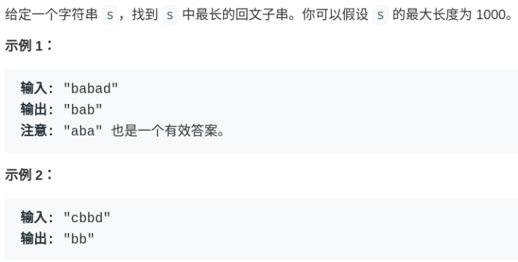
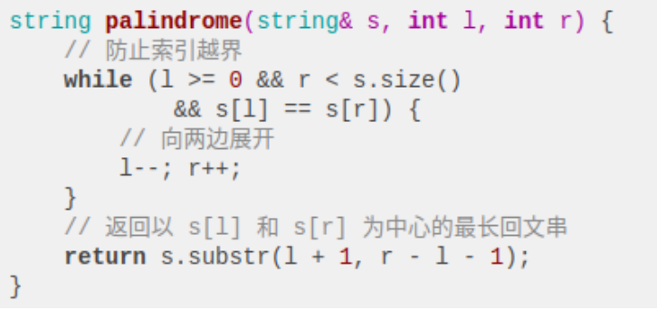
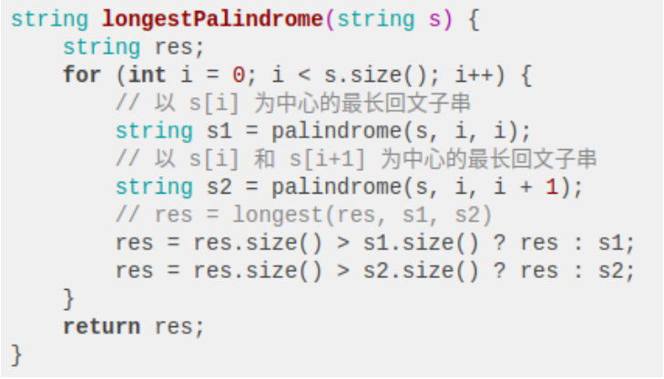

## 经典面试题：最长回文子串

回文串是面试常常遇到的问题（虽然问题本身没啥意义），本文就告诉你回文串问题的核心思想是什么。

首先，明确一下什：回文串就是正着读和反着读都一样的字符串。

比如说字符串aba和abba都是回文串，因为它们对称，反过来还是和本身一样。反之，字符串abac就不是回文串。

可以看到回文串的的长度可能是奇数，也可能是偶数，这就添加了回文串问题的难度，解决该类问题的核心是双指针。下面就通过一道最长回文子串的问题来具体理解一下回文串问题：



```
string longestPalindrome(string s) {}
```

### 一、思考

对于这个问题，我们首先应该思考的是，给一个字符串s，如何在s中找到一个回文子串？

有一个很有趣的思路：既然回文串是一个正着反着读都一样的字符串，那么如果我们把s反转，称为s'，然后在s和s'中寻找最长公共子串，这样应该就能找到最长回文子串。

比如说字符串abacd，反过来是dcaba，它俩的最长公共子串是aba，也就是最长回文子串。

但是这个思路是错误的，比如说字符串aacxycaa，反转之后是aacyxcaa，最长公共子串是aac，但是最长回文子串应该是aa。

虽然这个思路不正确，但是这种把问题转化为其他形式的思考方式是非常值得提倡的。

下面，就来说一下正确的思路，如何使用双指针。

寻找回文串的问题核心思想是：**从中间开始向两边扩散来判断回文串。**对于最长回文子串，就是这个意思：

```
for 0 <= i < len(s):
  找到以 s[i] 为中心的回文串
  更新答案
```

但是呢，我们刚才也说了，回文串的长度可能是奇数也可能是偶数，如果是abba这种情况，没有一个中心字符，上面的算法就没辙了。所以我们可以修改一下：

```
for 0 <= i < len(s):
  找到以 s[i] 为中心的回文串
  找到以 s[i] 和 s[i+1] 为中心的回文串
  更新答案
```

PS：读者可能发现这里的索引会越界，等会会处理。

### 二、代码实现

按照上面的思路，先要实现一个函数来寻找最长回文串，这个函数是有点技巧的：



为什么要传入两个指针l和r呢？因为这样实现可以同时处理回文串长度为奇数和偶数的情况：

```
for 0 <= i < len(s):
  # 找到以 s[i] 为中心的回文串
  palindrome(s, i, i)
  # 找到以 s[i] 和 s[i+1] 为中心的回文串
  palindrome(s, i, i + 1)
  更新答案
```

下面看下longestPalindrome的完整代码：



至此，这道最长回文子串的问题就解决了，时间复杂度 O(N^2)，空间复杂度 O(1)。

值得一提的是，这个问题可以用动态规划方法解决，时间复杂度一样，但是空间复杂度至少要 O(N^2) 来存储 DP table。这道题是少有的动态规划非最优解法的问题。