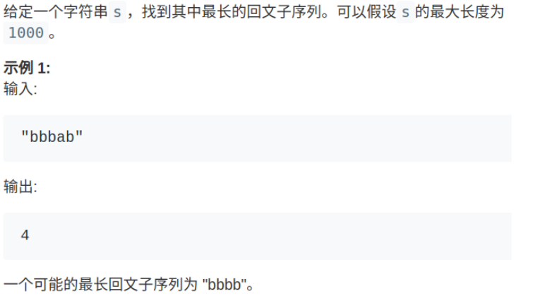
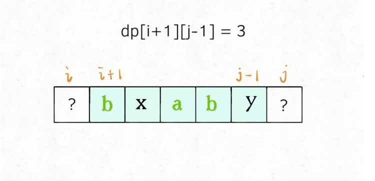
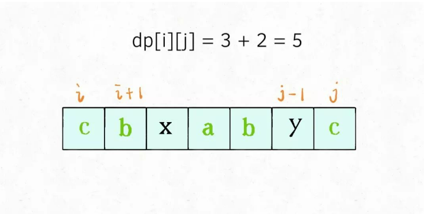
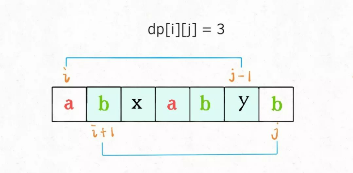
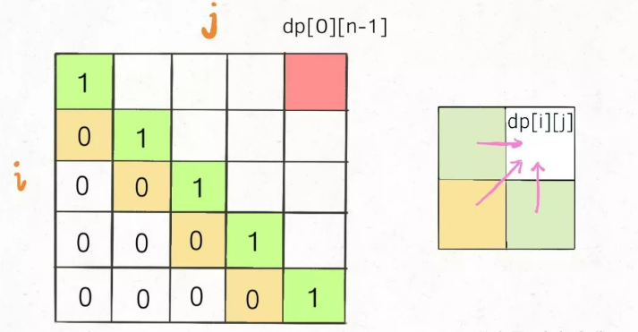
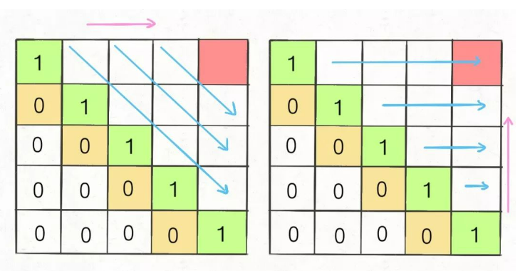
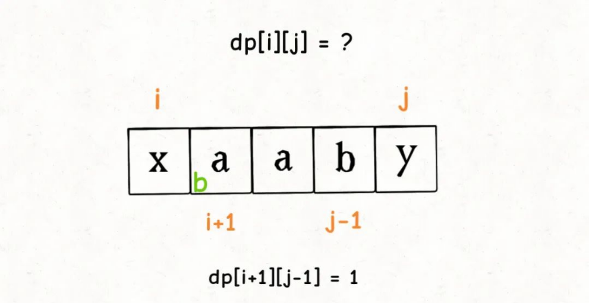

## 子序列解题模板：最长回文子序列

子序列问题是常见的算法问题，而且并不好解决。

首先，子序列问题本身就相对子串、子数组更困难一些，因为前者是不连续的序列，而后两者是连续的，就算穷举都不容易，更别说求解相关的算法问题了。

而且，子序列问题很可能涉及到两个字符串，比如让你求两个字符串的 最长公共子序列，如果没有一定的处理经验，真的不容易想出来。所以本文就来扒一扒子序列问题的套路，其实就有两种模板，相关问题只要往这两种思路上想，十拿九稳。

一般来说，这类问题都是让你求一个最长子序列，因为最短子序列就是一个字符嘛，没啥可问的。一旦涉及到子序列和最值，那几乎可以肯定，考察的是动态规划技巧，时间复杂度一般都是 O(n^2)。

原因很简单，你想想一个字符串，它的子序列有多少种可能？起码是指数级的吧，这种情况下，不用动态规划技巧，还想怎么着呢？

既然要用动态规划，那就要定义 dp 数组，找状态转移关系。我们说的两种思路模板，就是 dp 数组的定义思路。不同的问题可能需要不同的 dp 数组定义来解决。

### 一、两种思路

1、第一种思路模板是一个一维的 dp 数组：

```
int n = array.length;
int[] dp = new int[n];

for (int i = 1; i < n; i++) {
  for (int j = 0; j < i; j++) {
    dp[i] = 最值(dp[i], dp[j] + ...)
  }
}
```

举个我们写过的例子 最长递增子序列，在这个思路中 dp 数组的定义是：

**在子数组array[0..i]中，以array[i]结尾的目标子序列（最长递增子序列）的长度是dp[i]。**

为啥最长递增子序列需要这种思路呢？因为这样符合归纳法，可以找到状态转移的关系。

2、第二种思路模板是一个二维的 dp 数组：

```
int n = arr.length;
int[][] dp = new dp[n][n];

for (int i = 0; i < n; i++) {
  for (int j = 1; j < n; j++) {
    if (arr[i] == arr[j]) 
      dp[i][j] = dp[i][j] + ...
    else
      dp[i][j] = 最值(...)
  }
}
```

这种思路运用相对更多一些，尤其是涉及**两个字符串/数组的子序列**。本思路中 dp 数组含义又分为「只涉及一个字符串」和「涉及两个字符串」两种情况。

2.1 涉及两个字符串/数组时（比如最长公共子序列），dp 数组的含义如下：

在子数组arr1[0..i]和子数组arr2[0..j]中，我们要求的子序列（最长公共子序列）长度为dp[i][j]。

2.2 只涉及一个字符串/数组时（比如本文要讲的最长回文子序列），dp 数组的含义如下：

在子数组array[i..j]中，我们要求的子序列（最长回文子序列）的长度为dp[i][j]。

第一种情况可以参考这两篇旧文：详解编辑距离 和 最长公共子序列。

下面就借最长回文子序列这个问题，详解一下第二种情况下如何使用动态规划。

### 二、最长回文子序列

之前解决了 最长回文子串 的问题，这次提升难度，求最长回文子序列的长度：



我们说这个问题对 dp 数组的定义是：**在子串s[i..j]中，最长回文子序列的长度为dp[i][j]。**一定要记住这个定义才能理解算法。

为啥这个问题要这样定义二维的 dp 数组呢？我们前文多次提到，**找状态转移需要归纳思维，说白了就是如何从已知的结果推出未知的部分，这样定义容易归纳，容易发现状态转移关系。**

具体来说，如果我们想求dp[i][j]，假设你知道了子问题dp[i+1][j-1]的结果（s[i+1..j-1]中最长回文子序列的长度），你是否能想办法算出dp[i][j]的值（s[i..j]中，最长回文子序列的长度）呢？



可以！**这取决于s[i]和s[j]的字符：**

如果它俩相等，那么它俩加上s[i+1..j-1]中的最长回文子序列就是s[i..j]的最长回文子序列：



如果它俩不相等，说明它俩不可能同时出现在s[i..j]的最长回文子序列中，那么把它俩分别加入s[i+1..j-1]中，看看哪个子串产生的回文子序列更长即可：



以上两种情况写成代码就是这样：

```
if (s[i] == s[j])
  // 它俩一定在最长回文子序列中
  dp[i][j] = dp[i + 1][j - 1] + 2;
else
  // s[i+1..j] 和 s[i..j-1] 谁的回文子序列更长？
  dp[i][j] = max(dp[i + 1][j], dp[i][j - 1]);
```

至此，状态转移方程就写出来了，根据 dp 数组的定义，我们要求的就是dp[0][n - 1]，也就是整个s的最长回文子序列的长度。

### 三、代码实现

首先明确一下 base case，如果只有一个字符，显然最长回文子序列长度是 1，也就是dp[i][j] = 1,(i == j)。

因为i肯定小于等于j，所以对于那些i > j的位置，根本不存在什么子序列，应该初始化为 0。

另外，看看刚才写的状态转移方程，想求dp[i][j]需要知道dp[i+1][j-1]，dp[i+1][j]，dp[i][j-1]这三个位置；再看看我们确定的 base case，填入 dp 数组之后是这样：



**为了保证每次计算dp[i][j]，左、下、左下三个方向的位置已经被计算出来，只能斜着遍历或者反着遍历：**



我选择反着遍历，代码如下：

```
int longestPalindromeSubseq(string s) {
  int n = s.size();
  // dp 数组全部初始化为 0
  vector<vector<int>> dp(n, vector<int>(n, 0));
  // base case
  for (int i = 0; i < n; i++)
    dp[i][i] = 1;
  // 反着遍历保证正确的状态转移
  for (int i = n - 1; i >= 0; i--) {
    for (int j = i + 1; j < n; j++) {
      // 状态转移方程
      if (s[i] == s[j])
        dp[i][j] = dp[i + 1][j - 1] + 2;
      else
        dp[i][j] = max(dp[i + 1][j], dp[i][j - 1]);
    }
  }
  // 整个 s 的最长回文子串长度
  return dp[0][n - 1];
}
```

至此，最长回文子序列的问题就解决了。

主要还是正确定义 dp 数组的含义，遇到子序列问题，首先想到两种动态规划思路，然后根据实际问题看看哪种思路容易找到状态转移关系。

另外，找到状态转移和 base case 之后，一定要观察 DP table，看看怎么遍历才能保证通过已计算出来的结果解决新的问题

有了以上思路方向，子序列问题也不过如此嘛。

### 四、扩展延伸

虽然回文相关的问题没有什么特别广泛的使用场景，但是你会算最长回文子序列之后，一些类似的题目也可以顺手做掉。
力扣1312题**计算让字符串成为回文串的最少插入次数**:

输入一个字符串s，你可以在字符串的任意位置插入任意字符。如果要把s变回文串，请你计算最少要进行多少次插入？

函数签名如下：

```
int minInsertions(String s)
```

比如说输入 s = "abcea"，算法返回2，因为可以给s插入2个字符变回回文串 “abeceba” 或者 "aebcbea"。如果输入 s = "aba"，则算法返回0，因为s已经是回文串，不用插入任何字符。

这也是一道单字符串的子序列问题，所以我们也可以使用一个二维dp数组，其中dp[i][j]的定义如下：

**对字符串s[i..j]，最少需要进行dp[i][j]次插入才能变成回文串**

根据dp数组的定义，**base case 就是dp[i][i] = 0**，因为单个字符本身就是回文串，不需要插入。

然后使用数学归纳法，假设已经计算出子问题dp[i+1][j-1]的值了，如何退出dp[i][j]的值：



实际上和最长回文子序列问题的状态转移方程非常类似，这里也分两种情况：

```
if (s[i] == s[j]) {
  // 不需要插入任何字符
  dp[i][j] = dp[i + 1][j - 1];
} else {
  // 把s[i+1..j]和s[i..j-1]变为回文串，选插入次数较少的
  // 然后还要再插入一个s[i]或s[j]，使s[i..j]配成回文串
  dp[i][j] = min(dp[i + 1][j], dp[i][j - 1]) + 1;
}
```

最后，我们依然采取倒着遍历dp数组的方式，并写出代码：

```
int minInsertions(String s) {
  int n = s.length();
  // dp[i][j]表示把字符串s[i..j]变成回文串的最少插入次数
  // dp数组全部初始化为0
  int[][] dp = new int[n][n];
  // 反着遍历保证正确的状态转移
  for(int i = n - 1; i >= 0; i--) {
    for(int j = i + 1; j < n; j++) {
      // 状态转移方程
      if (s.charAt(i) == s.charAt(j)) 
        // 如果相等，则不需要插入字符
        dp[i][j] = dp[i+1][j-1]
      else 
        // 把s[i+1..j]和s[i..j-1]变为回文串，选插入次数最少的
        // 然后还要再插入一个s[i]或s[j]，使s[i..j]配成回文串
        dp[i][j] = min(dp[i + 1][j], dp[i][j - 1]) + 1;
    }
  }
  // 整个s的最少插入次数
  return dp[0][n-1];
}
```

至此，这道题也使用子序列解题模板解决了，整体逻辑和最长回文子序列非常相似，那么这个问题是否可以直接复用回文子序列的解法呢？

其实是可以的，我们甚至都不用写状态转移方程，你仔细想想：

**我先算出字符串s中的最长回文子序列，那些不在最长回文子序列中的字符，不就是需要插入的字符吗？**

所以这道题可以直接复用之前实现的longestPalindromeSubseq函数：

```
// 计算把s变成回文串的最少插入次数
public int minInsertions(String s) {
  return s.length() - longestPalindromeSubseq(s);
}
// 计算s中的最长回文子序列长度
int longestPalindromeSubseq(String s) {
  // 见上文
}
```

好了，这就是子序列相关的算法。