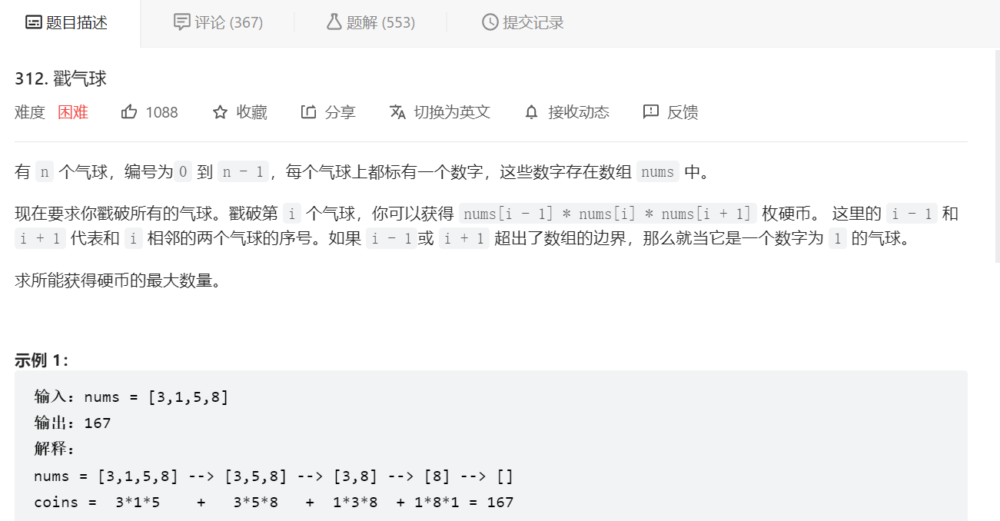
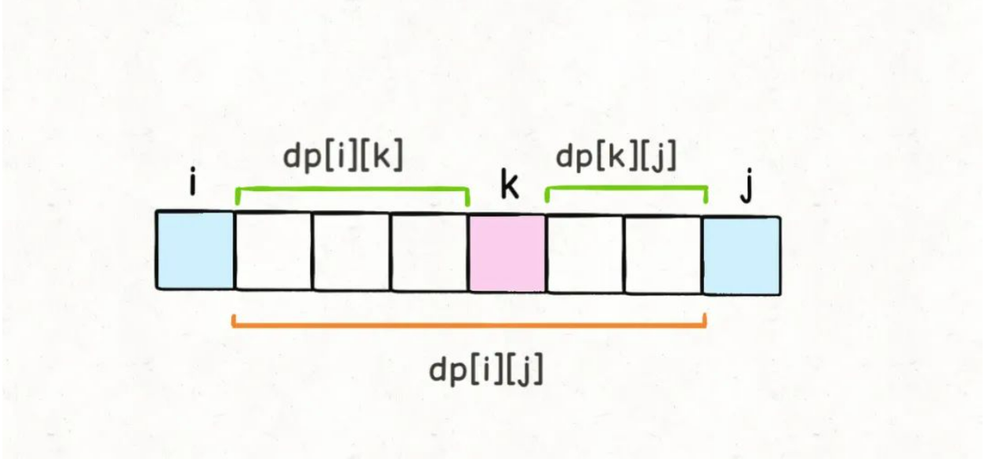
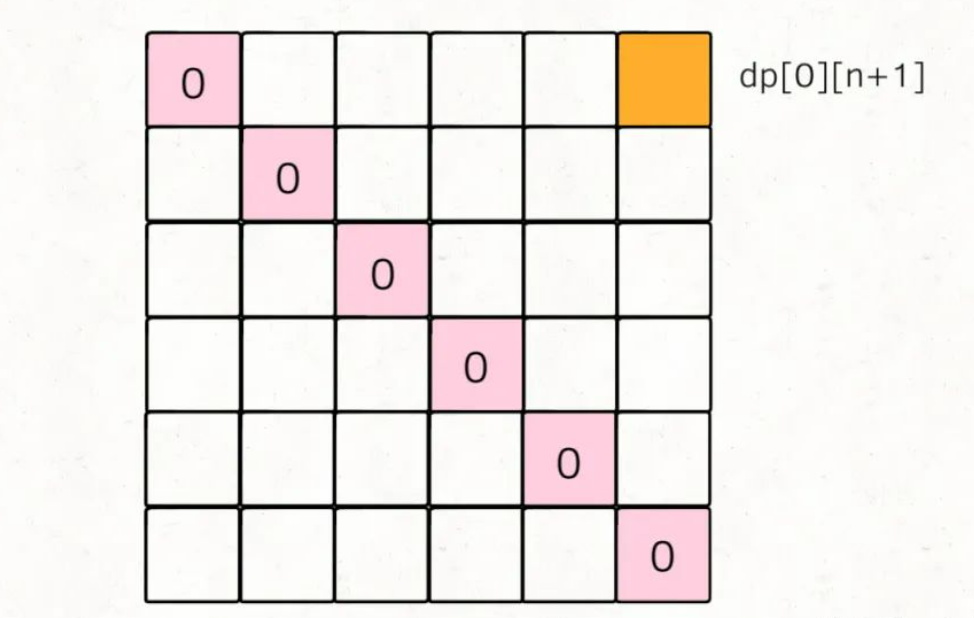
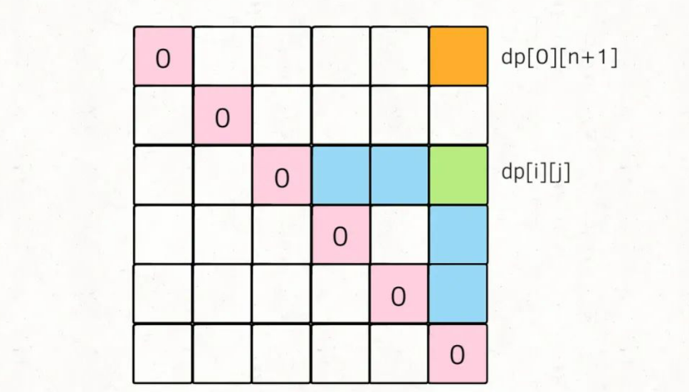
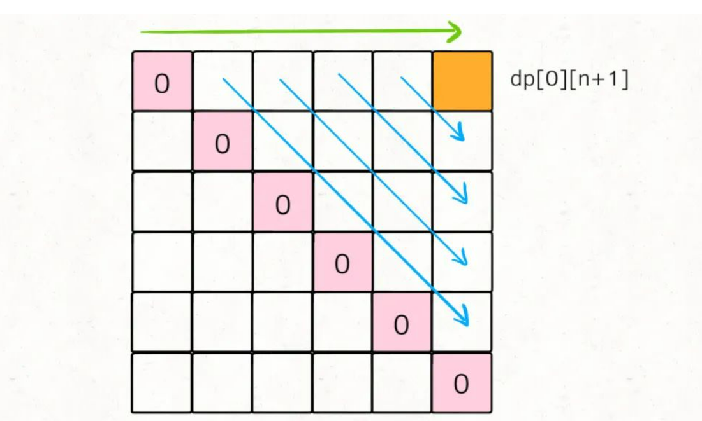
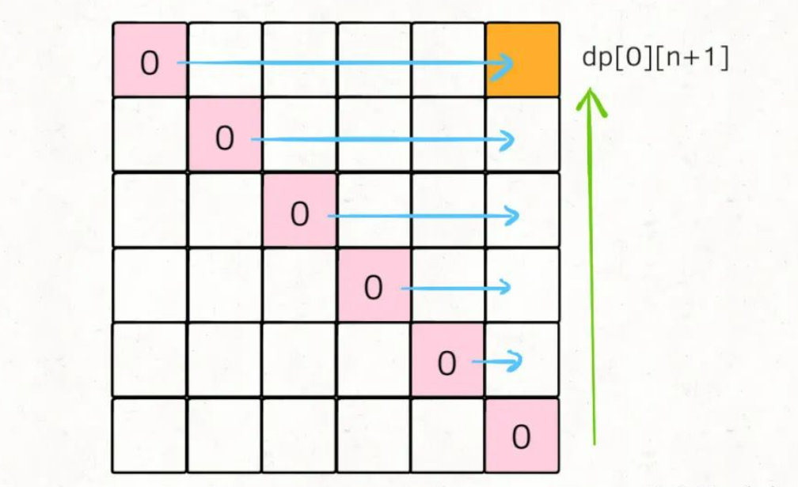

## 经典动态规划：戳气球问题 https://mp.weixin.qq.com/s/I0yo0XZamm-jMpG-_B3G8g

今天我们要聊的这道题「Burst Balloon」和之前我们写过的那篇 经典动态规划：高楼扔鸡蛋问题 分析过的高楼扔鸡蛋问题类似，知名度很高，但难度确实也很大。来看一看这道题目到底有多难。

它是 LeetCode 第 312 题，题目如下：



首先必须要说明，这个题目的状态转移方程真的比较巧妙，所以说如果你看了题目之后完全没有思路恰恰是正常的。虽然最优答案不容易想出来，但基本的思路分析是我们应该力求做到的。所以本文会先分析一下常规思路，然后再引入动态规划解法。

### 一、回溯思路

先来顺一下解决这种问题的套路：

**我们前文多次强调过，很显然只要涉及求最值，没有任何奇技淫巧，一定是穷举所有可能的结果，然后对比得出最值。**

所以说，只要遇到求最值的算法问题，首先要思考的就是：如何穷举出所有可能的结果？

穷举主要有两种算法，就是回溯算法和动态规划，前者就是暴力穷举，而后者是根据状态转移方程推导「状态」。

如何将我们的扎气球问题转化成回溯算法呢？这个应该不难想到的，**我们其实就是想穷举戳气球的顺序，**不同的戳气球顺序可能得到不同的分数，我们需要把所有可能的分数中最高的那个找出来，对吧。

那么，这不就是一个「全排列」问题嘛，我们前文 回溯算法框架套路详解 中有全排列算法的详解和代码，其实只要稍微改一下逻辑即可，伪码思路如下：

```
int res = Integer.MIN_VALUE;
/* 输入一组气球，返回戳破它们获得的最大分数 */
int maxCoins(int[] nums) {
  backtrack(nums, 0);
  return res;
}
/* 回溯算法的伪码解法 */
void backtrack(int[] nums, int socre) {
  if (nums 为空) {
    res = max(res, score);
    return;
  }
  for (int i = 0; i < nums.length; i++) {
    int point = nums[i-1] * nums[i] * nums[i+1];
    int temp = nums[i];
    // 做选择
    在 nums 中删除元素 nums[i]
    // 递归回溯
    backtrack(nums, score + point);
    // 撤销选择
    将 temp 还原到 nums[i]
  }
}
```

回溯算法就是这么简单粗暴，但是相应的，算法的效率非常低。这个解法等同于全排列，所以时间复杂度是阶乘级别，非常高，题目说了nums的大小n最多为 500，所以回溯算法肯定是不能通过所有测试用例的。

### 二、动态规划思路

这个动态规划问题和我们之前的动态规划系列相比有什么特别之处？为什么它比较难呢？

**原因在于，这个问题中我们每戳破一个气球nums[i]，得到的分数和该气球相邻的气球nums[i-1]和nums[i+1]是有相关性的。**

我们前文 动态规划套路框架详解 说过运用动态规划算法的一个重要条件：**子问题必须独立**。所以对于这个戳气球问题，如果想用动态规划，必须巧妙地定义dp数组的含义，**避免子问题产生相关性**，才能推出合理的状态转移方程。

如何定义dp数组呢，这里需要对问题进行一个简单地转化。题目说可以认为nums[-1] = nums[n] = 1，那么我们先直接把这两个边界加进去，形成一个新的数组points：

```
int maxCoins(int[] nums)  {
  int n = nums.length
  // 两端加入两个虚拟气球
  int points = new int[n+2]
  points[0] = points[n+1] = 1;
  for(int i = 1; i <= n; i++) {
    points[i] = nums[i-1]
  }
  // ...
}
```

现在气球的索引变成了从1到n，points[0]和points[n+1]可以认为是两个「虚拟气球」。

那么我们可以改变问题：**在一排气球points中，请你戳破气球0和气球n+1之间的所有气球（不包括0和n+1），使得最终只剩下气球0和气球n+1两个气球，最多能够得到多少分？**

现在可以定义dp数组的含义：

dp[i][j] = x**表示，戳破气球i和气球j之间（开区间，不包括i和j）的所有气球，可以获得的最高分数为x。**

那么根据这个定义，题目要求的结果就是dp[0][n+1]的值，而 **base case 就是dp[i][j] = 0，其中0 <= i <= n+1, j <= i+1，因为这种情况下，开区间(i, j)中间根本没有气球可以戳。**

```
// base case 已经都被初始化为 0
int[][] dp = new int[n + 2][n + 2];
```

现在我们要根据这个dp数组来推导状态转移方程了，根据我们前文的套路，所谓的推导「状态转移方程」，实际上就是在思考怎么「做选择」，也就是这道题目最有技巧的部分：

不就是想求戳破气球i和气球j之间的最高分数吗，如果「正向思考」，就只能写出前文的**回溯算法**；**我们需要「反向思考」，想一想气球i和气球j之间最后一个被戳破的气球可能是哪一个？**

其实气球i和气球j之间的所有气球都可能是最后被戳破的那一个，不防假设为k。回顾动态规划的套路，这里其实已经找到了「状态」和「选择」：i和j就是两个「状态」，最后戳破的那个气球k就是「选择」。

**根据刚才对dp数组的定义，如果最后一个戳破气球k，dp[i][j]的值应该为：**

```
dp[i][j] = dp[i][k] + dp[k][j] 
         + points[i]*points[k]*points[j]
```

你不是要最后戳破气球k吗？那得先把开区间(i, k)的气球都戳破，再把开区间(k, j)的气球都戳破；最后剩下的气球k，相邻的就是气球i和气球j，这时候戳破k的话得到的分数就是points[i]*points[k]*points[j]。

那么戳破开区间(i, k)和开区间(k, j)的气球最多能得到的分数是多少呢？嘿嘿，就是dp[i][k]和dp[k][j]，这恰好就是我们对dp数组的定义嘛！



结合这个图，就能体会出dp数组定义的巧妙了。由于是开区间，dp[i][k]和dp[k][j]不会影响气球k；而戳破气球k时，旁边相邻的就是气球i和气球j了，最后还会剩下气球i和气球j，这也恰好满足了dp数组开区间的定义。

那么，对于一组给定的i和j，我们只要穷举i < k < j的所有气球k，选择得分最高的作为dp[i][j]的值即可，这也就是状态转移方程：

```
// 最后戳破的气球是哪个？
for (int k = i + 1; k < j; k++) {
  // 择优做选择，使得 dp[i][j] 最大
  dp[i][j] = Math.max(
    dp[i][j], 
    dp[i][k] + dp[k][j] + points[i]*points[j]*points[k]
  );
}
```

写出状态转移方程就完成这道题的一大半了，但是还有问题：对于k的穷举仅仅是在做「选择」，但是应该如何穷举「状态」i和j呢？

```
for (int i = ...; ; )
  for (int j = ...; ; )
    for (int k = i + 1; k < j; k++) {
      dp[i][j] = Math.max(
        dp[i][j], 
        dp[i][k] + dp[k][j] + points[i]*points[j]*points[k]
      );
return dp[0][n+1];
```

### 三、写出代码

**关于「状态」的穷举，最重要的一点就是：状态转移所依赖的状态必须被提前计算出来。**

拿这道题举例，dp[i][j]所依赖的状态是dp[i][k]和dp[k][j]，那么我们必须保证：在计算dp[i][j]时，dp[i][k]和dp[k][j]已经被计算出来了（其中i < k < j）。

> PS：最终状态就是指题目要求的结果，对于这道题目也就是dp[0][n+1]。

我们先把 base case 和最终的状态在 DP table 上画出来：



对于任一dp[i][j]，我们希望所有dp[i][k]和dp[k][j]已经被计算，画在图上就是这种情况：



那么，为了达到这个要求，可以有两种遍历方法，要么斜着遍历，要么从下到上从左到右遍历：





斜着遍历有一点难写，所以一般我们就从下往上遍历，下面看完整代码：

```
int maxCoins(int[] nums) {
  int n = nums.length;
  // 添加两侧的虚拟气球
  int[] points = new int[n+2];
  points[0] = points[n+1] = 1;
  for(int i = 1; i < n+1; i++) { // i <= n
    points[i] = nums[i-1];
  }
  // base case 已经被初始化为0
  int[][] dp = new int[n+2][n+2];
  // 开始状态转移
  // i应该从下往上
  for(int i = n; i >= 0; i--) { // i = n+1 j = n+2这种情况不存在，所以从i = n开始
    // j应该从左往右
    for(int j = i + 1; j < n + 2; j++) {
      // 最后戳破得气球是哪个？
      for(int k = i + 1; k < j; k++) {
        // 状态转移 择优做选择
        dp[i][j] = max(
          dp[i][j], 
          dp[i][k] + dp[k][j] + points[i]*points[k]*points[j], // 戳破i-k 以及 k-j 只剩下 i, j, k相连了
        )
      }
    }
  }
  return dp[0][n+1];
}
```

至此，这道题目就完全解决了，十分巧妙，但也不是那么难，对吧？

关键在于dp数组的定义，需要避免子问题互相影响，所以我们反向思考，将dp[i][j]的定义设为开区间，考虑最后戳破的气球是哪一个，以此构建了状态转移方程。

对于如何穷举「状态」，我们使用了小技巧，通过 base case 和最终状态推导出i,j的遍历方向，保证正确的状态转移。