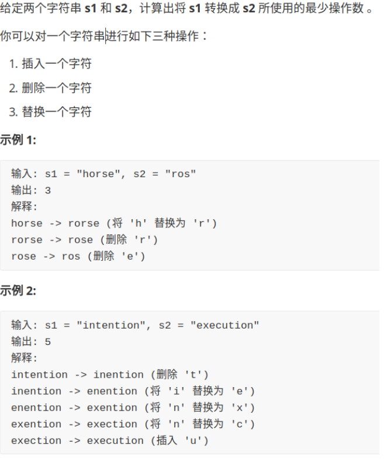
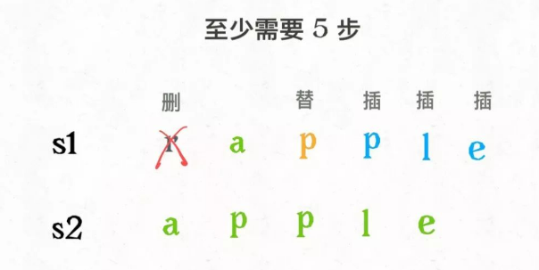
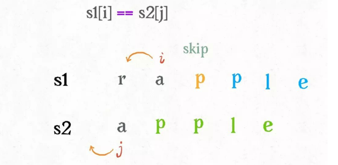
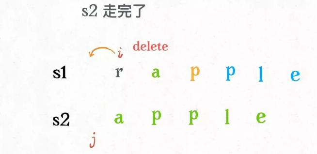
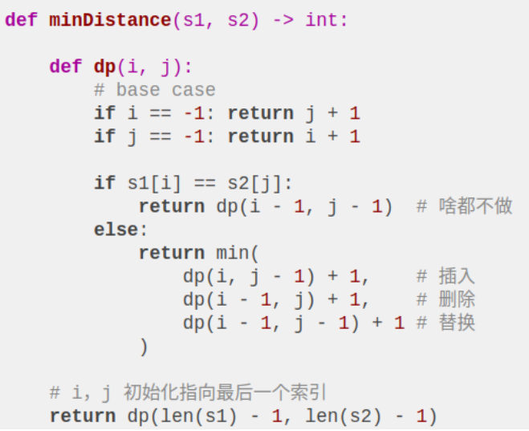

## 经动态规划：编辑距离

下面先来看下题目：



为什么说这个问题难呢，因为显而易见，它就是难，让人手足无措，望而生畏。

为什么说它实用呢，因为前几天我就在日常生活中用到了这个算法。之前有一篇公众号文章由于疏忽，写错位了一段内容，我决定修改这部分内容让逻辑通顺。但是公众号文章最多只能修改 20 个字，且只支持增、删、替换操作（跟编辑距离问题一模一样），于是我就用算法求出了一个最优方案，只用了 16 步就完成了修改。

再比如高大上一点的应用，DNA 序列是由 A,G,C,T 组成的序列，可以类比成字符串。编辑距离可以衡量两个 DNA 序列的相似度，编辑距离越小，说明这两段 DNA 越相似，说不定这俩 DNA 的主人是远古近亲啥的。

下面言归正传，详细讲解一下编辑距离该怎么算，相信本文会让你有收获。

### 一、思路

编辑距离问题就是给我们两个字符串s1和s2，只能用三种操作，让我们把s1变成s2，求最少的操作数。需要明确的是，不管是把s1变成s2还是反过来，结果都是一样的，所以后文就以s1变成s2举例。

前文 最长公共子序列 说过，解决两个字符串的动态规划问题，**一般都是用两个指针i,j分别指向两个字符串的最后，然后一步步往前走，缩小问题的规模。**

设两个字符串分别为 "rad" 和 "apple"，为了把s1变成s2，算法会这样进行：




请记住这个 GIF 过程，这样就能算出编辑距离。关键在于如何做出正确的操作，稍后会讲。

根据上面的 GIF，可以发现操作不只有三个，其实还有第四个操作，就是什么都不要做（skip）。比如这个情况：



因为这两个字符本来就相同，为了使编辑距离最小，显然不应该对它们有任何操作，直接往前移动i,j即可。

还有一个很容易处理的情况，**就是j走完s2时，如果i还没走完s1，那么只能用删除操作把s1缩短为s2。比如这个情况：**



类似的，**如果i走完s1时j还没走完了s2，那就只能用插入操作把s2剩下的字符全部插入s1。等会会看到，这两种情况就是算法的 base case。**

下面详解一下如何将这个思路转化成代码，坐稳，准备发车了。

### 二、代码详解

先梳理一下之前的思路：

base case 是i走完s1或j走完s2，可以直接返回另一个字符串剩下的长度。

对于每对儿字符s1[i]和s2[j]，可以有四种操作：

```
if s1[i] == s2[j]:
  啥都别做（skip）
  i, j 同时向前移动
else:
  三选一：
    插入（insert）
    删除（delete）
    替换（replace）
```

有这个框架，问题就已经解决了。读者也许会问，这个「三选一」到底该怎么选择呢？很简单，全试一遍，哪个操作最后得到的编辑距离最小，就选谁。这里需要递归技巧，理解需要点技巧，先看下代码：



下面来详细解释一下这段递归代码，base case 应该不用解释了，主要解释一下递归部分。

都说递归代码的可解释性很好，这是有道理的，只要理解函数的定义，就能很清楚地理解算法的逻辑。我们这里 dp(i, j) 函数的定义是这样的：

```
def dp(i, j) -> int
# 返回 s1[0..i] 和 s2[0..j] 的最小编辑距离
```

记住这个定义之后，先来看这段代码：

```
if s1[i] == s2[j]:
  return dp(i - 1, j - 1)  # 啥都不做
# 解释：
# 本来就相等，不需要任何操作
# s1[0..i] 和 s2[0..j] 的最小编辑距离等于
# s1[0..i-1] 和 s2[0..j-1] 的最小编辑距离
# 也就是说 dp(i, j) 等于 dp(i-1, j-1)
```

如果s1[i]！=s2[j]，就要对三个操作递归了，稍微需要点思考：

```
dp(i, j - 1) + 1,    # 插入
# 解释：
# 我直接在 s1[i] 插入一个和 s2[j] 一样的字符
# 那么 s2[j] 就被匹配了，前移 j，继续跟 i 对比
# 别忘了操作数加一
```


```
dp(i - 1, j) + 1,    # 删除
# 解释：
# 我直接把 s[i] 这个字符删掉
# 前移 i，继续跟 j 对比
# 操作数加一
```


```
dp(i - 1, j - 1) + 1 # 替换
# 解释：
# 我直接把 s1[i] 替换成 s2[j]，这样它俩就匹配了
# 同时前移 i，j 继续对比
# 操作数加一
```


现在，你应该完全理解这段短小精悍的代码了。还有点小问题就是，这个解法是暴力解法，存在重叠子问题，需要用动态规划技巧来优化。

怎么能一眼看出存在重叠子问题呢？前文 动态规划之正则表达式 有提过，这里再简单提一下，需要抽象出本文算法的递归框架：

```
def dp(i, j):
  dp(i - 1, j - 1) #1
  dp(i, j - 1)     #2
  dp(i - 1, j)     #3
```

对于子问题dp(i-1,j-1)，如何通过原问题dp(i,j)得到呢？有不止一条路径，比如dp(i,j)->#1和dp(i,j)->#2->#3。一旦发现一条重复路径，就说明存在巨量重复路径，也就是重叠子问题。

### 三、动态规划优化
对于重叠子问题呢，前文 动态规划详解 介绍过，优化方法无非是备忘录或者 DP table。

备忘录很好加，原来的代码稍加修改即可：

```
def minDistance(s1, s2) -> int:
  memo = dict() # 备忘录
  def dp(i, j):
    if (i, j) in memo: 
      return memo[(i, j)]
    ...

    if s1[i] == s2[j]:
      memo[(i, j)] = ...  
    else:
      memo[(i, j)] = ...
    return memo[(i, j)]

  return dp(len(s1) - 1, len(s2) - 1)
```

**主要说下 DP table 的解法：**

首先明确 dp 数组的含义，dp 数组是一个二维数组，长这样：


dp[i][j]的含义和之前的 dp 函数类似：

```
def dp(i, j) -> int
# 返回 s1[0..i] 和 s2[0..j] 的最小编辑距离

dp[i-1][j-1]
# 存储 s1[0..i] 和 s2[0..j] 的最小编辑距离
```

有了之前递归解法的铺垫，应该很容易理解。dp 函数的 base case 是i,j等于 -1，而数组索引至少是 0，所以 dp 数组会偏移一位，dp[..][0]和dp[0][..]对应 base case。。

既然 dp 数组和递归 dp 函数含义一样，也就可以直接套用之前的思路写代码，唯一不同的是，DP table 是自底向上求解，递归解法是自顶向下求解：


### 四、扩展延伸

一般来说，处理两个字符串的动态规划问题，都是按本文的思路处理，建立 DP table。为什么呢，因为易于找出状态转移的关系，比如编辑距离的 DP table：


还有一个细节，既然每个dp[i][j]只和它附近的三个状态有关，空间复杂度是可以压缩成 O(min(M,N)) 的（M，N 是两个字符串的长度）。不难，但是可解释性大大降低，读者可以自己尝试优化一下。
