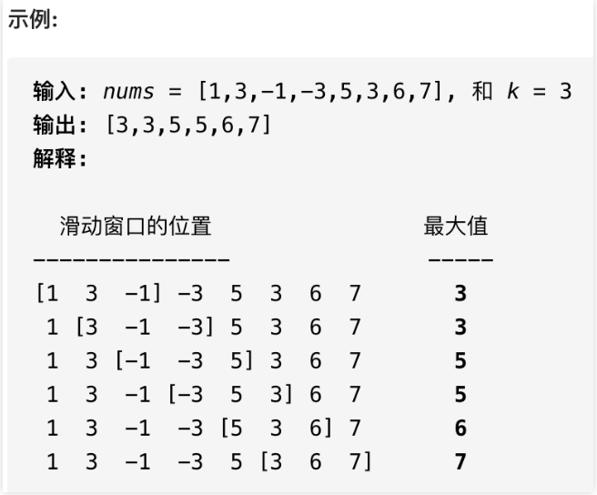
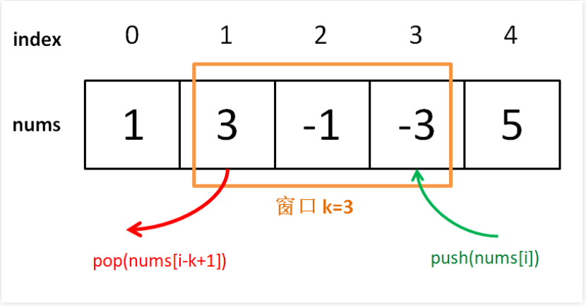
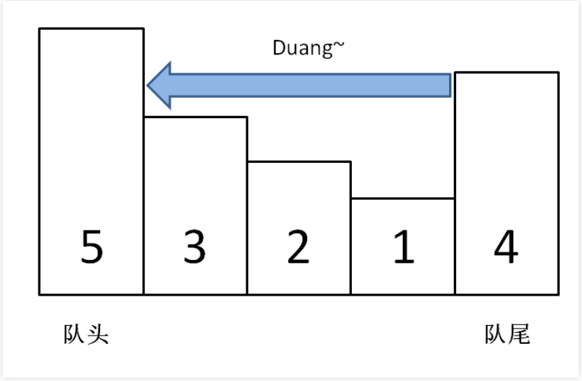
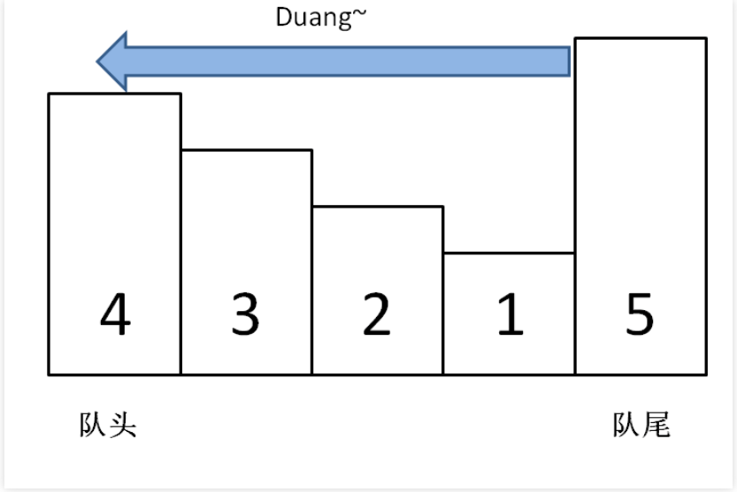

## 单调队列通用模板及运用（参考链接：https://mp.weixin.qq.com/s?__biz=MzAxODQxMDM0Mw==&mid=2247497201&idx=1&sn=7fae090d77321b4cf162dc43e9177f50&scene=21#wechat_redirect）

> 读完本文，可以去力扣解决如下题目： 239. 滑动窗口最大值（困难）

前文用 单调栈解决三道算法问题 介绍了单调栈这种特殊数据结构，本文写一个类似的数据结构「单调队列」。

也许这种数据结构的名字你没听过，其实没啥难的，就是一个「队列」，只是使用了一点巧妙的方法，使得队列中的元素全都是单调递增（或递减）的。

为啥要发明「单调队列」这种结构呢，主要是为了解决下面这个场景：

**给你一个数组window，已知其最值为A，如果给window中添加一个数B，那么比较一下A和B就可以立即算出新的最值；但如果要从window数组中减少一个数，就不能直接得到最值了，因为如果减少的这个数恰好是A，就需要遍历window中的所有元素重新寻找新的最值**。

这个场景很常见，但不用单调队列似乎也可以，比如优先级队列也是一种特殊的队列，专门用来动态寻找最值的，我创建一个大（小）顶堆，不就可以很快拿到最大（小）值了吗？

如果单纯地维护最值的话，优先级队列很专业，队头元素就是最值。但优先级队列无法满足标准队列结构「先进先出」的**时间顺序**，因为优先级队列底层利用二叉堆对元素进行动态排序，元素的出队顺序是元素的大小顺序，和入队的先后顺序完全没有关系。

所以，现在需要一种新的队列结构，既能够维护队列元素「先进先出」的时间顺序，又能够正确维护队列中所有元素的最值，这就是「单调队列」结构。

「单调队列」这个数据结构主要用来辅助解决滑动窗口相关的问题，前文 滑动窗口核心框架(https://mp.weixin.qq.com/s?__biz=MzAxODQxMDM0Mw==&mid=2247497171&idx=1&sn=faa317e8acf4d28859257794aaf933b7&scene=21#wechat_redirect) 把滑动窗口算法作为双指针技巧的一部分进行了讲解，但有些稍微复杂的滑动窗口问题不能只靠两个指针来解决，需要上更先进的数据结构。

比方说，你注意看前文 滑动窗口核心框架 讲的几道题目，每当窗口扩大（right++）和窗口缩小（left++）时，你单凭移出和移入窗口的元素即可决定是否更新答案。

但就本文开头说的那个判断一个窗口中最值的例子，你就无法单凭移出窗口的那个元素更新窗口的最值，除非重新遍历所有元素，但这样的话时间复杂度就上来了，这是我们不希望看到的。

我们来看看力扣第 239 题「滑动窗口最大值」，就是一道标准的滑动窗口问题：

给你输入一个数组nums和一个正整数k，有一个大小为k的窗口在nums上从左至右滑动，请你输出每次窗口中k个元素的最大值。

函数签名如下：

```
int[] maxSlidingWindow(int[] nums, int k);
```

比如说力扣给出的一个示例：



接下来，我们就借助单调队列结构，用O(1)时间算出每个滑动窗口中的最大值，使得整个算法在线性时间完成。

### 一、搭建解题框架

在介绍「单调队列」这种数据结构的 API 之前，先来看看一个普通的队列的标准 API：

```
class Queue {
    // enqueue 操作，在队尾加入元素 n
    void push(int n);
    // dequeue 操作，删除队头元素
    void pop();
}
```

我们要实现的「单调队列」的 API 也差不多：

```
class MonotonicQueue {
    // 在队尾添加元素 n
    void push(int n);
    // 返回当前队列中的最大值
    int max();
    // 队头元素如果是 n，删除它
    void pop(int n);
}
```

当然，这几个 API 的实现方法肯定跟一般的 Queue 不一样，不过我们暂且不管，而且认为这几个操作的时间复杂度都是 O(1)，先把这道「滑动窗口」问题的解答框架搭出来：

```
int[] maxSlidingWindow(int[] nums, int k) {
    // 创建单调优先队列
    MonotonicQueue window = new MonotonicQueue();
    // 结果数组
    List<Integer> res = new ArrayList<>();
    
    for(int i = 0; i < nums.length; i++) {
        if (i < k - 1) {
            // 先把窗口的前k-1填满
            window.push(nums[i]);
        } else {
            // 比如k为3，0 1下标的元素先进入window,然后当i=2的时候2 == k-1不满足走这里
            // 窗口开始向前滑动
            // 移入新元素(前面进了两个总共3个，当i=2的时候再进入队列，这时候window已经满了)
            window.push(nums[i]);
            // 将当前窗口中的最大元素记入结果
            res.add(window.max());
            // 移除最后的元素(也就是最初进入队列的那个，比如i=2，我们需要移除第0个，i=3移除第一个，这样保证了顺序的方式进出队列)
            window.pop(nums[i - k + 1]);
        }
    }
    // 将list类型转化成int[]数组作为返回值
    // ArrayList属于动态数组类型为List，但是题目要求返回int[]定长集合
    int[] arr = new int[res.size()];
    for (int i = 0; i < res.size(); i++) {
        arr[i] = res.get(i);
    }
    return arr;
}
```



这个思路很简单，能理解吧？下面我们开始重头戏，单调队列的实现。

### 二、实现单调队列数据结构

**观察滑动窗口的过程就能发现，实现「单调队列」必须使用一种数据结构支持在头部和尾部进行插入和删除，很明显双链表是满足这个条件的**。

「单调队列」的核心思路和「单调栈」类似，push方法依然在队尾添加元素，但是要把前面比自己小的元素都删掉：

```
class MonotonicQueue {
    // 双链表，支持头部和尾部增删元素
    // 维护其中的元素自尾部到头部单调递增
    private LinkedList<Integer> maxq = new LinkedList<>();

    // 在尾部添加一个元素 n，维护 maxq 的单调性质
    public void push(int n) {
        // 将前面小于自己的元素都删除
        // maxq不为空的并且maxq的最后的小于当今尾部要加的元素
        while (!maxq.isEmpty() && maxq.getLast() < n) {
            // poll: 删除并返回第一个元素。
            // pollLast: 此方法用于检索链表的最后一个元素或结尾元素，并最终从列表中删除最后一个元素
            maxq.pollLast();
        }
        maxq.addLast(n);
    }
}
```

你可以想象，加入数字的大小代表人的体重，把前面体重不足的都压扁了，直到遇到更大的量级才停住。



如果每个元素被加入时都这样操作，最终单调队列中的元素大小就会保持一个单调递减的顺序，因此我们的max方法可以可以这样写：

```
public int max() {
    // 队头的元素肯定是最大的
    return maxq.getFirst();
}
```

pop方法在队头删除元素n，也很好写：

```
public void pop(int n) {
    if (n == maxq.getFirst()) {
        maxq.pollFirst();
    }
}
```

之所以要判断data.getFirst() == n，是因为我们想删除的队头元素n可能已经被「压扁」了，可能已经不存在了，所以这时候就不用删除了：



至此，单调队列设计完毕，看下完整的解题代码：

```
/* 单调队列的实现 */
class MonotonicQueue {
    LinkedList<Integer> maxq = new LinkedList<>();
    public void push(int n) {
        // 大的排在队列前面，每次从队列尾部拿出来跟n比较，如果小于n就直接从队列尾部移除
        // 将小于n的元素全部删除
        while(!maxq.isEmpty() && maxq.getLast() < n) {
            maxq.pollLast();
        }
        // 然后将n加入尾部
        maxq.addLast(n);
    }
    
    public int max() {
        return maxq.getFirst();
    }

    public void pop(int n) {
        if (n == maxq.getFirst()) {
            maxq.pollFirst();
        }
    }
}

/* 解题函数的实现 */
int[] maxSlidingWindow(int[] nums, int k) {
    MonotonicQueue window = new MonotonicQueue();
    List<Integer> res = new ArrayList<>();
    
    for(int i = 0; i < nums.length; i++) {
        if (i < k - 1) {
            // 对于队列的前k-1个元素需要我们挨个添加进去
            // 先填满窗口的前k-1
            window.push(nums[i]);
        } else {
            // 窗口向前滑动，加入新数字
            window.push(nums[i]);
            // 记录当前窗口的最大值
            res.add(window.max());
            // 移除旧数字
            window.pop(nums[i-k+1]);
        } 
    }
    // 需要转成 int[] 数组再返回
    int[] arr = new int[res.size()];
    for (int i = 0; i < res.size(); i++) {
        arr[i] = res.get(i);
    }
    return arr;
}
```

有一点细节问题不要忽略，在实现MonotonicQueue时，我们使用了 Java 的LinkedList，因为链表结构支持在头部和尾部快速增删元素；而在解法代码中的res则使用的ArrayList结构，因为后续会按照索引取元素，所以数组结构更合适。

关于单调队列 API 的时间复杂度，读者可能有疑惑：push操作中含有 while 循环，时间复杂度应该不是O(1)呀，那么本算法的时间复杂度应该不是线性时间吧？

这里就用到了 算法时空复杂度分析使用手册 中讲到的摊还分析：

单独看push操作的复杂度确实不是O(1)，但是算法整体的复杂度依然是O(N)线性时间。要这样想，nums中的每个元素最多被push和pop一次，没有任何多余操作，所以整体的复杂度还是O(N)。空间复杂度就很简单了，就是窗口的大小O(k)。


