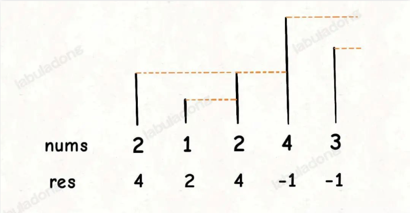
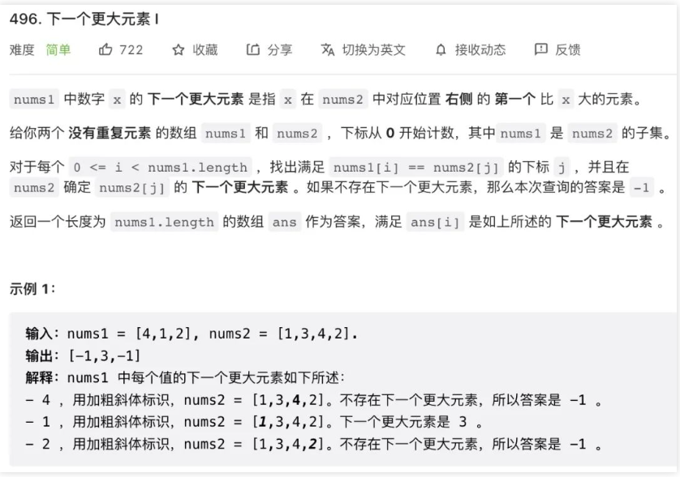
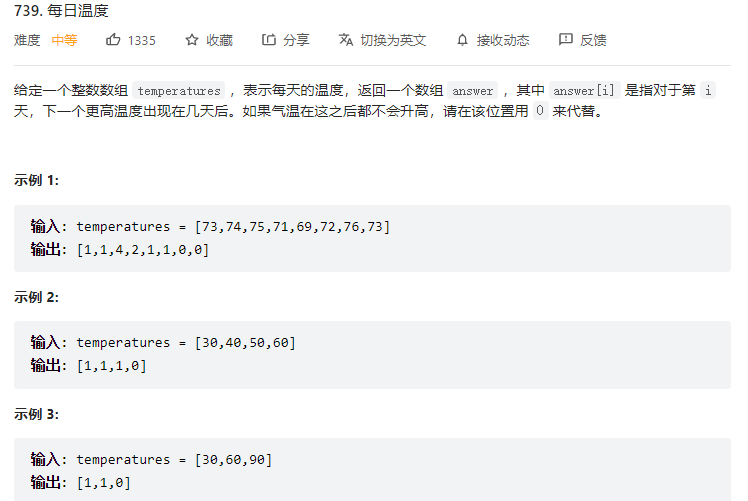
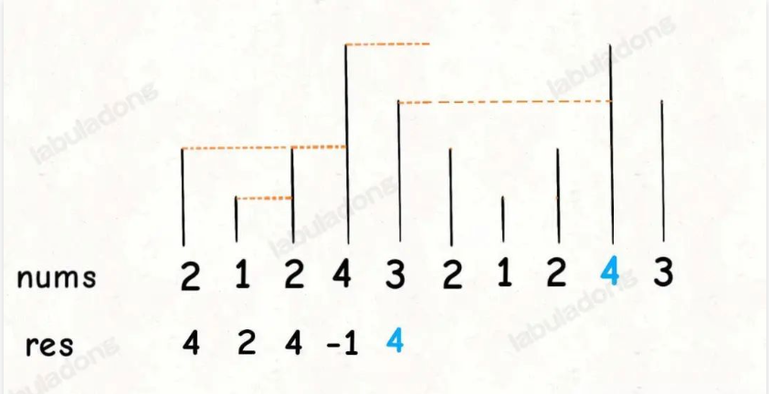

## 单调栈解题模板及运用（参考链接：https://mp.weixin.qq.com/s?__biz=MzAxODQxMDM0Mw==&mid=2247497113&idx=1&sn=36517e8b999d6da6e2042c1f03f9e8e2&scene=21#wechat_redirect）

> 读完本文，可以去leetcode解决：496.下一个更大元素I 503.下一个更大元素II 739.每日温度

栈（stack）是很简单的一种数据结构，先进后出的逻辑顺序，符合某些问题的特点，比如说函数调用栈。单调栈实际上就是栈，只是利用了一些巧妙的逻辑，使得每次新元素入栈后，栈内的元素都保持有序（单调递增或单调递减）。

听起来有点像堆（heap）？不是的，单调栈用途不太广泛，只处理一种典型的问题，**叫做「下一个更大元素」**。本文用讲解单调队列的算法模版解决这类问题，并且探讨处理「循环数组」的策略。

### 单调栈模板

现在给你出这么一道题：输入一个数组nums，请你返回一个等长的结果数组，结果数组中对应索引存储着下一个更大元素，如果没有更大的元素，就存 -1。函数签名如下：

```
int[] nextGreaterElement(int[] nums);
```

比如说，输入一个数组nums = [2,1,2,4,3]，你返回数组[4,2,4,-1,-1]。因为第一个 2 后面比 2 大的数是 4; 1 后面比 1 大的数是 2；第二个 2 后面比 2 大的数是 4; 4 后面没有比 4 大的数，填 -1；3 后面没有比 3 大的数，填 -1。

这道题的暴力解法很好想到，就是对每个元素后面都进行扫描，找到第一个更大的元素就行了。但是暴力解法的时间复杂度是O(n^2)。

这个问题可以这样抽象思考：把数组的元素想象成并列站立的人，元素大小想象成人的身高。这些人面对你站成一列，如何求元素「2」的下一个更大元素呢？很简单，如果能够看到元素「2」，那么他后面可见的第一个人就是「2」的下一个更大元素，因为比「2」小的元素身高不够，都被「2」挡住了，第一个露出来的就是答案。



这个情景很好理解吧？带着这个抽象的情景，先来看下代码。

```
int[] nextGreaterElement(int[] nums) {
    int n = nums.length;
    // 存放答案的数组
    int[] res = new int[n];
    Stack<Integer> s = new Stack<>();
    // 倒着往栈里放(倒着往栈里放是为了数组元素从头往后正着出,也就是比如第一个2需要跟后面的1、2、4进行比较，这时候因为倒着入栈，所以出站的时候就是正着出，1，2，4)
    for(int i = n - 1; i >= 0; i--) {
        // 检查stack是否有元素，检查s的栈顶元素是否小于等于nums[i]，如果都满足则进入while循环去弹出栈顶元素
        while(!s.isEmpty() && s.peek() <= nums[i]) {
            // 判定个子高矮
            // 矮个起开，反正也被挡着了。。。
            s.pop();
        }
        // 如果栈是空的，说明nums[i]后面没有比他大的则返回-1，否则返回栈顶元素
        // nums[i] 身后的更大元素
        res[i] = s.isEmpty() ? -1 : s.peek();
        // 将自身放到栈顶
        s.push(res[i]);
    }
    return res;
}
```

这就是单调队列解决问题的模板。for 循环要从后往前扫描元素，因为我们借助的是栈的结构，倒着入栈，其实是正着出栈。while 循环是把两个「个子高」元素之间的元素排除，因为他们的存在没有意义，前面挡着个「更高」的元素，所以他们不可能被作为后续进来的元素的下一个更大元素了。

这个算法的时间复杂度不是那么直观，如果你看到 for 循环嵌套 while 循环，可能认为这个算法的复杂度也是O(n^2)，但是实际上这个算法的复杂度只有O(n)。

分析它的时间复杂度，要从整体来看：总共有n个元素，每个元素都被push入栈了一次，而最多会被pop一次，没有任何冗余操作。所以总的计算规模是和元素规模n成正比的，也就是O(n)的复杂度。

### 问题变形

单调栈的使用技巧差不多了，首先来一个简单的变形，力扣第 496 题「下一个更大元素 I」：



这道题给你输入两个数组nums1和nums2，让你求nums1中的元素在nums2中的下一个更大元素，函数签名如下：

```
int[] nextGreaterElement(int[] nums1, int[] nums2)
```

其实和把我们刚才的代码改一改就可以解决这道题了，因为题目说nums1是nums2的子集，那么我们先把nums2中每个元素的下一个更大元素算出来存到一个映射里，然后再让nums1中的元素去查表即可：

```
int[] nextGreaterElement(int[] nums1, int[] nums2) {
    // 记录nums2中每个元素的下一个更大的元素
    int[] greater = nextGreaterElement(nums2);
    // 转换为映射：元素x->x的下一个最大元素
    HashMap<Integer, Integer> greaterMap = new HashMap<>();
    for(int i = 0; i < nums2.length; i++) {
        greaterMap.put(nums2[i], greater[i]);
    }
    // nums1是nums2的子集，所以根据greaterMap可以得到结果
    int[] res = new int[nums1.length];
    for(int i = 0; i < nums1.length; i++) {
        res[i] = greaterMap.get(nums1[i]);
    }
    return res;
}

// 利用栈的结构：后入先出，所以我们将nums倒序遍历，将nums[i]从后往前遍历分别加入到栈中，利用栈后入先出的规则，
// nums[i-1]会比较栈顶到栈底的数据,也就是从nums[i]到nums[i+1]等
int[] nextGreaterElement(int[] nums) {
    int n = nums.length;
    // 结果数组
    int[] res = new int[n];
    Stack<Integer> s = new Stack<>();
    for(int i = n - 1; i >= 0; i--) {
        // 如果s不为空，且栈顶小于等于nums[i]
        while(!s.isEmpty() && s.peek() <= nums[i]) {
            s.pop();
        }
        res[i] = s.isEmpty() ? -1 : s.peek();
        s.push(nums[i]);
    }
    return res;
}
```

再看看力扣第 739 题「每日温度」：



给你一个数组temperatures，这个数组存放的是近几天的天气气温，你返回一个等长的数组，计算：对于每一天，你还要至少等多少天才能等到一个更暖和的气温；如果等不到那一天，填 0。函数签名如下：

```
int[] dailyTemperatures(int[] temperatures);
```

比如说给你输入temperatures = [73,74,75,71,69,76]，你返回[1,1,3,2,1,0]。因为第一天 73 华氏度，第二天 74 华氏度，比 73 大，所以对于第一天，只要等一天就能等到一个更暖和的气温，后面的同理。

这个问题本质上也是找下一个更大元素，只不过现在不是问你下一个更大元素的值是多少，而是问你当前元素距离下一个更大元素的索引距离而已。

相同的思路，直接调用单调栈的算法模板，稍作改动就可以，直接上代码吧：

```
int[] dailyTemperatures(int[] temperatures) {
    int n = temperatures.length;
    int res = new int[n];
    // 这里我们的栈结构储存下标
    Stack<Integer> s = new Stack<>();
    for(int i = n - 1; i >= 0; i--) {
        while(!s.isEmpty() && temperatures[s.peek()] <= temperatures[i]) {
            s.pop();
        }
        // 得到索引间距
        // 下标减下标
        res[i] = s.isEmpty() ? 0 : (s.peek() - i);
        // 将索引入栈，而不是元素
        s.push(i);
    }
    return res;
}
```

单调栈讲解完毕，下面开始另一个重点：如何处理「循环数组」。

### 如何处理环形数组

同样是求下一个更大元素，现在假设给你的数组是个环形的，如何处理？力扣第 503 题「下一个更大元素 II」就是这个问题：输入一个「环形数组」，请你计算其中每个元素的下一个更大元素。

比如输入[2,1,2,4,3]，你应该返回[4,2,4,-1,4]，因为拥有了环形属性，**最后一个元素 3 绕了一圈后找到了比自己大的元素 4**。

我们一般是通过 % 运算符求模（余数），来模拟环形特效：

```
int[] arr = {1,2,3,4,5};
int n = arr.length, index = 0;
while (true) {
    // 在环形数组中转圈
    print(arr[index % n]);
    index++;
}
```

这个问题肯定还是要用单调栈的解题模板，但难点在于，比如输入是[2,1,2,4,3]，对于最后一个元素 3，如何找到元素 4 作为下一个更大元素。

对于这种需求，常用套路就是将数组长度翻倍：



这样，元素 3 就可以找到元素 4 作为下一个更大元素了，而且其他的元素都可以被正确地计算。

有了思路，最简单的实现方式当然可以把这个双倍长度的数组构造出来，然后套用算法模板。但是，**我们可以不用构造新数组，而是利用循环数组的技巧来模拟数组长度翻倍的效果**。直接看代码吧：

```
int[] nextGreaterElements(int[] nums) {
    int n = nums.length;
    int[] res = new int[n];
    Stack<Integer> s = new Stack<>();
    // 数组长度加倍模拟环形数组 假设数组长度为5，2*5-1 = 9，这时候从9开始到0也是10个元素，不需要将原数组加长到2倍
    // 数组长度加倍模拟环形数组
    for(int i = 2 * n - 1; i >= 0; i--) {
        // i%n  0-4 % 5 = (0,1,2,3,4) (5-9) % 5 = (0,1,2,3,4)
        while(!s.isEmpty() && s.peek() <= nums[i % n]) {
            s.pop();
        }
        res[i % n] = s.isEmpty() ? -1 : s.peek();
        s.push(nums[i % n]);
    }
    return res;
}
```

这样，就可以巧妙解决环形数组的问题，时间复杂度O(N)。
