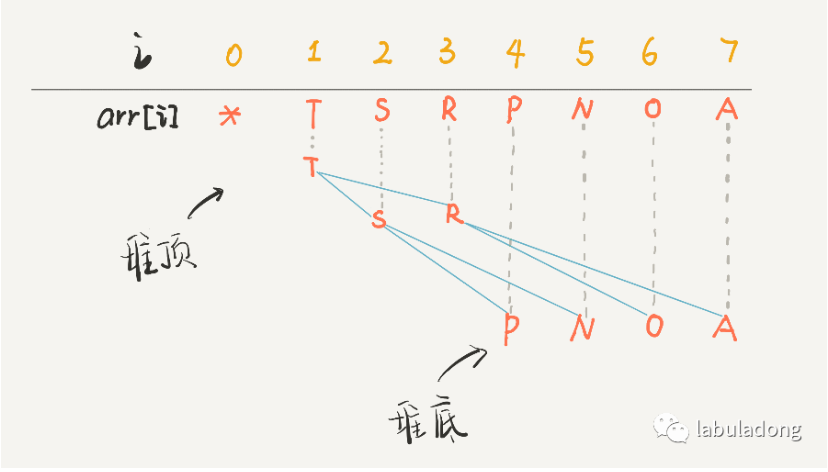
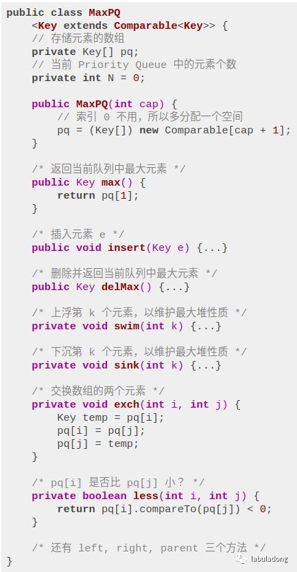
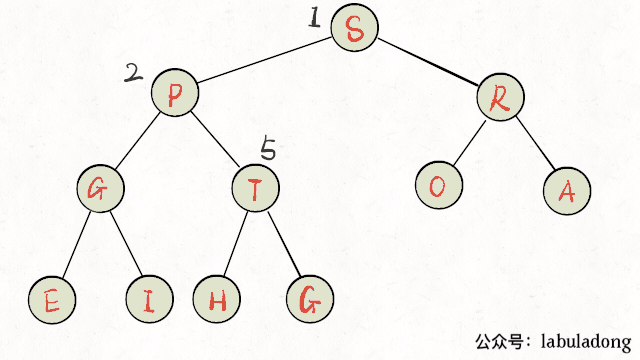
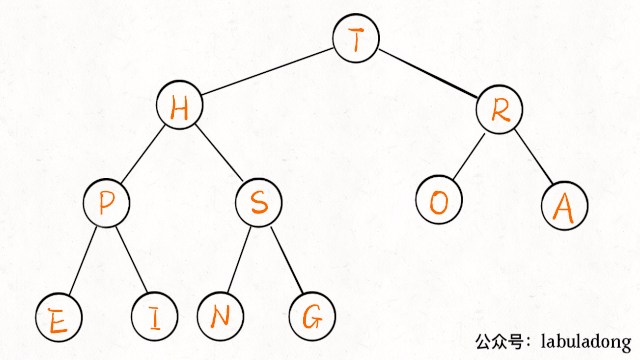
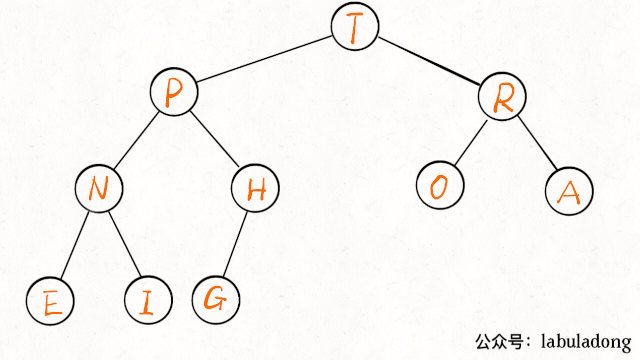
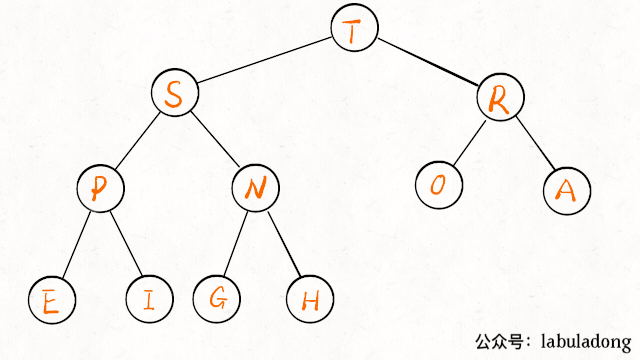

## 图文详解二叉堆，实现优先级队列（参考链接：https://mp.weixin.qq.com/s/o7tdyLiYm668dpUWd-x7Lg）

二叉堆（Binary Heap）没什么神秘，性质比二叉搜索树 BST 还简单。其主要操作就两个，sink（下沉）和swim（上浮），用以维护二叉堆的性质。**其主要应用有两个，首先是一种排序方法「堆排序」，第二是一种很有用的数据结构「优先级队列」**。

本文就以实现优先级队列（Priority Queue）为例，通过图片和人类的语言来描述一下二叉堆怎么运作的。

### 一、二叉堆概览

首先，二叉堆和二叉树有啥关系呢，为什么人们总数把二叉堆画成一棵二叉树？

因为，二叉堆其实就是一种特殊的二叉树（完全二叉树），只不过存储在数组里。一般的链表二叉树，我们操作节点的指针，而在数组里，我们把数组索引作为指针：

```
// 父节点的索引
int parent(int root) {
    // js Math.floor(root / 2)
    return root / 2; 
}
// 左孩子的索引
int left(int root) {
    return root * 2;
}
// 右孩子的索引
int right(int root) {
    return root * 2 + 1;
}
```

画个图你立即就能理解了，注意数组的第一个索引 0 空着不用：



PS：因为数组索引是数字，为了方便区分，将字符作为数组元素。

你看到了，把 arr[1] 作为整棵树的根的话，每个节点的父节点和左右孩子的索引都可以通过简单的运算得到，这就是二叉堆设计的一个巧妙之处。为了方便讲解，下面都会画的图都是二叉树结构，相信你能把树和数组对应起来。

二叉堆还分为最大堆和最小堆。**最大堆的性质是：每个节点都大于等于它的两个子节点**。类似的，**最小堆的性质是：每个节点都小于等于它的子节点**。

两种堆核心思路都是一样的，本文以最大堆为例讲解。

对于一个最大堆，根据其性质，显然堆顶，也就是 arr[1] 一定是所有元素中最大的元素。

### 二、优先级队列概览

优先级队列这种数据结构有一个很有用的功能，你插入或者删除元素的时候，元素会自动排序，这底层的原理就是二叉堆的操作。

数据结构的功能无非增删查改，优先级队列有两个主要 API，分别是insert插入一个元素和delMax删除最大元素（如果底层用最小堆，那么就是delMin）。

下面我们实现一个简化的优先级队列，先看下代码框架：

PS：为了清晰起见，这里用到 Java 的泛型，Key可以是任何一种可比较大小的数据类型，你可以认为它是 int、char 等。



### 三、实现 swim 和 sink

为什么要有上浮 swim 和下沉 sink 的操作呢？为了维护堆结构。

我们要讲的是最大堆，每个节点都比它的两个子节点大，但是在插入元素和删除元素时，难免破坏堆的性质，这就需要通过这两个操作来恢复堆的性质了。

对于最大堆，会破坏堆性质的有有两种情况：

1、如果某个节点 A 比它的子节点（中的一个）小，那么 A 就不配做父节点，应该下去，下面那个更大的节点上来做父节点，这就是对 A 进行下沉。

2、如果某个节点 A 比它的父节点大，那么 A 不应该做子节点，应该把父节点换下来，自己去做父节点，这就是对 A 的上浮。

当然，错位的节点 A 可能要上浮（或下沉）很多次，才能到达正确的位置，恢复堆的性质。所以代码中肯定有一个while循环。

**上浮的代码实现：**

```
private void swim(int k) {
    // 如果浮到堆顶，就不能再上浮了
    while (k > 1 && less(parent(k), k)) {
        // 如果第k个元素比上层大
        // 将k换上去
        exch(parent(k), k);
        // 同时修改k的下标为parent(k)
        k = parent(k);
    }
}
```

画个图看一眼就明白了：



**下沉的代码实现：**

下沉比上浮略微复杂一点，因为上浮某个节点 A，只需要 A 和其父节点比较大小即可；但是下沉某个节点 A，需要 A 和其两个子节点比较大小，如果 A 不是最大的就需要调整位置，要把较大的那个子节点和 A 交换。

```
private void sink(int k) {
    // 如果沉到堆底，就沉不下去了
    // 如果最后一个只有左子树，那就是k的左子节点2*k为最后一个数组元素 left(k) === N
    // 如果最后一个有右子树，那就是k的右子节点2*k + 1为最后一个数组元素 left(k) + 1 === N 即Left(k) < N
    // 所以会有left(k) <= N
    
    // 他这个思路：先判断left(k) <= N满足条件后，先让left为左右子树较大的，然后看有没有right(k)如果有且满足条件，去比较左右子树的较大值，找到两者较大的值的下标
    while (left(k) <= N) {
        // 假设左边的节点较大
        int older = left(k);
        // 如果右节点存在，比一下大小，并且left小于right
        if (right(k) <= N && less(left(k), right(k))) {
            older = right(k);
        }
        // 节点k比俩孩子都大，那就没必要下沉了
        if (less(older, k)) break;
        // 否则，不符合最大堆的结构，下沉k节点
        exch(k, older);
        k = older;
    }
}
```

画个图看下就明白了：



至此，二叉堆的主要操作就讲完了，一点都不难吧，代码加起来也就十行。明白了sink和swim的行为，下面就可以实现优先级队列了。

### 四、实现 delMax 和 insert

这两个方法就是建立在swim和sink上的。

**insert方法先把要插入的元素添加到堆底的最后，然后让其上浮到正确位置**。

```
public void insert(Key e) {
    // 比如：第一次插入N=0，然后N++为1，这时候我们将pq[1] = e;正好下标为0的时候不存任何元素
    // 第二次插入 N =1，然后N++为2，这时候我们将pq[2] = e，正好N=2就是最后一个元素的下标
    N++;
    // 先把新元素加到最后
    pq[N] = e;
    // 然后让他上浮到正确的位置
    swim(N);
}
```



**delMax方法先把堆顶元素 A 和堆底最后的元素 B 对调，然后删除 A，最后让 B 下沉到正确位置**。

```
public Key delMax() {
    // 最大堆的堆顶就是最大元素
    Key max = pq[1];
    // 把这个元素换到最后，删除值
    exch(1, N); // pq[N]就是最后一个
    // 删除最后一个
    pq[N] = null;
    N--;
    // 让pq[1]下沉到正确的位置
    sink(1);
    return max;
}
```



至此，一个优先级队列就实现了，插入和删除元素的时间复杂度为 O(logK)，K为当前二叉堆（优先级队列）中的元素总数。因为我们时间复杂度主要花费在sink或者swim上，而不管上浮还是下沉，最多也就树（堆）的高度，也就是 log 级别。

### 五、最后总结

二叉堆就是一种完全二叉树，所以适合存储在数组中，而且二叉堆拥有一些特殊性质。

二叉堆的操作很简单，主要就是上浮和下沉，来维护堆的性质（堆有序），核心代码也就十行。

优先级队列是基于二叉堆实现的，主要操作是插入和删除。插入是先插到最后，然后上浮到正确位置；删除是把第一个元素 pq[1]（最值）调换到最后再删除，然后把新的 pq[1] 下沉到正确位置。核心代码也就十行。

也许这就是数据结构的威力，简单的操作就能实现巧妙的功能，真心佩服发明二叉堆算法的人！


