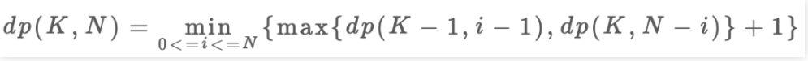

## 高楼扔鸡蛋问题完全解析 https://mp.weixin.qq.com/s/5Ssp0Cwd6wr8vPKR0lHtTQ

这是一个很经典的算法问题，若干楼层，若干个鸡蛋，让你算出最少的尝试次数，找到鸡蛋恰好摔不碎的那层楼，这道题的解法技巧很多，光动态规划就好几种效率不同的思路，
下面就来用我们一直强调的动态规划通用思路来研究一下这道题的几种解法。

### 一、解析题目

这是leetcode第887题**鸡蛋掉落**，我描述一下题目：
你面前有一栋从1到N共N层的楼，然后给你K个鸡蛋（K至少为1）。现在确定这栋楼存在楼层 0 <= F <= N，在这层楼将鸡蛋扔下去，鸡蛋恰好没摔碎（高于F的楼层都会碎，低于F的楼层都不会碎）。现在问你，
最坏情况下，你至少要扔几次鸡蛋，才能确定这个楼层F呢？

也就是让你找摔不碎鸡蛋的最高楼层F，但什么叫**最坏情况**下**至少**要扔几次呢？我们分别举个例子就明白了。

比方说**现在先不管鸡蛋个数的限制**，有7层楼，你怎么去找鸡蛋恰好摔碎的那层楼？

最原始的方式就是线性扫描：我先在1楼扔一下，没碎，我再去2楼扔一下，没碎，我再去3楼......

以这种策略，最坏情况应该就是我试到第7层鸡蛋也没碎（F = 7），也就是我扔了7次鸡蛋。

现在你应该理解什么叫做**最坏情况**下了，鸡蛋破碎一定发生在搜索区间穷尽时，不会说你在第1层摔一下鸡蛋就碎了，这是你运气好，不是最坏情况。

现在再来理解一下什么脚**至少**要扔几次。依然不考虑鸡蛋个数限制，同样是7层楼，我们可以优化策略。

最好的策略是使用二分查找思路，我先去第(1 + 7) / 2 = 4层扔一下：

如果碎了说明F小于4，我就去第(1 + 3) / 2 = 2层试......

如果没碎说明F大于等于4，我就去第(5 + 7) / 2 = 6层试......


以这种策略，最坏情况应该是试到第7层鸡蛋还没碎（F = 7），或者鸡蛋一直碎到第1层(F = 0)。然而无论哪种最坏情况，只需要试log7向上取整等于3次，比刚才尝试7次要少，这就是所谓的至少要扔几次。

> PS: 这有点像Big O表示法计算算法的复杂度

实际上，如果不限制鸡蛋个数的话，二分思路显然可以得到最少尝试的次数，但问题是，**现在给你了鸡蛋个数的限制K，直接使用二分思路就不行了。**

比如说只给你1个鸡蛋，7层楼，你敢用二分吗？你直接去第4层扔一下，如果鸡蛋没碎还好，但如果碎了你就没有鸡蛋继续测试了，无法确定鸡蛋恰好摔不碎的楼层F了。这种情况下只能用线性扫描的方法，算法返回结果应该是7。

有的读者业务会有这种想法：二分查找排除楼层的速度无疑是最快的，那干脆先用二分查找，等到只剩一个鸡蛋的时候再执行线性扫描，这样得到的结果是不是就是最少的扔鸡蛋次数呢？

很遗憾，并不是，比如说把楼层变高一些，100层，给你2个鸡蛋，你在50层扔一下，碎了，那就只能线性扫描1-49层了，最坏情况下要扔50次。

如果不要**二分**，变成**五分** **十分**都会大幅减少最坏情况下的尝试次数。比方说第一个鸡蛋每隔10层扔，在哪里碎了第二个鸡蛋一个个线性扫描，总共不会超过20次。

最优解其实是14次。最优策略非常多，而且并没有什么规律可言。

说了那么多，就是确保理解题目的意思，而且认识到这个题目确实复杂，就连我们手算都不容易，如何用算法解决呢？

### 二、思路分析

对动态规划问题，直接套我们以前多次强调的框架即可：这个问题有什么**状态**，有什么**选择**，然后穷举。

**状态 很明显，就是当前拥有的鸡蛋数K和需要测试的楼层N。**随着测试的进行，鸡蛋个数可能减少，楼层的搜索范围会减少，这就是状态的变化。

**选择 其实就是去选择哪层楼扔鸡蛋。**回去刚才的线性扫描和二分思路，二分查找每次选择到楼层区间的中间去扔鸡蛋，而线性扫描选择一层层向上测试。不同的选择会造成状态的转移。

现在明确了**状态**和**选择**，动态规划的基本思路就形成了：肯定是个二维的dp数组或者带有两个状态参数的dp函数来表示状态转移；外加一个for循环来遍历所有选择，择最优的选择更新状态：

```
# 当前状态为K个鸡蛋，面对N层楼
# 返回这个状态下的最优结果
int dp(int K, int N):
  int res
  for 1 <= i <= N:
    res = min(res, 这次在第i层楼扔鸡蛋)
  return res
```

这段伪代码还没有展示递归和状态转移，不过大致的算法框架已经完成了。

我们选择在第i层楼扔了鸡蛋之后，可能出现两种情况：鸡蛋碎了，鸡蛋没碎。**注意，这时候状态转移就来了：**

**如果鸡蛋碎了，**那么鸡蛋的个数K应该减一，搜索的楼层区间应该从[1..N]变为[1..i-1]共i-1楼层；

**如果鸡蛋没碎，**那么鸡蛋的个数K不变，搜索的楼层区间应该从[1...N]变为[i+1..N]共N-i层楼。


> PS: 问：在第i层楼扔鸡蛋如果没碎，楼层的搜索区间缩小至上面的楼层，是不是应该包含第i层楼呀？不必，因为已经包含了。开头说了F是可以等于0的，向上递归后，第i层楼其实就相当于第0层，可以被取到，所以说并没有错误。

因为我们要求的**最坏情况**下扔鸡蛋的次数，所以鸡蛋在第i层楼碎没碎，取决于哪种情况的结果更大：

```
int dp(int K, int N):
  int res
  for 1 <= i <= N:
    # 最坏情况下的最少扔鸡蛋次数
    res = min(res, 
              max(
                dp(k-1, i-1), # 碎了
                dp(k, N-i)    # 没碎
              ) + 1 # 在第i楼扔了一次
    )
  return res
```

递归的base case很容易理解：当楼层N等于0时，显然不需要扔鸡蛋；当鸡蛋数K为1时，显然只能线性扫描所有楼层：

```
def dp(K, N):
  if K === 1: return N
  if N === 0: return 0
```

至此，其实这道题就解决了！只要添加一个备忘录消除重叠子问题即可：

```
def superEggDrop(K: int, N: int):
  memo = dict()
  def dep(K, N):
    # base case
    if K === 1: return N
    if N === 0: return 0
    # 避免重复计算
    if (K, N) in memo:
      return memo[(K, N)]
    res = float('INF') # 正无穷
    #穷举所有可能的选择
    for i in range(1, N + 1): # range(1, 11) (从 1 开始到 10) => [1, 2, 3, 4, 5, 6, 7, 8, 9, 10]
      res = min(res, 
                max(
                  dp(k-1, i-1), # 碎了
                  dp(k, N-i), # 碎了
                ) + 1 # 在第i楼扔了一次
      )
    # 记入备忘录
    memo[(K, N)] = res
    return res
  return dp(K, N)
```

这个算法的时间复杂度是多少呢？**动态规划算法的时间复杂度就是子问题个数 × 函数本身的复杂度**

函数本身的复杂度就是忽略递归部分的复杂度，这里dp函数中有一个for循环，所以函数本身的复杂度是O(N)。

子问题的个数也就是不同状态组合的总数，显然是两个状态的乘积，也就是O(KN)。所以算法的总时间复杂度是O(K*N^2)，空间复杂度O（KN）。

这个问题很复杂，但是算法代码却十分简洁，这就是动态规划的特性，穷举加备忘录/DP table优化。

为什么用一个for循环遍历楼层[1..N]，也许会把这个逻辑和之前探讨的线性扫描混为一谈。其实不是的，**这只是再做一次[选择]。**

比方说你有 2个鸡蛋，面对 10 层楼，你**这次**选择去哪一层楼扔呢?不知道，那就把这 10 层楼全试一遍。至于下次怎么选择不用你操心，有正确的状态转移，递归算法会把每个选择的代价都算出来，我们取最优的那个就是最优解。

另外，这个问题还有更好的解法，比如修改代码中的for循环为二分搜索，可以将时间复杂度降为O(K*N*logN);再改进动态规划解法可以进一步降为O(KN);使用数学方法解决，时间复杂度达到最优 O(K*logN)，空间复杂度达到 0(1)。

二分的解法也有点误导性，你很可能以为它跟我们之前讨论的二分思路扔鸡蛋有关系，实际上没有半毛钱关系。能用二分搜索是因为状态转移方程的函数图像具有单调性，可以快速找到最值。

接下来我们看一看如何优化。

### 三、二分搜索优化

二分搜索的优化核心是状态转移方程的单调性，首先简述一下原始动态规划的思路：

1.暴力穷举尝试在所有楼层 1 <= i <= N 扔鸡蛋，每次选择尝试次数**最少**的那一层;

2.每次扔鸡蛋有两种可能，要么碎，要么没碎;

3.如果鸡蛋碎了，F应该在第i层下面，否则，F应该在第i层上面;

4.鸡蛋是碎了还是没碎，取决于哪种情况下尝试次数**更多**，因为我们想求的是最坏情况下的结果。

核心的状态转移代码是这段：

```
# 当前状态为K个鸡蛋，面对N层楼
# 返回这个状态下的最优结果
def dp(K, N):
  for 1 <= i <= N:
    # 最坏情况下的最少扔鸡蛋次数
    res = min(res,
              max(
                dp(k-1, i-1), # 碎了
                dp(k, N-i),   # 没碎
              ) + 1           # 在第i楼扔了一次
    )
  return res
```

这个for循环就是下面这个状态转移方程的具体代码实现：



如果能理解状态这个状态转移方程，那么就很容易理解二分查找的优化思路。

首先我们根据dp(K, N)数组的定义（有K个鸡蛋面对N层楼，最少需要扔几次），**很容易知道K固定时，这个函数随着N的增加一定是单调递增的，**无论你策略多聪明，楼层增加测试次数一定要增加。

那么注意dp(K-1，i-1)和dp(K, N - i)这两个函数，其中i是从1到N单增的，如果我们固定K和N，**把这两个函数看作关于i的函数，前者随着i的增加应该也是单调递增的，而后者随着i的增加应该是单调递减的：**


这时候求二者得较大值，再求这些最大值之间的最小值，其实就是求这两条直线交点，也就是红色折线得最低点嘛（就是最坏情况下的最少扔的次数）。

我们前门二分查找得运用技巧讲过，二分查找得运用很广泛，形如下面这种形式的for循环代码：

```
for(int i = 0; i < n; i++) {
  if (f(i)) 
    return i;
}
```

都很有可能可以运用二分查找来优化线性搜索的复杂度，回顾这两个dp函数得曲线，我们要找的最低点其实就是这种情况：

```
for(int i = 1; i <= N; i++) {
  if (dp(K-1, i-1) === dp(K, N-i))
    return dp(K, N-i)
}
```

熟悉二分搜索的同学肯定敏感地想到了，这不就是相当于求Valley（山谷）值嘛，可以用二分查找来快速寻找这个点的，直接看代码把，整体思路还是一样，只是加快了搜索速度：

```
def superEggDrop(self, K: int, N: int) -> int:
  memo = dict()
  def dp(K, N):
    if K === 1: return N
    if N === 0: return 0
    if (K, N) in memo:
      return memo[(K, N)]
    res = float('INF')
    # 用二分搜索代替线性搜索
    lo, hi = 1, N
    while lo <= hi:
      mid = (lo + hi) / 2
      broken = dp(K-1, mid-1)   # 碎
      not_broken = dp(K, N-mid) # 没碎
      # res = min(max(碎，没碎)+1)
      if broken > not_broken:
        hi = mid - 1
        res = min(res, broken + 1)
      else:
        lo = mid + 1
        res = min(res, not_broken + 1)
    memo[(K, N)] = res
    return res
  return dp(K, N)
```

这个算法的时间复杂度是多少呢？**动态规划算法的时间复杂度就是子问题个数×函数本身的复杂度。**

函数本身的复杂度就是忽略递归部分的复杂度，这里dp函数中用了一个二分搜索，所以函数本身的复杂度是O(logN)。
子问题的个数也就是不同状态组合的总数，显然是两个状态的乘积，也就是O(KN)。
所以算法的总时间复杂度是O(KNlogN)，空间复杂度O(KN)。效率上比之前的算法O(KN^2)要高效一些。

### 四、重新定义状态转移

前文 不同定义又不同解法 就提到过，找动态规划的状态转移本就是见仁见智，比较玄学的事情，不同的状态定义可以衍生出不同的解法，其解法和复杂程度都可能有巨大差异，这里就是一个很好的例子。

在回顾一下我们之前定义的dp数组含义：

```
def dp(k, n) -> int
# 当前状态为k个鸡蛋，面对N层楼
# 返回这个状态下最少的扔鸡蛋次数
```

用dp数组表示的话也是一样的：

```
dp[k][n] = m
# 当前状态为k个鸡蛋，面对N层楼
# 这个状态下最少的扔鸡蛋次数为m
```

按照这个定义，就是**确定当前的鸡蛋个数和面对的楼层数，就知道最小扔鸡蛋次数。**最终我们想要的答案就是dp(K, N)的结果。

这种思路下，肯定要穷举所有可能的扔法的，用二分搜索优化也只是做了【剪枝】，减少了搜索空间，但本质思路没有变，还是穷举。

现在，我们稍微修改dp数组的定义，**确定当前的鸡蛋个数和最多允许的扔鸡蛋次数，就知道能够确定F的最高楼层数。**具体来说是这个意思：

```
dp[k][m] = n
# 当前有k个鸡蛋，可以尝试扔m次鸡蛋
# 这个状态下，最坏情况下最多能确切测试一栋n层的楼

# 比如说dp[1][7] = 7表示：
# 现在有1个鸡蛋，允许你扔7次;
# 这个状态下最多给你7层楼，
# 使得你可以确定楼层F使得鸡蛋恰好摔不碎
# (一层一层线性探查嘛)
```

这其实就是我们原始思路的一个【反向】版本，我们先不管这种思路的状态转移怎么写，先来思考一下这种定义之下，最终想求的答案是什么？

我们最终要求的其实是扔鸡蛋次数m，但是这时候m在状态之中而不是dp数组的结果，可以这样处理：

```
int superEggDrop(int K, int N) {
  int m = 0;
  while(dp[K][m] < N) {
    m++;
    // 状态转移...
  }
  return m;
}
```

题目不是**给你K鸡蛋，N层楼，让你求最坏情况下最少的测试次数m吗？**while循环结束的条件是dp[K][m] == N，也就是**给你K个鸡蛋，测试m次，最坏情况下最多能测试N层楼。**

这两段描述，是完全一样的！这样组织代码也是正确的，关键就是状态转移方程怎么找？还得从我们原始的思路开始将，之前的解法配了这样图来理解状态转移思路：


这个图描述的仅仅是某一个楼层i，原始解法还得是线性或者二分扫描所有楼层，要求最大值，最小值。但是现在这种dp定义根本不需要这些了，基于下面两个事实：

**1.无论你在哪层楼扔鸡蛋，鸡蛋只可能摔碎或者没摔碎，碎了的话就测楼下，没碎的话就测楼上。**

**2.无论你上楼还是下楼，总的楼层数 = 楼上的楼层数 + 楼下的楼层数 + 1(当前这层楼)。**

根据这个特点，可以写出下面的状态转移方程：

```
dp[k][m] = dp[k][m-1] + dp[k-1][m-1] + 1
```

**dp[k][m-1]就是楼上的楼层数，**因为鸡蛋个数K不变，也就是鸡蛋没碎，扔鸡蛋次数m减一；

**dp[k-1][m-1]就是楼下的楼层数，**因为鸡蛋个数k减一，也就是鸡蛋碎了，同时扔鸡蛋次数m减一。

> PS: 这个m为什么要减一而不是加一？之前定义得很清楚，这个m是一个允许扔鸡蛋的次数上界，而不是扔了几次。


至此。整个思路就完成了，只要把状态转移方程填进框架即可：

```
int superEggDrop(int K, int N) {
  // m最多不会超过N次（线性扫描）
  int[][] dp = new int[K + 1][N + 1];
  // base case 
  // dp[0][..] = 0  // 当鸡蛋个数为0的时候，无论还剩下测试多少次，测试的楼层只能为0
  // dp[..][0] = 0  // 当测试次数为0的时候，无论还剩下多少个鸡蛋，测试的楼层也只能为0
  // java默认初始化数组都为0
  int m = 0;
  while(dp[K][m] < N) { // while循环结束的条件是dp[K][m] == N，也就是给你K个鸡蛋，测试m次，最坏情况下最多能测试N层楼。
    m++;
    for(int k = 1; k <= K; k++) {
      dp[k][m] = dp[k][m-1] + dp[k-1][m-1] + 1;
    }
  }
  return m;
}
```

如果你还觉得这段代码有点难以理解，其实他就是等同于这样写：

```
for(int m = 1; dp[K][m] < N; m++)
  for(int k = 1; k <= K; k++) {
    dp[k][m] = dp[k][m-1] + dp[k-1][m-1] + 1;
  }
}
```

看到这种代码形式就很熟悉了，因为我们要求的不是dp数组里的值，而是某个符合条件的索引m，所以用while循环来找到这个m而已。

这个算法的时间复杂度是多少？很明显就是两个嵌套循环的复杂度O（KN）。


