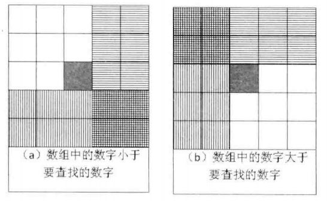
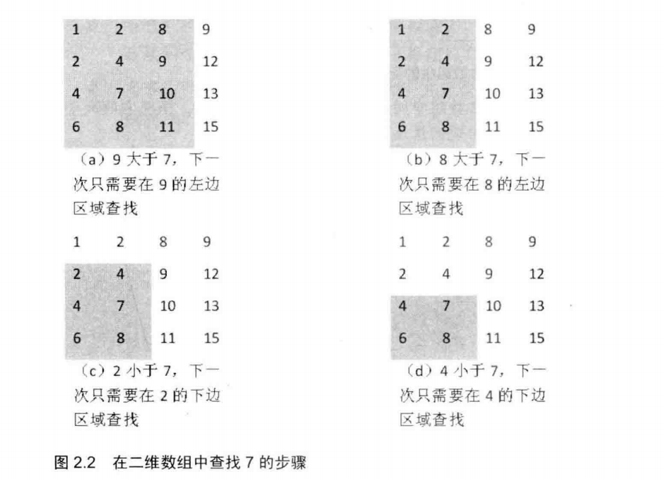

## 面试题4：二维数组中的查找

> 题目：在一个二维数组中，每一行都按照从左到右递增的顺序排序，每一列都按照从上到下递增的顺序排序。请完成一个函数，输入这样的一个二维数组和一个整数，判断数组中是否含有该整数。

例如下面的二维数组就是每行、每列都递增排序。如果在这个数组中查找数字7，则返回true；如果查找数字5，由于数组不含有该数字，则返回false。

1  2  8  9
2  4  9  12
4  7  10 13
6  8  11 15

在分析这个问题的时候，很多应聘者都会把二维数组画成矩形，然后在数组中选取一个数字，分3种情况来分析查找的过程。当数组中选区的数字刚好和要查找的数字相等时，就结束查找过程。如果选取的数字小于要查找的数字，那么根据数组排序的规则。如果选取的数字小于要查找的数字，那么根绝数组排序的规则，要查找的数字应该在当前选取位置的右边或者下边，如图2.1(a)所示。同样
如果选取的数字大于要查找的数字，那么要查找的数字应该在当前选取位置的上边或者左边，如图2.1(b)所示。



#### 图2.1 二维数组中的查找

> 注：在数组中间选择一个数（深色方格），根据他的大小判断要查找的数字可能出现的区域（阴影部分）。

在上面的分析中，由于要查找的数字相对于当前选取的位置有可能在两个区域中出现，而且这两个区域还有重叠，这问题看起来就复杂了，于是很多人就卡在这里束手无策了。

当我们需要解决一个复杂的问题时，一个很有效的办法就是从一个具体的问题入手，通过分析简单具体的例子，试图寻找普遍的规律。针对这个问题，我们不妨也从一个具体的例子入手。下面我们以在题目中给出的数组中查找数字7为例来一步步分析查找的过程。

前面我们之所以遇到难题，是因为我们在二维数组的中间选取一个数字来和要查找的数字进行比较，这就导致下一次要查找的是两个相互重叠的区域。如果我们从数组的一个角上选取数字来和要查找的数字进行比较，那么情况会不会变简单呢?

首先我们选取数组右上角的数字9。由于9大于7，并且9还是第4列的第一个(也是最小的)数字，因此7不可能出现在数字9所在的列。于是我们把这一列从需要考虑的区域内剔除，之后只需要分析剩下的3列，如图2.2(a)所示。在剩下的矩阵中，位于右上角的数字是8。同样8大于7，因此8所在的列我们也可以剔除。接下来我们只要分析剩下的两列即可，如图2.2(b)所示。

在由剩余的两列组成的数组中，数字2位于数组的右上角。2小于7.那么要查找的7可能在2的右边，也可能在2的下边。在前面的步骤中，我们已经发现2右边的列都已经被剔除了，也就是说7不可能出现在2的右边，因此7只有可能出现在2的下边。于是我们把数字2所在的行也剔除，只分析剩下的三行两列数字，如图 2.2(c)所示。在剩下的数字中，数字4位于右上角，和前面一样，我们把数字4所在的行也删除，最后乘下两行两列数字，如图2.2(d)所示。

在剩下的两行两列4个数字中，位于右上角的刚好就是我们要查找的数字7，于是查找过程就可以结束了。



> 注：矩阵中加阴影的区域是下一步查找的范围。

总结上述查找的过程，我们发现以下规律：首先选取数组中右上角的数字。如果该数字等于要查找的数字，则查找过程结束：如果该数字大于要查找的数字，则剔除这个数字所在列；如果该数字小于要查找的数字，则剔除这个数字所在的行。也就是说，如果要查找的数字不在数组的右上角，则每一次都在数组的查找范围中剔除一行或者一列。这样每一步都可以缩小查找的范围，直到找到要查找的数字，或者查找范围为空。

把整个查找过程分析清楚之后，我们再写代码就不是一件很难的事情了。下面是上述思路对应的参考代码：

```
bool Find(int* matrix, int rows, int columns, int number) {
  bool found = false;
  if (matrix != nullptr && rows > 0 && columns > 0) 
  {
    int row = 0;
    int column = columns - 1;
    while(row < rows && column >= 0) 
    {
      if (matrix[row*columns + column] == number)
      {
        found = true;
        break;
      }
      else if (matrix[row*columns + column] > number)
      {
        --column;
      }
      else
        ++row;
    }
  }
  return found;
}
```

在前面的分析中，我们每次都选取数组查找范围内的右上角数字。同样，我们也可以选取左下角的数字。感兴趣的读者不妨自己分析一下每次都选取左下角数字的查找过程。但我们不能选择左上角后者右下角数字。以左上角数字为例，最初数字1位于初始数组的左上角，由于1小于7，那么7应该位于1的右边或者下边。此时我们既不能从查找范围内剔除1所在的行，也不能剔除1所在的列，这样我们就无法缩小查找的范围。