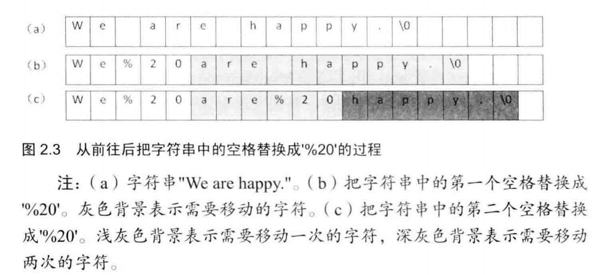
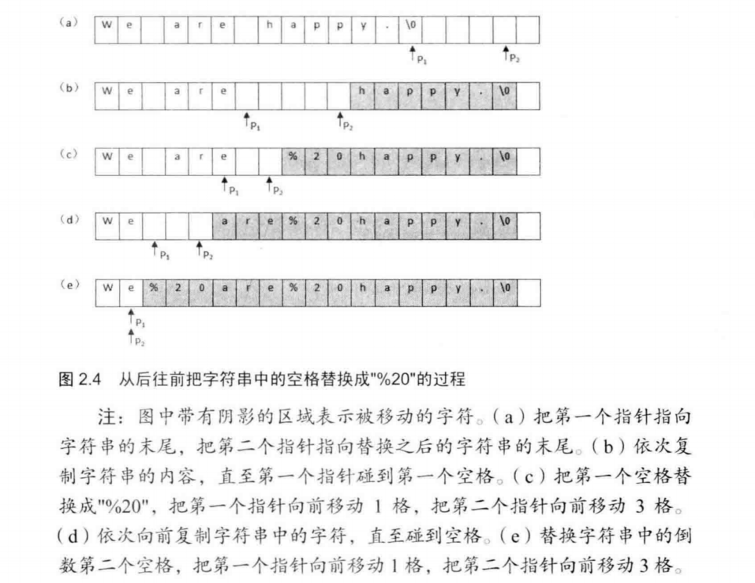

## 面试题5：替换空格

> 题目：请实现一个函数，把字符串中的每个空格替换成"%20"。例如，输入"We are happy."，则输出"We%20are%20happy."。

在网络编程中，如果URL参数中含有特殊字符，如空格、'#等，则可能导致服务器端无法获得正确的参数值。我们需要将这些特殊符号转换成服务器可以识别的字符。转换的规则是在%后面跟上ASCII码的两位十六进制的表示。比如空格的ASCII码是32，即十六进制的0x20，因此空格被替换成"%20"。再比如#的ASCII码为35，即十六进制的0x23，它在URL中被替换为"%23"。

看到这个题目，我们首先应该想到的是原来一个空格字符，替换之后变成'%'、'2'和'0'这 3 个字符，因此字符串会变长。如果是在原来的字符串上进行替换，就有可能覆盖修改在该字符串后面的内存。如果是创建新的字符串并在新的字符串上进行替换，那么我们可以自己分配足够多的内存。由于有两种不同的解决方案，我们应该向面试官问清楚，让他明确告诉我们他的需求。假设面试官让我们在原来的字符串上进行替换，并且保证输入的字符串后面有足够多的空余内存。

### 时间复杂度为O(N^2)的解法，不足以拿到Offer

现在我们考虑怎么执行替换操作。最直观的做法是从头到尾扫描字符串，每次碰到空格字符的时候进行替换。由于是把1个字符替换成3个字符，我们必须要把空格后面所有的字符都后移2字节，否则就有两个字符被覆盖了。
举个例子，我们从头到尾把"We are happy."中的每个空格替换成"%20"。为了形象起见，我们可以用一个表格来表示字符串，表格中的每个格子表示一个字符，如图2.3(a)所示。



我们替换第一个空格，这个字符串变成图 2.3(b)中的内容，表格中灰色背景的格子表示需要进行移动的区域。接着我们替换第二个空格，替换之后的内容如图2.3(c)所示。同时，我们注意到用深灰色背景标注的“happy”部分被移动了两次。

**假设字符串的长度是n。对每个空格字符，需要移动后面O(n)个字符，因此对于含有O(n)个空格字符的字符串而言，总的时间效率是O(n^2)**。

当我们把这种思路阐述给面试官后，他不会就此满意，他将让我们寻找更快的方法。在前面的分析中，我们发现数组中很多字符都移动了很多次，能不能减少移动次数呢?答案是肯定的。我们换一种思路，把从前向后替换改成从后向前替换。

### 时间复杂度为O(n)的解法，搞定Offer就靠它了

我们可以先遍历一次字符串，这样就能统计出字符串中空格的总数，并可以由此计算出替换之后的字符串的总长度。每替换一个空格，长度增加2，因此替换以后字符串的长度等于原来的长度加上2乘以空格数目。我们还是以前面的字符串"We are happy."为例。"We are happy."这个字符串的长度是14(包括结尾符号'\0')，里面有两个空格，因此替换之后字符串的长度是18。

我们从字符串的后面开始复制和替换。首先准备两个指针:P1和 P2。 P1指向原始字符串的末尾，而P2指向替换之后的字符串的末尾，如图2.4(a)所示。接下来我们向前移动指针P1，逐个把它指向的字符复制到P2指向的位置，直到碰到第一个空格为止。此时字符串如图2.4(b)所示，灰色背景的区域是进行了字符复制(移动)的区域。碰到第一个空格之后，把P1向前移动1格，在P2之前插入字符串"%20"。由于"%20"的长度为3，同时也要把P2向前移动3格，如图2.4(c)所示。

我们接着向前复制，直到碰到第二个空格，如图2.4(d)所示。和上一次一样，我们再把P1向前移动1格，并把P2向前移动3格插入"%20"，如图2.4(e)所示。此时P1和P2指向同一位置，表明所有空格都已经替换完毕。
从上面的分析中我们可以看出，所有的字符都只复制(移动)一次，因此这个算法的时间效率是O(n)，比第一个思路要快。



在面试过程中，我们也可以和前面的分析一样画一两个示意图解释自己的思路，这样既能帮助我们理清思路，也能使我们和面试官的交流变得更加高效。在面试官肯定我们的思路之后，就可以写代码了。下面是参考代码：

```
/* length为字符数组string的总容量 */
void ReplaceBlank(char string[], int length)
{
  if (string == nullptr || length <= 0)
    return;
  /* originalLength为字符串string的实际长度 */
  int originalLength = 0;
  int numberOfBlank = 0;
  int i = 0;
  // 统计长度
  while(string[i] != '\0') 
  {
    ++originalLength;
    if (string[i] == '')
      ++numberOfBlank;
    ++i;
  }
  /* newLength为把空格替换成'%20'之后的长度 */
  int newLength = originalLength + 2 * numberOfBlank;
  if (newLength > length)
    return;
  
  // 定义两个指针 p1 指向原长度
  int indexOfOriginal = originalLength;
  // p2指向新的长度
  int indexOfNew = newLength;
  // 从后往前遍历
  while(indexOfOriginal >= 0 && indexOfNew > indexOfOriginal)
  {
    if (string[indexOfOriginal] == '')
    {
      // 空的时候，新字符串往前走三格
      string[indexOfNew--] = '0';
      string[indexOfNew--] = '2';
      string[indexOfNew--] = '%';
    }
    else
    {
      // 拷贝原先的，往前走一格
      string[indexOfNew--] = string[indexOfOriginal];
    }
    // p1往前走一格
    --indexOfOriginal;
  }
}
```