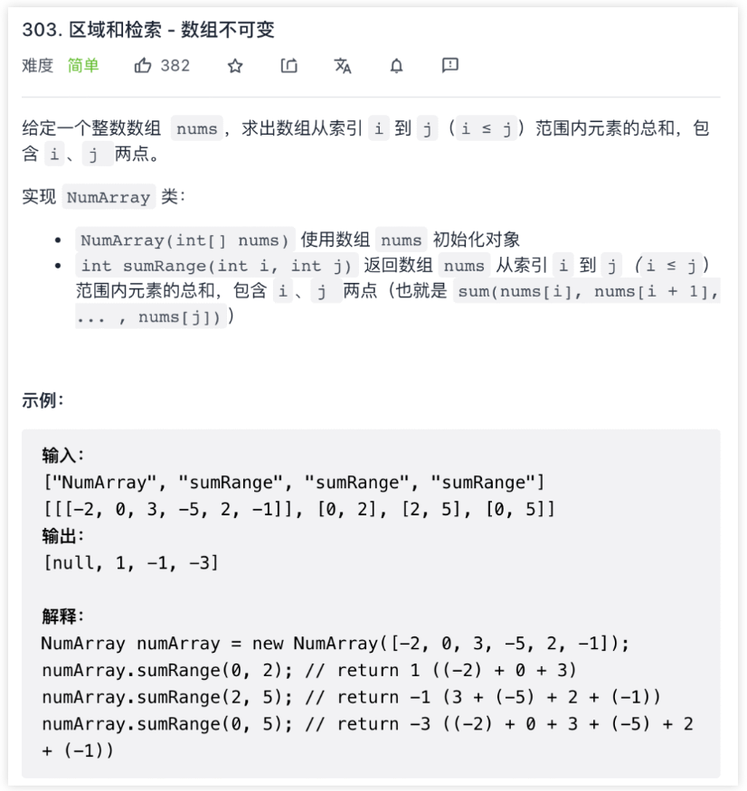
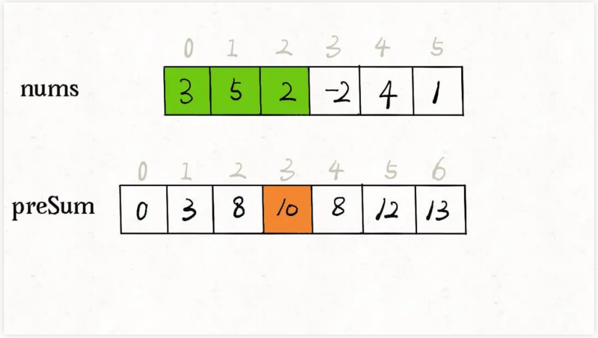
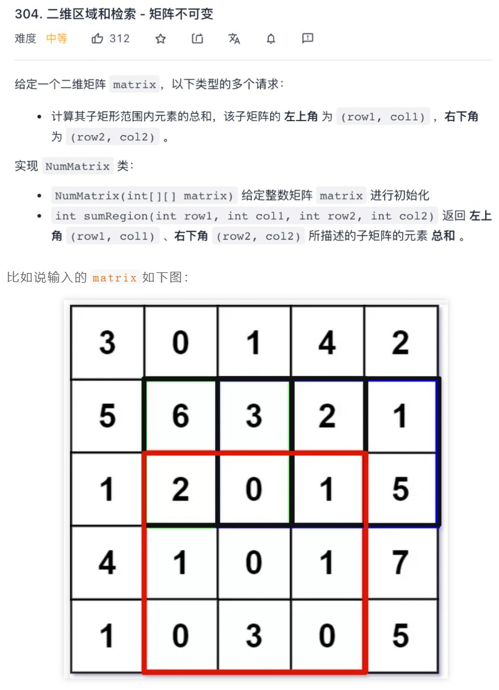

## 前缀和数组解决子数组问题（参考链接：https://mp.weixin.qq.com/s?__biz=MzAxODQxMDM0Mw==&mid=2247494095&idx=2&sn=19a2609f33eadbbda1f6b75e2298d931&scene=21#wechat_redirect）

前缀和技巧适用于快速、频繁地计算一个索引区间内的元素之和。

### 一维数组中的前缀和

先看一道例题，力扣第 303 题「区域和检索 - 数组不可变」，让你计算数组区间内元素的和，这是一道标准的前缀和问题：



题目要求你实现这样一个类：

```
class NumArray {

    public NumArray(int[] nums) {}

    /* 查询闭区间 [left, right] 的累加和 */
    public int sumRange(int left, int right) {}
}
```

sumRange函数需要计算并返回一个索引区间之内的元素和，没学过前缀和的人可能写出如下代码：

```
class NumArray {

    private int[] nums;

    public NumArray(int[] nums) {
        this.nums = nums;
    }

    public int sumRange(int left, int right) {
        int res = 0;
        for (int i = left; i <= right; i++) {
            res += nums[i];
        }
        return res;
    }
}
```

这样，可以达到效果，但是效率很差，因为sumRange方法会被频繁调用，而它的时间复杂度是O(N)，其中N代表nums数组的长度。

这道题的最优解法是使用前缀和技巧，将sumRange函数的时间复杂度降为O(1)，说白了就是不要在sumRange里面用 for 循环，咋整？

直接看代码实现：

```
class NumArray {
    // 前缀和数组
    private int[] preSum;
    /* 输入一个数组，构造前缀和 */
    public NumArray(int[] nums) {
        // preSum[0] = 0，便于计算累加和
        preSum = new int[nums.length + 1];
        // 计算Nums的累加和
        for(int i = 1; i < preSum.length; i++) {
            preSum[i] = preSum[i - 1] + nums[i - 1];
        }
    }
    /* 查询闭区间 [left, right] 的累加和 */
    // ps: nums: [1,2,3,4] preSum: [0, 1, 3, 6, 10] 假设我们求[2, 3]的和（下标2，下标3），
    // 那么我们将preSum[right + 1](preSum[4])也就是前right个数的和 减去 前left-1个数的和（preSum[left]）
    // [1,2,|3,4] right为3，我们先拿出来前3个数的和包括下标3，就是preSum[right+1]，然后我们拿到前Left-1包含(left-1) 也就是1 在presum中的和
    // 就是preSum[2]
    public int sumRange(int left, int right) {
        return preSum[right + 1] - preSum[left];
    }
}
```

核心思路是我们 new 一个新的数组preSum出来，preSum[i]记录nums[0..i-1]的累加和，看图 10 = 3 + 5 + 2：



看这个preSum数组，如果我想求索引区间[1, 4]内的所有元素之和，就可以通过preSum[5] - preSum[1]得出。

这样，sumRange函数仅仅需要做一次减法运算，避免了每次进行 for 循环调用，最坏时间复杂度为常数O(1)。

这个技巧在生活中运用也挺广泛的，比方说，你们班上有若干同学，每个同学有一个期末考试的成绩（满分 100 分），那么请你实现一个 API，输入任意一个分数段，返回有多少同学的成绩在这个分数段内。

那么，你可以先通过计数排序的方式计算每个分数具体有多少个同学，然后利用前缀和技巧来实现分数段查询的 API：

```
int[] scores; // 存储这所有同学的分数
// 试卷满分 100 分
int[] count = new int[100 + 1];
// 记录每个分数有几个同学
for(int score : scores) {
    count[score]++;
}
// 构造前缀和
for(int i = 1; i < count.length; i++) {
    count[i] = count[i-1]+count[i];
}
// 利用 count 这个前缀和数组进行分数段查询
```

接下来，我们看一看前缀和思路在实际算法题中可以如何运用。

### 二维矩阵中的前缀和

这是力扣第 304 题「304. 二维区域和检索 - 矩阵不可变」，其实和上一题类似，上一题是让你计算子数组的元素之和，这道题让你计算二维矩阵中子矩阵的元素之和：




