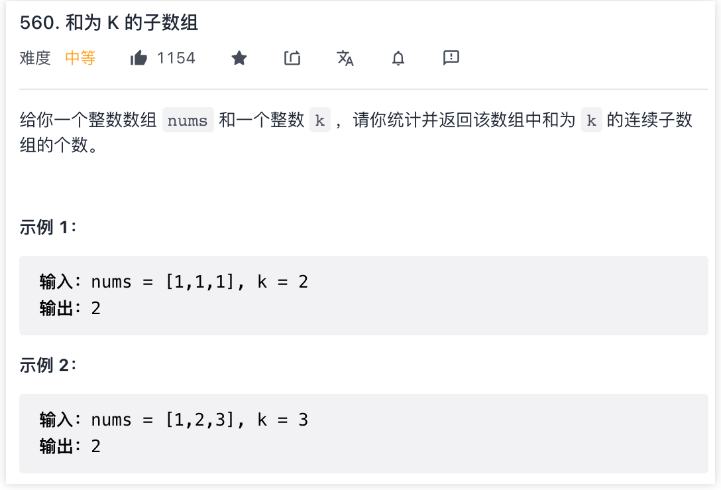
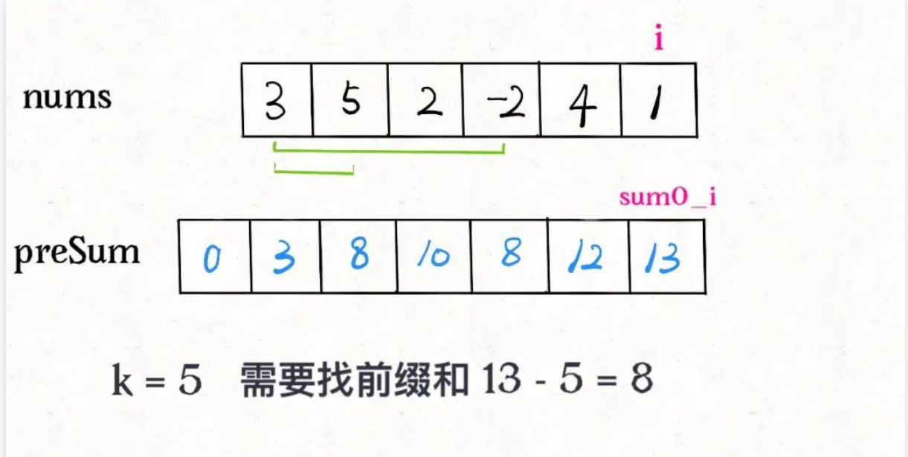

## 前缀和数组解决子数组问题（参考链接：https://mp.weixin.qq.com/s?__biz=MzAxODQxMDM0Mw==&mid=2247494095&idx=2&sn=19a2609f33eadbbda1f6b75e2298d931&scene=21#wechat_redirect）

前缀和技巧适用于快速、频繁地计算一个索引区间内的元素之和。

### 一维数组中的前缀和

先看一道例题，力扣第 303 题「区域和检索 - 数组不可变」，让你计算数组区间内元素的和，这是一道标准的前缀和问题：


题目要求你实现这样一个类：

```
class NumArray {

    public NumArray(int[] nums) {}

    /* 查询闭区间 [left, right] 的累加和 */
    public int sumRange(int left, int right) {}
}
```

sumRange函数需要计算并返回一个索引区间之内的元素和，没学过前缀和的人可能写出如下代码：

```
class NumArray {

    private int[] nums;

    public NumArray(int[] nums) {
        this.nums = nums;
    }

    public int sumRange(int left, int right) {
        int res = 0;
        for (int i = left; i <= right; i++) {
            res += nums[i];
        }
        return res;
    }
}
```

这样，可以达到效果，但是效率很差，因为sumRange方法会被频繁调用，而它的时间复杂度是O(N)，其中N代表nums数组的长度。

这道题的最优解法是使用前缀和技巧，将sumRange函数的时间复杂度降为O(1)，说白了就是不要在sumRange里面用 for 循环，咋整？

直接看代码实现：

```
class NumArray {
    // 前缀和数组
    private int[] preSum;
    /* 输入一个数组，构造前缀和 */
    public NumArray(int[] nums) {
        // preSum[0] = 0，便于计算累加和
        preSum = new int[nums.length + 1];
        // 计算Nums的累加和
        for(int i = 1; i < preSum.length; i++) {
            preSum[i] = preSum[i - 1] + nums[i - 1];
        }
    }
    /* 查询闭区间 [left, right] 的累加和 */
    // ps: nums: [1,2,3,4] preSum: [0, 1, 3, 6, 10] 假设我们求[2, 3]的和（下标2，下标3），
    // 那么我们将preSum[right + 1](preSum[4])也就是前right个数的和 减去 前left-1个数的和（preSum[left]）
    // [1,2,|3,4] right为3，我们先拿出来前3个数的和包括下标3，就是preSum[right+1]，然后我们拿到前Left-1包含(left-1) 也就是1 在presum中的和
    // 就是preSum[2]
    public int sumRange(int left, int right) {
        return preSum[right + 1] - preSum[left];
    }
}
```

核心思路是我们 new 一个新的数组preSum出来，preSum[i]记录nums[0..i-1]的累加和，看图 10 = 3 + 5 + 2：


看这个preSum数组，如果我想求索引区间[1, 4]内的所有元素之和，就可以通过preSum[5] - preSum[1]得出。

这样，sumRange函数仅仅需要做一次减法运算，避免了每次进行 for 循环调用，最坏时间复杂度为常数O(1)。

这个技巧在生活中运用也挺广泛的，比方说，你们班上有若干同学，每个同学有一个期末考试的成绩（满分 100 分），那么请你实现一个 API，输入任意一个分数段，返回有多少同学的成绩在这个分数段内。

那么，你可以先通过计数排序的方式计算每个分数具体有多少个同学，然后利用前缀和技巧来实现分数段查询的 API：

```
int[] scores; // 存储这所有同学的分数
// 试卷满分 100 分
int[] count = new int[100 + 1];
// 记录每个分数有几个同学
for(int score : scores) {
    count[score]++;
}
// 构造前缀和
for(int i = 1; i < count.length; i++) {
    count[i] = count[i-1]+count[i];
}
// 利用 count 这个前缀和数组进行分数段查询
```

接下来，我们看一看前缀和思路在实际算法题中可以如何运用。

### 二维矩阵中的前缀和

这是力扣第 304 题「304. 二维区域和检索 - 矩阵不可变」，其实和上一题类似，上一题是让你计算子数组的元素之和，这道题让你计算二维矩阵中子矩阵的元素之和：


那么sumRegion([2,1,4,3])就是图中红色的子矩阵，你需要返回该子矩阵的元素和 8。

这题的思路和一维数组中的前缀和是非常类似的，如下图：


如果我想计算红色的这个子矩阵的元素之和，可以用绿色矩阵减去蓝色矩阵减去橙色矩阵最后加上粉色矩阵，而绿蓝橙粉这四个矩阵有一个共同的特点，就是左上角就是(0, 0)原点。

那么我们可以维护一个二维preSum数组，专门记录以原点为顶点的矩阵的元素之和，就可以用几次加减运算算出任何一个子矩阵的元素和：

```
class NumMatrix {
    // 记录从原点左上角到右下角的元素和
    // preSum[i][j] 记录矩阵[0, 0, i, j]的元素和
    private int[][] preSum;
    
    public NumMatrix(int[][] matrix) {
        // m行，n列
        int m = matrix.length, n = matrix[0].length;
        // 如果是一维数组则退出
        if (m == 0 || n == 0) return;
        // 构造前缀和矩阵
        preSum = new int[m+1][n+1];
        for(int i = 1; i <= m; i++) {
            for(int j = 1; i <= n; j++) {
                // 计算每个矩阵[0,0,i,j]的元素和
                // 计算每个矩阵[0,0,i,j]的值为：上面的preSum[i-1][j] + 左面的preSum[i][j-1] + 当前值matrix[i-1][j-1] - 左上角的preSum[i-1][j-1]
                preSum[i][j] = preSum[i-1][j] + preSum[i][j-1] + matrix[i-1][j-1] - preSum[i-1][j-1];
            }
        }
    }
    
    // 计算子矩阵[x1,y1,x2,y2]的元素和
    public int sumRegion(int x1, int y1, int x2, int y2) {
        return preSum[x2+1][y2+1] - preSum[x1][y2+1] - preSum[x2+1][y1] + preSum[x1][y1];
    }
}
```

这样，sumRegion函数的复杂度也用前缀和技巧优化到了 O(1)。

### 和为 k 的子数组

最后聊一道稍微有些困难的前缀和题目，力扣第 560 题「和为 K 的子数组」：



那我把所有子数组都穷举出来，算它们的和，看看谁的和等于k不就行了，借助前缀和技巧很容易写出一个解法：

```
int subarraySum(int[] nums, int k) {
    int n = nums.length;
    // 构造前缀和
    int[] preSum = new int[n+1];
    preSum[0] = 0;
    for(int i = 0; i < n; i++) {
        preSum[i+1] = preSum[i] + nums[i];
    }
    int res = 0;
    // 穷举所有子数组
    // 为了求nums[j..i-1]
    // 我们让外层从1开始循环到n结束，这样取到的i在preSum[i]相当于nums[i-1]
    // 内层循环我们从0开始 循环到n-1结束，这样就是真实的nums[j]数组
    for(int i = 1; i <= n; i++) {   
        for(int j = 0; j < i; j++) {
            // 子数组 nums[j..i-1] 的元素和
            if (preSum[i] - preSum[j] == k) 
                res++;
        }
    }
    return res;
}
```

这个解法的时间复杂度O(N^2)空间复杂度O(N)，并不是最优的解法。不过通过这个解法理解了前缀和数组的工作原理之后，可以使用一些巧妙的办法把时间复杂度进一步降低。

注意前面的解法有嵌套的 for 循环：

```
for (int i = 1; i <= n; i++)
    for (int j = 0; j < i; j++)
        if (preSum[i] - preSum[j] == k)
            res++;
```

第二层 for 循环在干嘛呢？翻译一下就是，在计算，有几个j能够使得preSum[i]和preSum[j]的差为k。毎找到一个这样的j，就把结果加一。

我们可以把 if 语句里的条件判断移项，这样写：

```
if (preSum[j] == preSum[i] - k)
    res++;
```

优化的思路是：**我直接记录下有几个preSum[j]和preSum[i] - k相等，直接更新结果，就避免了内层的 for 循环。**我们可以用哈希表，在记录前缀和的同时记录该前缀和出现的次数。

```
int subarraySum(int[] nums, int k) {
    int n = nums.length;
    // map：前缀和 -> 该前缀和出现的次数
    HashMap<Integer, Integer> 
        preSum = new HashMap<>();
    // base case
    preSum.put(0, 1);

    int res = 0, sum0_i = 0;
    for (int i = 0; i < n; i++) {
        sum0_i += nums[i];
        // 这是我们想找的前缀和 nums[0..j]
        int sum0_j = sum0_i - k;
        // 如果前面有这个前缀和，则直接更新答案
        if (preSum.containsKey(sum0_j))
            res += preSum.get(sum0_j);
        // 把前缀和 nums[0..i] 加入并记录出现次数
        preSum.put(sum0_i, 
            preSum.getOrDefault(sum0_i, 0) + 1);
    }
    return res;
}
```

比如说下面这个情况，需要前缀和 8 就能找到和为k的子数组了，之前的暴力解法需要遍历数组去数有几个 8，而优化解法借助哈希表可以直接得知有几个前缀和为 8。



这样，就把时间复杂度降到了O(N)，是最优解法了。

前缀和技巧就讲到这里，应该说这个算法技巧是会者不难难者不会，实际运用中还是要多培养自己的思维灵活性，做到一眼看出题目是一个前缀和问题。
