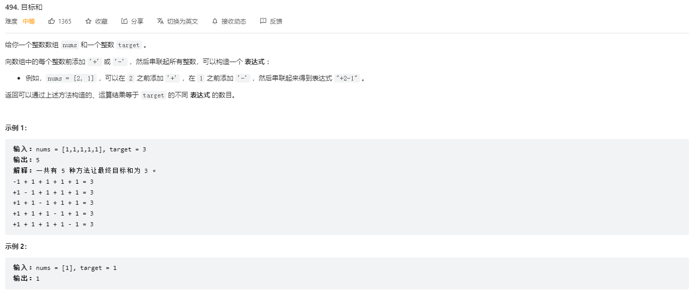

## 回溯算法和动态规划(参考链接：https://mp.weixin.qq.com/s/OyqQXQnyH_UzmxdytK2rTA)

我们前文经常说回溯算法和递归算法有点类似，有的问题如果实在想不出状态转移方程，尝试用回溯算法暴力解决也是一个聪明的策略，总比写不出来解法强。

那么，回溯算法和动态规划到底是啥关系？它俩都涉及递归，算法模板看起来还挺像的，都涉及做「选择」，真的酷似父与子。

那么，它俩具体有啥区别呢？回溯算法和动态规划之间，是否可能互相转化呢？

今天就用力扣第 494 题「目标和」来详细对比一下回溯算法和动态规划，真可谓群魔乱舞：



注意，给出的例子 nums 全是 1，但实际上可以是任意正整数哦。

### 一、回溯思路

其实我第一眼看到这个题目，花了两分钟就写出了一个回溯解法。

任何算法的核心都是穷举，回溯算法就是一个暴力穷举算法，前文 回溯算法解题框架 就写了回溯算法框架：

```
def backtrack(路径, 选择列表):
  if 满足结束条件:
    result.add(路径)
    return
  for 选择 in 选择列表:
    做选择
    backtrack(路径, 选择列表)
    撤销选择
```

关键就是搞清楚什么是「选择」，而对于这道题，「选择」不是明摆着的吗？

**对于每个数字 nums[i]，我们可以选择给一个正号 + 或者一个负号 -**，然后利用回溯模板穷举出来所有可能的结果，数一数到底有几种组合能够凑出 target 不就行了嘛？

伪码思路如下：

```

```