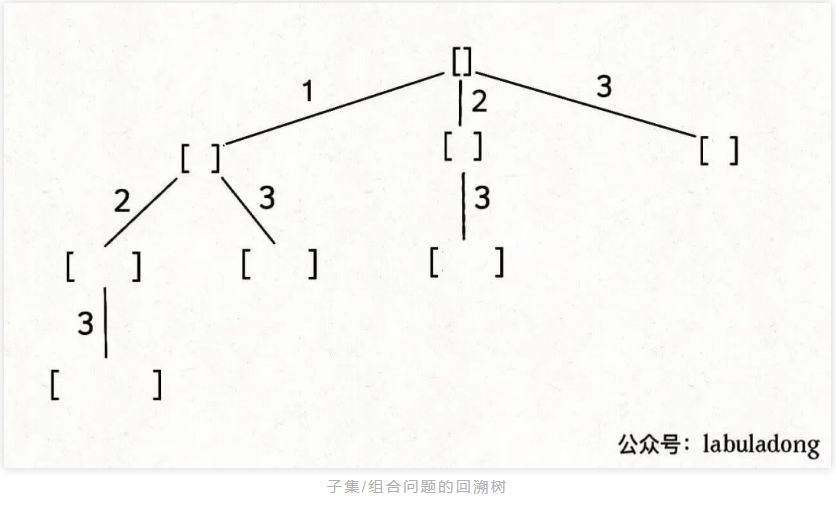
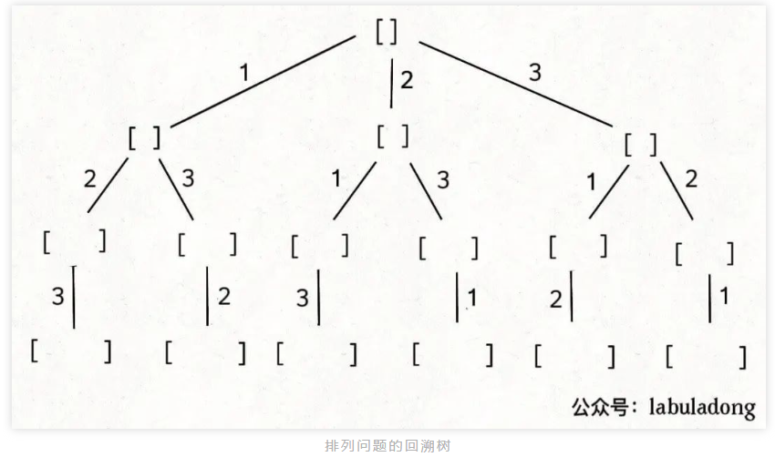
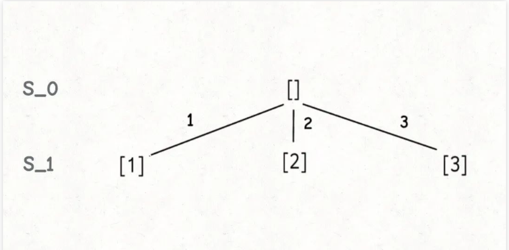
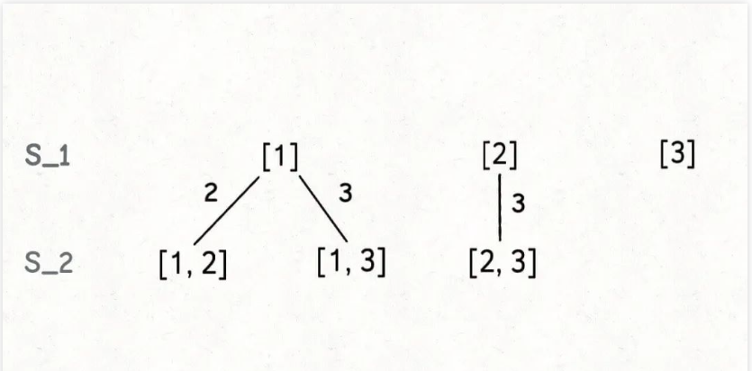
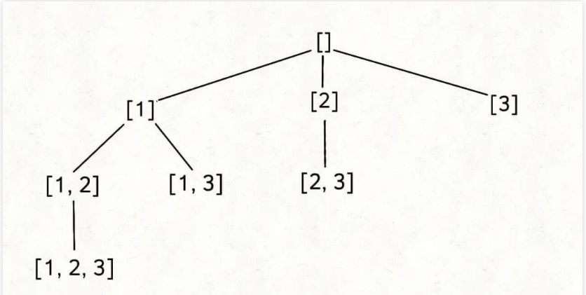
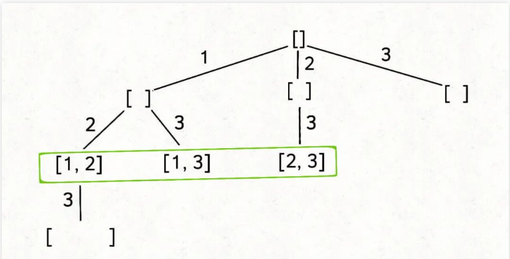
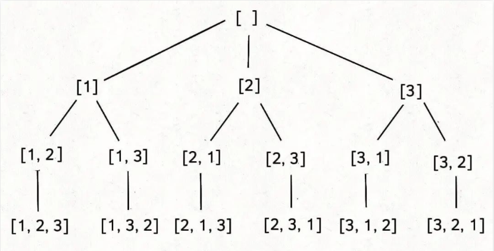
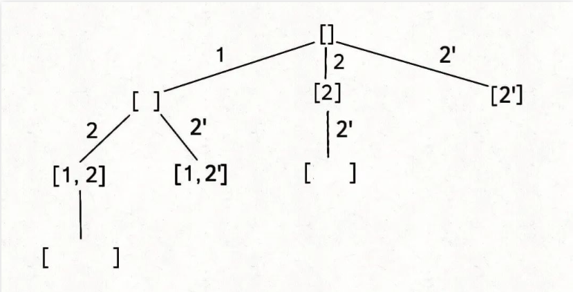
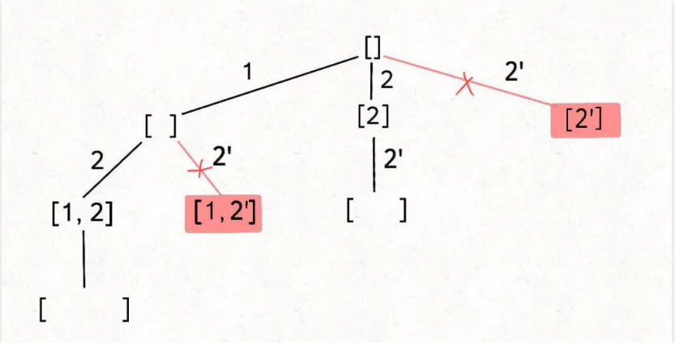

### 回溯算法秒杀所有排列、组合、子集问题(参考链接：https://mp.weixin.qq.com/s?__biz=MzAxODQxMDM0Mw==&mid=2247496080&idx=1&sn=a2ae8c8ebf13c7ea704ffb6b16018f08&scene=21#wechat_redirect)

> 读完本文可以解决：78. 子集（Medium) 90. 子集 II（Medium） 77. 组合（Medium） 39. 组合总和（Medium） 40. 组合总和 II（Medium） 216. 组合总和 III（Medium） 46. 全排列（Medium） 47. 全排列 II（Medium）

虽然这几个问题是高中就学过的，但如果想编写算法决这几类问题，还是非常考验计算机思维的，本文就讲讲编程解决这几个问题的核心思路，以后再有什么变体，你也能手到擒来，以不变应万变。

无论是排列、组合还是子集问题，简单说无非就是让你从序列nums中以给定规则取若干元素，主要有以下几种变体：

**形式一、元素无重不可复选，即nums中的元素都是唯一的，每个元素最多只能被使用一次，这也是最基本的形式**。

以组合为例，如果输入nums = [2,3,6,7]，和为 7 的组合应该只有[7]。

**形式二、元素可重不可复选，即nums中的元素可以存在重复，每个元素最多只能被使用一次**。

以组合为例，如果输入nums = [2,5,2,1,2]，和为 7 的组合应该有两种[2,2,2,1]和[5,2]。

**形式三、元素无重可复选，即nums中的元素都是唯一的，每个元素可以被使用若干次**。

以组合为例，如果输入nums = [2,3,6,7]，和为 7 的组合应该有两种[2,2,3]和[7]。

**当然，也可以说有第四种形式，即元素可重可复选。但既然元素可复选，那又何必存在重复元素呢？元素去重之后就等同于形式三，所以这种情况不用考虑**。

上面用组合问题举的例子，但排列、组合、子集问题都可以有这三种基本形式，所以共有 9 种变化。

除此之外，题目也可以再添加各种限制条件，比如让你求和为target且元素个数为k的组合，那这么一来又可以衍生出一堆变体，怪不得面试笔试中经常考到排列组合这种基本题型。

**但无论形式怎么变化，其本质就是穷举所有解，而这些解呈现树形结构，所以合理使用回溯算法框架，稍改代码框架即可把这些问题一网打尽**。

具体来说，你需要先阅读并理解前文 回溯算法核心套路，然后记住如下子集问题和排列问题的回溯树，就可以解决所有排列组合子集相关的问题：





为什么只要记住这两种树形结构就能解决所有相关问题呢？

**首先，组合问题和子集问题其实是等价的，这个后面会讲；至于之前说的三种变化形式，无非是在这两棵树上剪掉或者增加一些树枝罢了**。

那么，接下来我们就开始穷举，把排列/组合/子集问题的 9 种形式都过一遍，学学如何用回溯算法把它们一套带走。

### 子集（元素无重不可复选）

力扣第 78 题「子集」就是这个问题：

题目给你输入一个无重复元素的数组nums，其中每个元素最多使用一次，请你返回nums的所有子集。

函数签名如下：

```
List<List<Integer>> subsets(int[] nums)
```

比如输入nums = [1,2,3]，算法应该返回如下子集：

```
[ [],[1],[2],[3],[1,2],[1,3],[2,3],[1,2,3] ]
```

好，我们暂时不考虑如何用代码实现，先回忆一下我们的高中知识，如何手推所有子集？

首先，生成元素个数为 0 的子集，即空集[]，为了方便表示，我称之为S_0。

然后，在S_0的基础上生成元素个数为 1 的所有子集，我称为S_1：



接下来，我们可以在S_1的基础上推导出S_2，即元素个数为 2 的所有子集：



为什么集合[2]只需要添加3，而不添加前面的1呢？

因为集合中的元素不用考虑顺序，[1,2,3]中2后面只有3，如果你向前考虑1，那么[2,1]会和之前已经生成的子集[1,2]重复。

**换句话说，我们通过保证元素之间的相对顺序不变来防止出现重复的子集。**

接着，我们可以通过S_2推出S_3，实际上S_3中只有一个集合[1,2,3]，它是通过[1,2]推出的。

整个推导过程就是这样一棵树：



注意这棵树的特性：

**如果把根节点作为第 0 层，将每个节点和根节点之间树枝上的元素作为该节点的值，那么第n层的所有节点就是大小为n的所有子集**。

你比如大小为 2 的子集就是这一层节点的值：



> PS：注意，本文之后所说「节点的值」都是指节点和根节点之间树枝上的元素，且将根节点认为是第 0 层。

那么再进一步，如果想计算所有子集，那只要遍历这棵多叉树，把所有节点的值收集起来不就行了？

直接看代码：

```
List<List<Integer>> res = new LinkedList<>();

// 记录回溯算法的递归路径
LinkedList<Integer> track = new LinkedList<>();

// 主函数
public List<List<Integer>> subsets(int[] nums) {
    backtrack(nums, 0);
    return res;
}

// 回溯算法核心函数，遍历子集问题的回溯树
void backtrack(int[] nums, int start) {
    // 前序位置，每个节点的值都是一个子集
    res.add(new LinkedList<>(track));
    
    // 回溯算法标准框架
    for(int i = start; i < nums.length; i++) {
        // 做选择
        track.addLast(nums[i]);
        // 通过start参数控制树枝的遍历，避免产生重复的子集
        backtrack(nums, i + 1);
        // 撤销选择
        track.removeLast();
    }
}
```

最后，backtrack函数开头看似没有 base case，会不会进入无限递归？

其实不会的，当start == nums.length时，叶子节点的值会被装入res，但 for 循环不会执行，也就结束了递归。

### 组合（元素无重不可复选）

如果你能够成功的生成所有无重子集，那么你稍微改改代码就能生成所有无重组合了。

你比如说，让你在nums = [1,2,3]中拿 2 个元素形成所有的组合，你怎么做？

稍微想想就会发现，大小为 2 的所有组合，不就是所有大小为 2 的子集嘛。

**所以我说组合和子集是一样的：大小为k的组合就是大小为k的子集。**

比如力扣第 77 题「组合」：

给定两个整数n和k，返回范围[1, n]中所有可能的k个数的组合。

函数签名如下：

```
List<List<Integer>> combine(int n, int k)
```

比如combine(3, 2)的返回值应该是：

```
[ [1,2],[1,3],[2,3] ]
```

这是标准的组合问题，但我给你翻译一下就变成子集问题了：

**给你输入一个数组nums = [1,2..,n]和一个正整数k，请你生成所有大小为k的子集。**

还是以nums = [1,2,3]为例，刚才让你求所有子集，就是把所有节点的值都收集起来；**现在你只需要把第 2 层（根节点视为第 0 层）的节点收集起来，就是大小为 2 的所有组合：**


反映到代码上，只需要稍改 base case，控制算法仅仅收集第k层节点的值即可：

```
List<List<Integer>> res = new LinkedList<>();
// 记录回溯算法的递归路径
LinkedList<Integer> track = new LinkedList<>();

// 主函数
public List<List<Integer>> combine(int n, int k) {
    backtrack(1, n, k);
    return res;
}

void backtrack(int start, int n, int k) {
    // base case
    if (k === track.size()) {
        // 遍历到了第k层，收集当前节点的值
        res.add(new LinkedList<>(track));
        return;
    }
    for(int i = start; i <= n; i++) {
        // 选择
        track.addLast(i);
        // 通过 start 参数控制树枝的遍历，避免产生重复的子集
        backtrack(i + 1, n, k);
        // 撤销选择
        track.removeLast(i);
    }
}
```

这样，标准的子集问题也解决了。

### 排列（元素无重不可复选）

力扣第 46 题「全排列」就是标准的排列问题：

给定一个不含重复数字的数组nums，返回其所有可能的全排列。

函数签名如下：

```
List<List<Integer>> permute(int[] nums)
```

比如输入nums = [1,2,3]，函数的返回值应该是：

```
[
    [1,2,3],[1,3,2],
    [2,1,3],[2,3,1],
    [3,1,2],[3,2,1]
]
```

刚才讲的组合/子集问题使用start变量保证元素nums[start]之后只会出现nums[start+1..]中的元素，通过固定元素的相对位置保证不出现重复的子集。

**但排列问题的本质就是穷举元素的位置，nums[i]之后也可以出现nums[i]左边的元素，所以之前的那一套玩不转了，需要额外使用used数组来标记哪些元素还可以被选择。**

标准全排列可以抽象成如下这棵二叉树：



我们用used数组标记已经在路径上的元素避免重复选择，然后收集所有叶子节点上的值，就是所有全排列的结果：

```
List<List<Integer>> res = new LinkedList<>();
// 记录回溯算法的递归路径
LinkedList<Integer> track = new LinkedList<>();
// track 中的元素会被标记为 true
boolean[] used;

/* 主函数，输入一组不重复的数字，返回它们的全排列 */
public List<List<Integer>> permute(int[] nums) {
    used = new Boolean[nums.length];
    backtrack(nums);
    return res;
}

// 回溯算法核心函数
void backtrack(int[] nums) {
    // base case，到达叶子节点
    if (track.size() == nums.length) {
        // 收集叶子节点上的值
        res.add(new LinkedList(track));
        return;
    }
    // 回溯算法标准框架
    for(int i = 0; i < nums.length; i++) {
        // 已经存在track中的元素，不能重复选择
        if (used[i]) {
            continue;
        }
        // 做选择
        used[i] = true;
        track.addLast(nums[i]);
        // 进入下一层回溯树
        backtrack(nums);
        // 撤销选择
        track.removeLast(nums[i]);
        used[i] = false;
    }
}
```

这样，全排列问题就解决了。

但如果题目不让你算全排列，而是让你算元素个数为k的排列，怎么算？

也很简单，改下backtrack函数的 base case，仅收集第k层的节点值即可：

```
void backtrack(int[] nums, int k) {
    // base case，到达第k层
    if (track.size() == k) {
        // 第 k 层节点的值就是大小为 k 的排列
        res.add(new LinkedList(track));
        return;
    }
    
    // 回溯算法标准框架
    for (int i = 0; i < nums.length; i++) {
        // ...
        backtrack(nums, k);
        // ...
    }
}
```

### 子集/组合（元素可重不可复选）

刚才讲的标准子集问题输入的nums是没有重复元素的，但如果存在重复元素，怎么处理呢？

力扣第 90 题「子集 II」就是这样一个问题：

给你一个整数数组nums，其中可能包含重复元素，请你返回该数组所有可能的子集。

函数签名如下：

```
List<List<Integer>> subsetsWithDup(int[] nums)
```

比如输入nums = [1,2,2]，你应该输出：

```
[ [],[1],[2],[1,2],[2,2],[1,2,2] ]
```

当然，按道理说集合不应该包含重复元素的，但既然题目这样问了，我们就忽略这个细节吧，仔细思考一下这道题怎么做才是正事。

就以nums = [1,2,2]为例，为了区别两个2是不同元素，后面我们写作nums = [1,2,2']。

按照之前的思路画出子集的树形结构，显然，两条值相同的相邻树枝会产生重复：



```
[ 
    [],
    [1],[2],[2'],
    [1,2],[1,2'],[2,2'],
    [1,2,2']
]
```

所以我们需要进行剪枝，如果一个节点有多条值相同的树枝相邻，则只遍历第一条，剩下的都剪掉，不要去遍历：



**体现在代码上，需要先进行排序，让相同的元素靠在一起，如果发现nums[i] == nums[i-1]，则跳过：**

```
List<List<Integer>> res = new LinkedList<>();
LinkedList<Integer> track = new LinkedList<>();

public List<List<Integer>> subsetsWithDup(int[] nums) {
    // 先排序，让相同元素靠在一起
    Arrays.sort(nums);
    backtrack(nums, 0);
    return res;
}

void backtrack(int[] nums, int start) {
    // 前序位置，每个节点的值都是一个子集
    res.add(new LinkedList<>(track));
    
    for(int i = start; i < nums.length; i++) {
        // 剪枝逻辑，值相同的相邻树枝，只遍历第一条
        if (i > start && nums[i] === nums[i-1]) continue;
        // 做选择
        track.addLast(nums[i]);
        // 子树
        backtrack(nums, i + 1);
        // 撤销选择
        track.removeLast(nums[i]);
    }
}
```

这段代码和之前标准的子集问题的代码几乎相同，就是添加了排序和剪枝的逻辑。

至于为什么要这样剪枝，结合前面的图应该也很容易理解，这样带重复元素的子集问题也解决了。

**我们说了组合问题和子集问题是等价的**，所以我们直接看一道组合的题目吧，这是力扣第 40 题「组合总和 II」：

给你输入candidates和一个目标和target，从candidates中找出中所有和为target的组合。

candidates可能存在重复元素，且其中的每个数字最多只能使用一次。

说这是一个组合问题，其实换个问法就变成子集问题了：请你计算candidates中所有和为target的子集。

所以这题怎么做呢？

对比子集问题的解法，只要额外用一个trackSum变量记录回溯路径上的元素和，然后将 base case 改一改即可解决这道题：

```
List<List<Integer>> res = new LinkedList<>();
// 记录回溯的路径
LinkedList<Integer> track = new LinkedList<>();
// 记录track中的元素之和
int trackSum = 0;

public List<List<Integer>> combinationSum2(int[] candidates, int target) {
    if (candidates.length == 0) return res;
    // 先排序，让相同的元素靠在一起
    Arrays.sort(candidates);
    backtrack(candidates, 0, target);
    return res;
}

// 回溯算法主函数
void backtrack(int[] nums, int start, int target) {
    // base case，达到这一目标和，找到符合条件的组合
    if (trackSum == target) {
        res.add(new LinkedList<>(track));
        return;
    }
    // base case，超过目标和，直接结束
    if (trackSum > target) {
        return;
    }
    // 回溯算法标准框架
    for(int i = start; i < nums.length; i++) {
        // 剪枝逻辑，值相同，只遍历第一条
        if (i > start && nums[i] == nums[i-1]) continue;
        // 做选择
        track.addLast(nums[i]);
        trackSum += nums[i];
        // 递归遍历下一层回溯树
        backtrack(nums, i + 1, target);
        // 撤销选择
        track.removeLast(nums[i]);
        trackSum -= nums[i];
    }
}
```

### 排列（元素可重不可复选）

排列问题的输入如果存在重复，比子集/组合问题稍微复杂一点，我们看看力扣第 47 题「全排列 II」：

给你输入一个可包含重复数字的序列nums，请你写一个算法，返回所有可能的全排列，函数签名如下：

```
List<List<Integer>> permuteUnique(int[] nums)
```

比如输入nums = [1,2,2]，函数返回：

```
[ [1,2,2],[2,1,2],[2,2,1] ]
```

先看解法代码：

```
List<List<Integer>> res = new LinkedList<>();
LinkedList<Integer> track = new LinkedList<>();
boolean[] used;

public List<List<Integer>> permuteUnique(int[] nums) {
    // 先排序，让相同的元素靠在一起
    Arrays.sort(nums);
    used = new boolean[nums.length];
    backtrack(nums);
    return res;
}

void backtrack(int[] nums) {
    if (track.size() === nums.length) {
        res.add(new LinkedList(track));
        return;
    }
    for(int i = 0; i < nums.length; i++) {
        if (used[i]) continue;
        // 新添加的剪枝逻辑，固定相同的元素在排列中的相对位置
        // 首先这里全排列跟子集和组合不一样的地方，这里没有start，不需要start > i
        // 像[1,2,2]，我们第一层选择了i=0(1)，然后在第二层我们选择了i=1(2)，第三层i=2(2)，选出了122
        // 但是第二层我们选择i=2(2)的时候，i = 2 > 0 && nums[2](2) == nums[1](2) && 这时候used[1]在回撤中恢复为了false，
        // 正好满足我们的条件，直接跳过即可
        if (i > 0 && nums[i] == nums[i-1] && !used[i-1]) continue;
        // 做选择
        track.addLast(nums[i]);
        used[i] = true;
        // 递归回溯子树
        backtrack(nums);
        // 撤销选择
        track.removeLast(nums[i]);
        used[i] = false;
    }
}
```
你对比一下之前的标准全排列解法代码，这段解法代码只有两处不同：

1、对nums进行了排序。

2、添加了一句额外的剪枝逻辑

类比输入包含重复元素的子集/组合问题，你大概应该理解这么做是为了防止出现重复结果。

但是注意排列问题的剪枝逻辑，和子集/组合问题的剪枝逻辑略有不同：新增了!used[i - 1]的逻辑判断。

这个地方理解起来就需要一些技巧性了，且听我慢慢到来。为了方便研究，依然把相同的元素用上标'以示区别。

假设输入为nums = [1,2,2']，标准的全排列算法会得出如下答案：

```
[
    [1,2,2'],[1,2',2],
    [2,1,2'],[2,2',1],
    [2',1,2],[2',2,1]
]
```

显然，这个结果存在重复，比如[1,2,2']和[1,2',2]应该只被算作同一个排列，但被算作了两个不同的排列。

所以现在的关键在于，如何设计剪枝逻辑，把这种重复去除掉？

**答案是，保证相同元素在排列中的相对位置保持不变。**

比如说nums = [1,2,2']这个例子，我保持排列中2一直在2'前面。

这样的话，你从上面 6 个排列中只能挑出 3 个排列符合这个条件：

```
[ [1,2,2'],[2,1,2'],[2,2',1] ]
```

这也就是正确答案。

进一步，如果nums = [1,2,2',2'']，我只要保证重复元素2的相对位置固定，比如说2 -> 2' -> 2''，也可以得到无重复的全排列结果。

仔细思考，应该很容易明白其中的原理：

**标准全排列算法之所以出现重复，是因为把相同元素形成的排列序列视为不同的序列，但实际上它们应该是相同的；而如果固定相同元素形成的序列顺序，当然就避免了重复。**

那么反映到代码上，你注意看这个剪枝逻辑：

```
// 新添加的剪枝逻辑，固定相同的元素在排列中的相对位置
if (i > 0 && nums[i] == nums[i - 1] && !used[i - 1]) {
    // 如果前面的相邻相等元素没有用过，则跳过
    continue;
}
// 选择 nums[i]
```

**当出现重复元素时，比如输入nums = [1,2,2',2'']，2'只有在2已经被使用的情况下才会被选择，2''只有在2'已经被使用的情况下才会被选择，这就保证了相同元素在排列中的相对位置保证固定。**

好了，这样包含重复输入的排列问题也解决了。