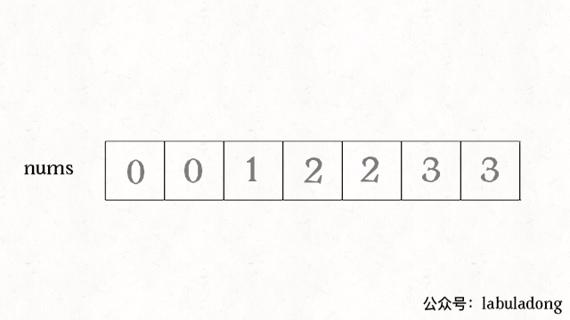
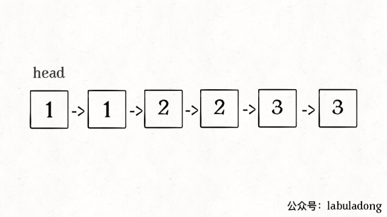

## 如何去除有序数组的重复元素

我们知道对于数组来说，在尾部插入、删除元素是比较高效的，时间复杂度但是如果在中间或者开头插入、删除元素，就会涉及数据的搬移。时间复杂度为a).效率较低。

所以对于一般处理数组的算法问题，要尽可能只对数组尾部的元素进行操作，以滩@额外的时间复杂度。

首先讲讲如何对一个有序数组去重，题目如下;

输入一个有序的数组，你需要原地删除重复的元素，使得每个元素只能出现一次.派回去重后新数组的长度。函数签名如下;

```
int removeDuplicates(int[] nums);
```

比如输入nums=[0,1,1,2,3,3,4]，算法应该返回5，且nums的前5个元素分别为[0,1,2,3,4]，至于后面的元素是什么，我们并不关心。

显然，由于数组已经排序，所以重复的元素一定连在一起，找出它们并不难，但如果每找到一个重复元素就立即删除它，就是在数组中间进行删除操作，整个时间复杂度会达到O(N)。而且题目要求我们原地修改，也就是说不能用辅助数组，空间复杂度应是 O(1)。

**其实，对于数组相关的算法问题，有一个通用的技巧:要尽量避免在中间删除元素，那我就先想办法把这个元素换到最后**。这样，最终待删除的元素都拖在数组尾部，一个个弹出就行了，每次操作的时间复杂度也就降低到 O(1)了。

按照这个思路，又可以衍生出解决类似需求的通用方式:双指针技巧。具体一点说应该是快、慢指针。

我们让慢指针**slow**走在后面，快指针**fast**走在前面探路，找到一个不重复的元素就填到**sLow**的位置，并让**slow**前进一步。这样，当**fast**指针遍历完整个数组nums后，**nums[0..slow]就是不重复元素，之后的所有元素都是重复元素**。

```
int removeDuplicates(int[] nums) {
  int n = nums.length;
  if (n == 0) return 0;
  int slow = 0, fast = 1;
  while(fast < n) {
    if (nums[fast] != nums[slow]) {
      slow++;
      // 维护nums[0..slow]无重复
      nums[slow] = nums[fast];
    }
    fast++;
  }
  // 长度为索引+1
  return slow + 1; 
}
```

看下算法执行过程：



再简单扩展一下，如果给你一个有序链表，如何去重呢?其实和数组是一模一样的唯一的区别是把数组赋值操作变成操作指针而已:

```
ListNode deleteDuplicates(ListNode head) {
  if (head == null) return null;
  ListNode slow = head, fast = head.next;
  while(fast != null) {
    if (fast.val != slow.val) {
      // nums[slow] = nums[fast];
      slow.next = fast;
      // slow++
      slow = slow.next;
    }
    // fast++
    fast = fast.next;
  }
  // 断开与后面重复元素的链接
  slow.next = null;
  return head;
}
```



