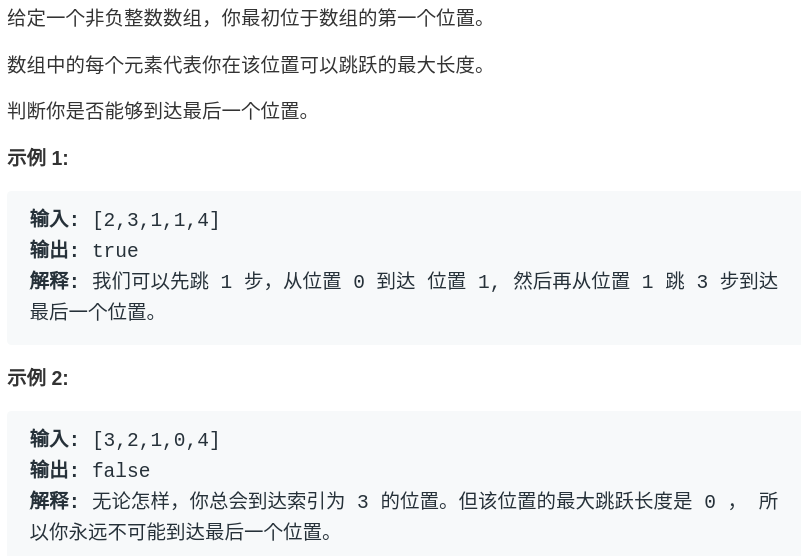
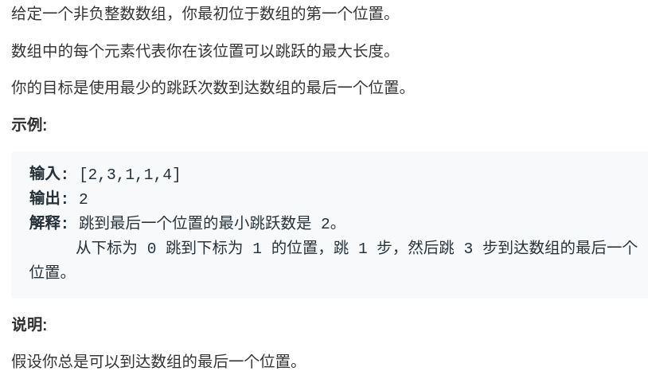
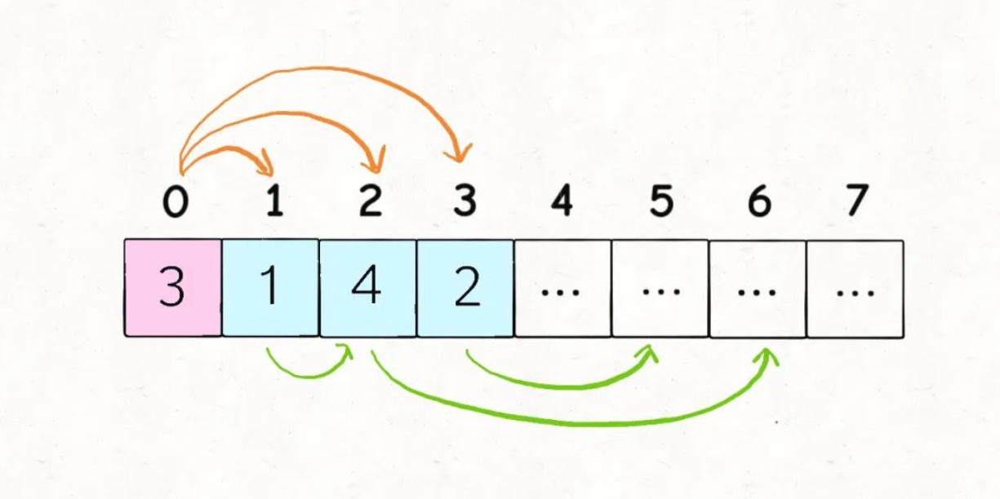
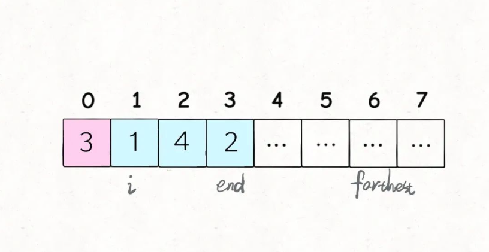

## 经典贪心算法：跳跃游戏（学习链接：https://mp.weixin.qq.com/s?__biz=MzAxODQxMDM0Mw==&mid=2247485087&idx=1&sn=ddbed992e5ad8f1aa3b3d4afcb17889b&scene=21#wechat_redirect）

动态规划和贪心算法到底有啥关系，说白了，贪心算法可以理解为一种特殊的动态规划问题，拥有一些更特殊的性质，可以进一步降低动态规划算法的时间复杂度。那么这篇文章，就讲 LeetCode 上两道经典的贪心算法：跳跃游戏 I 和跳跃游戏 II。

这两道题可以使用动态规划或者算法和贪心算法进行求解，通过实践，你就能更深刻地理解贪心和动规的区别和联系了。

### Jump Game I

跳跃游戏 I 是 LeetCode 第 55 题，难度是 Medium，但实际上是比较简单的，看题目：



**不知道读者有没有发现，有关动态规划的问题，大多是让你求最值的**，比如最长子序列，最小编辑距离，最长公共子串等等等。这就是规律，因为动态规划本身就是运筹学里的一种求最值的算法。

那么贪心算法作为特殊的动态规划也是一样，一般也是让你求个最值。这道题表面上不是求最值，但是可以改一改：

**请问通过题目中的跳跃规则，最多能跳多远**？如果能够越过最后一格，返回 true，否则返回 false。

所以说，这道题肯定可以用动态规划求解的。但是由于它比较简单，下一道题再用动态规划和贪心思路进行对比，现在直接上贪心的思路：

```
bool canJump(vector<int>& nums) {
  int n = nums.size();
  int farthest = 0;
  // i的最大值为n-2，也就是数组的倒数第二个元素，
  // 因为题目让我们算的就是是否能跳到最后一个元素。所以没必要计算最后一个
  for(int i = 0; i < n - 1; i++) {
    // 我们对每一个i求最优解
    // 不断计算能跳到的最远距离
    farthest = max(farthest, i + nums[i]);
    // 可能碰到了0，卡住跳不动了
    if (farthest <= i) return false;
  }
  // 是否能跳到最后一个元素n-1
  return farthest >= n - 1;
}
```

你别说，如果之前没有做过类似的题目，还真不一定能够想出来这个解法。每一步都计算一下从当前位置最远能够跳到哪里，然后和一个全局最优的最远位置farthest做对比，通过每一步的最优解，更新全局最优解，这就是贪心。

很简单是吧？记住这一题的思路，看第二题，你就发现事情没有这么简单。。。

### Jump Game II

这是 LeetCode 第 45 题，也是让你在数组上跳，不过难度是 Hard，解法比上一题困难一些：



**现在的问题是，保证你一定可以跳到最后一格，请问你最少要跳多少次，才能跳过去**？

我们先来说说动态规划的思路，采用**自顶向下的递归动态规划**，可以这样定义一个dp函数：

```
// 定义：从索引p跳到最后一格，至少需要dp(nums, p)步
int dp(vector<int>& nums, int p)
```

我们想求的结果就是dp(nums, 0)，base case 就是当p超过最后一格时，不需要跳跃：

```
if (p >= nums.size() - 1) {
  return 0;
}
```

根据 动态规划套路详解 的动规框架，就可以暴力穷举所有可能的跳法，通过备忘录memo消除重叠子问题，取其中的最小值最为最终答案：

```
vector<int> memo; 
// 主函数
int jump(vector<int>& nums) {
  int n = nums.size();
  // 备忘录都初始化为 n，相当于 INT_MAX
  // 因为从 0 跳到 n - 1 最多 n - 1 步  [1,2,3] 从下标0跳到下标2 最多n-1 2步
  memo = vector<int>(n, n);
  return dp(nums, 0);
}

int dp(vector<int>& nums, int p) {
  int n = nums.size();
  // base case
  if (p >= n - 1) {
    return 0;
  }
  // 子问题已经计算过
  if (memo[p] != n) {
    return memo[p];
  }
  int steps = nums[p];
  // 你可以选择跳1步，2步...
  for(int i = 1; i <= steps; i++) {
    // 穷举每一个选择
    // 计算每一个子问题的结果
    int subProblem = dp(nums, p + i);
    // 取其中最小的作为最终结果
    // 为何subProblem + 1，首先subProblem是p+i的子问题，我们从p跳到p+i，也得跳一次。
    // 因为我们最后求的是次数
    memo[p] = min(memo[p], subProblem + 1);
  }
  return memo[p];
}
```

**这个动态规划应该很明显了，按照 动态规划套路详解 所说的套路，状态就是当前所站立的索引p，选择就是可以跳出的步数**。

该算法的时间复杂度是 递归深度 × 每次递归需要的时间复杂度，即 O(N^2)，在 LeetCode 上是无法通过所有用例的，会超时。

**贪心算法比动态规划多了一个性质：贪心选择性质**。我知道大家都不喜欢看严谨但枯燥的数学形式定义，那么我们就来直观地看一看什么样的问题满足贪心选择性质。

刚才的动态规划思路，不是要穷举所有子问题，然后取其中最小的作为结果吗？核心的代码框架是这样：

```
 int steps = nums[p];
    // 你可以选择跳 1 步，2 步...
    for (int i = 1; i <= steps; i++) {
      // 计算每一个子问题的结果
      int subProblem = dp(nums, p + i);
      res = min(subProblem + 1, res);
    }
```

for 循环中会陷入递归计算子问题，这是动态规划时间复杂度高的根本原因。

但是，真的需要「递归地」计算出每一个子问题的结果，然后求最值吗？直观地想一想，似乎不需要递归，只需要判断哪一个选择最具有「潜力」即可：



比如上图这种情况应该跳多少呢？

**显然应该跳 2 步调到索引 2，因为nums[2]的可跳跃区域涵盖了索引区间[3..6]，比其他的都大**。如果想求最少的跳跃次数，那么往索引 2 跳必然是最优的选择。

你看，**这就是贪心选择性质，我们不需要「递归地」计算出所有选择的具体结果然后比较求最值，而只需要做出那个最有「潜力」，看起来最优的选择即可**。

绕过这个弯儿来，就可以写代码了：

```
int jump(vector<int>& nums) {
  int n = nums.size();
  // i end 标记了可以选择的跳跃步数，farthest标记了可选择跳跃步数[i..end]种能够跳到的最远距离，jumps记录了跳跃次数
  // 比如[2,3,1,1,4]第一次i == end == 0，我们必须跳一次，jump++ = 1，far = 2, end = 2，然后我们找 1-2之间找到下次能跳的最远的far=4 然后当i==end==2的时候 我们需要跳一次，然后让end为上一次i-end能跳的最远的far
  int end = 0, farthest = 0;
  int jumps = 0;
  for(int i = 0; i < n - 1; i++) {
    farthest = max(farthest, nums[i] + i);
    if (end == i) {
      jumps++;
      end = farthest;
    }
  }
  return jumps;
}
```

结合刚才那个图，就知道这段短小精悍的代码在干什么了：



i和end标记了可以选择的跳跃步数，farthest标记了所有可选择跳跃步数[i..end]中能够跳到的最远距离，jumps记录了跳跃次数。

本算法的时间复杂度 O(N)，空间复杂度 O(1)，可以说是非常高效，动态规划都被吊起来打了。

至此，两道跳跃问题都使用贪心算法解决了。

其实对于贪心选择性质，是可以有严格的数学证明的，有兴趣的读者可以参看《算法导论》第十六章，专门有一个章节介绍贪心算法。这里限于篇幅和通俗性，就不展开了。

使用贪心算法的实际应用还挺多，比如赫夫曼编码也是一个经典的贪心算法应用。更多时候运用贪心算法可能不是求最优解，而是求次优解以节约时间，比如经典的旅行商问题。

不过我们常见的贪心算法题目，就像本文的题目，大多一眼就能看出来，大不了就先用动态规划求解，如果动态规划都超时，说明该问题存在贪心选择性质无疑了。

