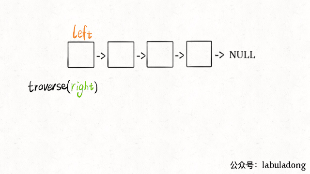
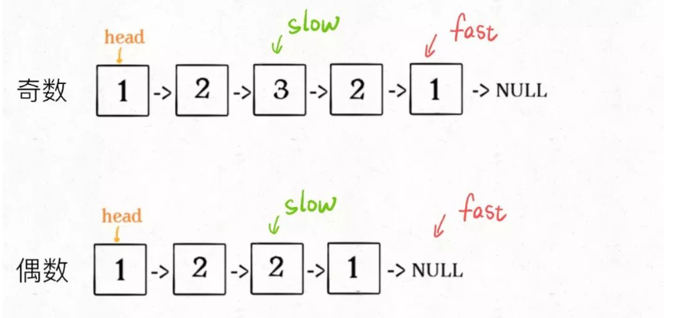
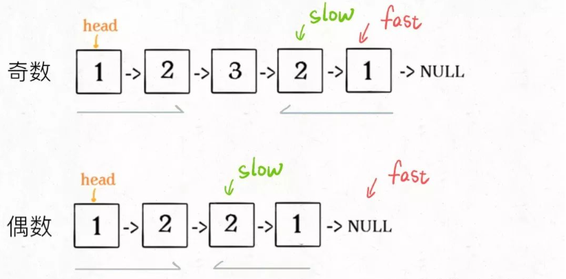
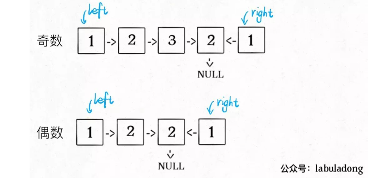
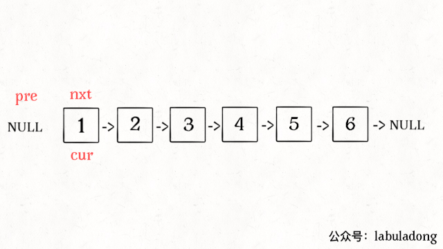
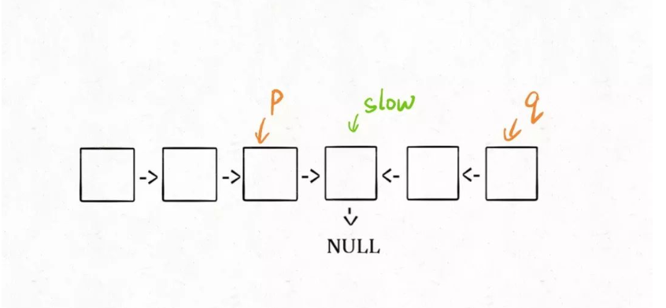

## 如何高效判断回文单链表？(参考链接：https://mp.weixin.qq.com/s?__biz=MzAxODQxMDM0Mw==&mid=2247484822&idx=1&sn=44742c9a3557038c8da7150100d94db9&scene=21#wechat_redirect)

如何判断一个链表是不是回文链表。

之前labuladong老师有两篇文章写了回文串和回文序列相关的问题：

经典面试题: 最长回文字串(https://mp.weixin.qq.com/s?__biz=MzAxODQxMDM0Mw==&mid=2247484471&idx=1&sn=7c26d04a1f035770920d31377a1ebd42&chksm=9bd7fa3faca07329189e9e8b51e1a665166946b66b8e8978299ba96d5f2c0d3eafa7db08b681&scene=21#wechat_redirect)

子序列解题模板：最长回文子序列(https://mp.weixin.qq.com/s?__biz=MzAxODQxMDM0Mw==&mid=2247484666&idx=1&sn=e3305be9513eaa16f7f1568c0892a468&chksm=9bd7faf2aca073e4f08332a706b7c10af877fee3993aac4dae86d05783d3d0df31844287104e&scene=21#wechat_redirect)

我们知道，寻找回文串的核心思想是从中心向两端扩展：

```
// 回文串长度为基数则让l=r，'abcba' l=r=2
// 回文串长度为偶数则让r = l+1, 'abccba' l = 2 r = 3
string palindrome(string& s, int l, int r) {
   // 防止索引越界
   while(l >= 0 && r < s.size() && s[l] == s[r]) {
       // 向两边展开
       l--; r++;
   } 
   // 返回以s[l]和s[r]为中心的最长回文串
   return s.substr(l+1, r-l-1); // substr，起始坐标，长度
}
```

因为回文串长度可能为奇数也可能是偶数，长度为奇数时只存在一个中心点，而长度为偶数时存在两个中心点，所以上面这个函数需要传入l和r，就是为了处理这两种情况

而**判断**一个字符串是不是回文串就简单很多，不需要考虑奇偶情况，只需要「双指针技巧」，从两端向中间逼近即可：

```
bool isPalindrome(string s) {
    int left = 0, right = s.length - 1;
    // 长度为单数也最后一个为left==right也不需要判断了
    // 长度为偶数就是'abccba' 组后cc为23满足 2<3 但是再l++r--就会出现cc为32不满足Left < right
    while(left < right) {
        if (s[left] != s[right]) {
            return false;
        }
        left++; right--;
    }
    return true;
}
```

以上代码很好理解吧，**因为回文串是对称的，所以正着读和倒着读应该是一样的，这一特点是解决回文串问题的关键**。

下面扩展这一最简单的情况，来解决：如何判断一个「单链表」是不是回文。

### 一、判断回文单链表

输入一个单链表的头结点，判断这个链表中的数字是不是回文：

```
/**
 * 单链表节点的定义：
 * public class ListNode {
 *     int val;
 *     ListNode next;
 * }
 */

boolean isPalindrome(ListNode head);

输入: 1->2->null
输出: false

输入: 1->2->2->1->null
输出: true
```

这道题的难点在于，单链表无法倒着遍历，无法使用双指针技巧。那么最简单的办法就是，把原始链表反转存入一条新的链表，然后比较这两条链表是否相同。关于如何反转链表，可以参见前文 递归思维：k 个一组反转链表(https://mp.weixin.qq.com/s?__biz=MzAxODQxMDM0Mw==&mid=2247484597&idx=1&sn=c603f1752e33cb2701e371d84254aee2&chksm=9bd7fabdaca073abd512d8fff18016c9092ede45fed65c307852c65a2026d8568ee294563c78&scene=21#wechat_redirect)。

其实，**借助二叉树后序遍历的思路，不需要显式反转原始链表也可以倒序遍历链表**，下面来具体聊聊。

对于二叉树的几种遍历方式，我们再熟悉不过了：

```
void traverse(TreeNode root) {
    // 前序遍历代码
    traverse(root.left);
    // 中序遍历代码
    traverse(root.right);
    // 后序遍历代码
}
```

链表兼具递归结构，树结构不过是链表的衍生。那么，**链表其实也可以有前序遍历和后序遍历**：

```
void traverse(ListNode head) {
    // 前序遍历代码
    traverse(head.next);
    // 后序遍历代码
}
```

这个框架有什么指导意义呢？如果我想正序打印链表中的val值，可以在前序遍历位置写代码；反之，如果想倒序遍历链表，就可以在后序遍历位置操作：

```
/* 倒序打印单链表中的元素值 */
void traverse(ListNode head) {
    if (head == null) return;
    traverse(head.next);
    // 后序遍历代码
    print(head.val);
}
```

说到这了，其实可以稍作修改，模仿双指针实现回文判断的功能：

```
// 左侧指针
ListNode left;

boolean isPalindrome(ListNode head) {
    left = head;
    return traverse(head);
}

boolean traverse(ListNode right) {
    // base case
    if (right == null) return true;
    // 继续递归
    boolean res = traverse(right.next);
    // 后序遍历写代码
    res = res && (right.val == left.val);
    left = left.next;
    return res;
}
```
这么做的核心逻辑是什么呢？**实际上就是把链表节点放入一个栈，然后再拿出来，这时候元素顺序就是反的**，只不过我们利用的是递归函数的堆栈而已。



当然，无论造一条反转链表还是利用后续遍历，算法的时间和空间复杂度都是 O(N)。下面我们想想，能不能不用额外的空间，解决这个问题呢？

### 二、优化空间复杂度

更好的思路是这样的：

**1、先通过 双指针 中的快慢指针来找到链表的中点**：

```
ListNode slow, fast;
slow = fast = head;
while (fast != null && fast.next != null) {
    slow = slow.next;
    fast = fast.next.next;
}
// slow 指针现在指向链表中点
```



**2、如果fast指针没有指向null，说明链表长度为奇数，slow还要再前进一步**：

```
if (fast != null)
    slow = slow.next;
```



**3、从slow开始反转后面的链表，现在就可以开始比较回文串了**：

```
ListNode left = head;
// 找到链表的终点后，反转中点的右侧链表
ListNode right = reverse(slow);

while(right != null) {
    if (left.val != right.val) {
        return false;
    }
    left = left.next;
    right = right.next;
}
return true;
```



至此，把上面 3 段代码合在一起就高效地解决这个问题了，其中reverse函数很容易实现：

```
ListNode reverse(ListNode head) {
    // 比如1->2->null 反转
    // cur为上述链表，pre为null，while(cur不为null)，我们进入while循环
    // 1.找到next(2->null)，我们让cur指向pre(null)，此时cur为1->null，我们让pre = cur pre变为了1->null，cur = next，cur变为了(2->null)
    // 2.接着上面cur != null，找到next(null)，我们让cur指向pre(1->null)，此时cur为2->1->null，我们让pre = cur，pre变为了2->1->null，
    // cur = next，cur变为了null，接下来，循环结束 得到pre为(2->1->null)
    
    // pre前一个元素，cur当前的元素
    ListNode pre = null, cur = head;
    while(cur != null) {
        ListNode next = cur.next;
        cur.next = pre;
        pre = cur;
        cur = next;
    }
    return pre;
}
```



算法总体的时间复杂度 O(N)，空间复杂度 O(1)，已经是最优的了。

我知道肯定有读者会问：这种解法虽然高效，但破坏了输入链表的原始结构，能不能避免这个瑕疵呢？

其实这个问题很好解决，关键在于得到p, q这两个指针位置：



这样，只要在函数 return 之前加一段代码即可恢复原先链表顺序：

```
p.next = reverse(q);
```

### 三、最后总结

首先，寻找回文串是从中间向两端扩展，判断回文串是从两端向中间收缩。

对于单链表，无法直接倒序遍历，可以造一条新的反转链表，可以利用链表的后序遍历，也可以用栈结构倒序处理单链表。

具体到回文链表的判断问题，由于回文的特殊性，可以不完全反转链表，而是仅仅反转部分链表，将空间复杂度降到 O(1)，不过需要注意链表长度的奇偶。


