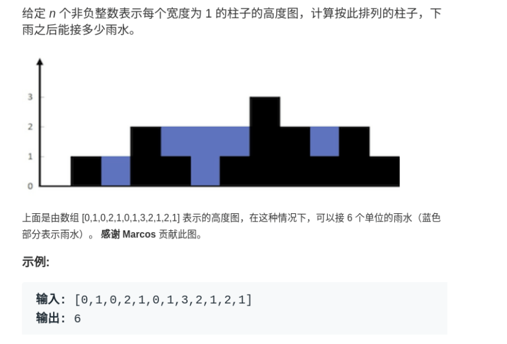
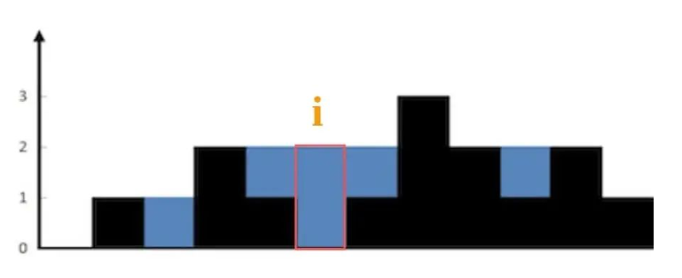
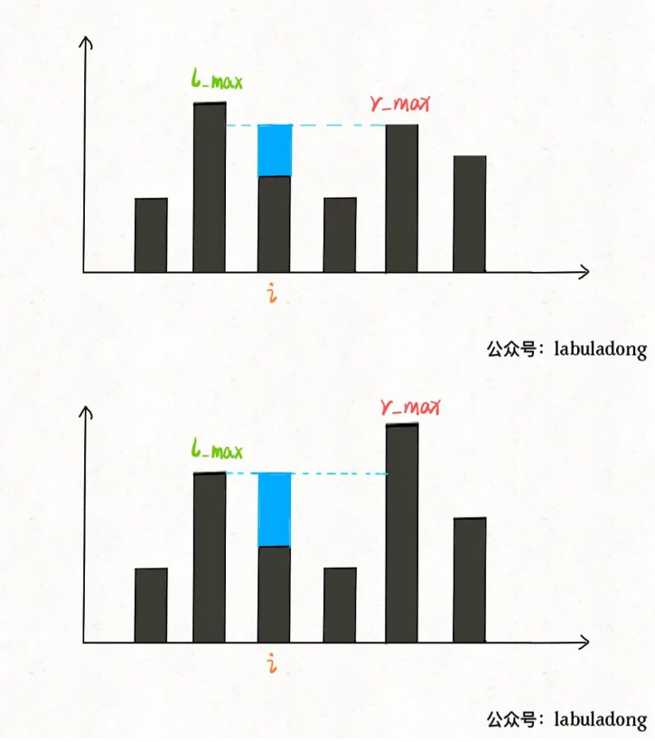
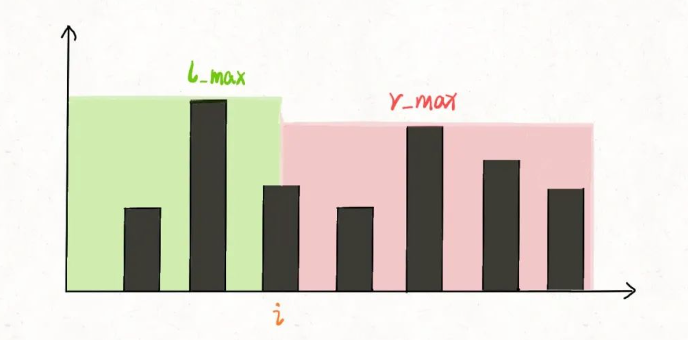
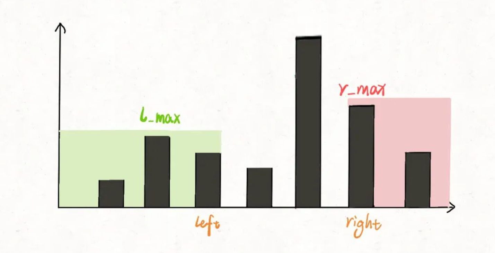
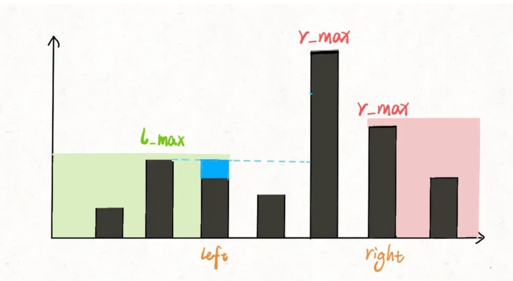
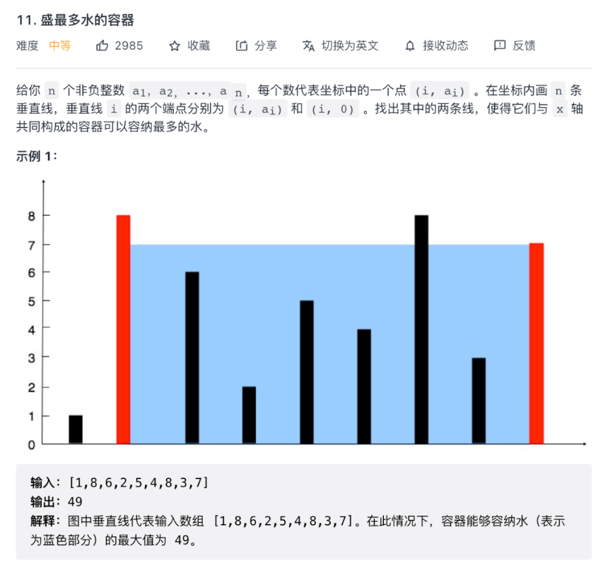

## 详解一道高频面试题：接雨水（参考链接：https://mp.weixin.qq.com/s?__biz=MzAxODQxMDM0Mw==&mid=2247494095&idx=5&sn=8a69b2ca4d48e8b4db2b153a405c6e52&scene=21#wechat_redirect）

接雨水这道题目挺有意思，在面试题中出现频率还挺高的，本文就来步步优化，讲解一下这道题。

先看一下题目：



就是用一个数组表示一个条形图，问你这个条形图最多能接多少水。

```
int trap(int[] height);
```

下面就来由浅入深介绍暴力解法 -> 备忘录解法 -> 双指针解法，在 O(N) 时间 O(1) 空间内解决这个问题。

### 一、核心思路

所以对于这种问题，我们不要想整体，而应该去想局部；就像之前的文章写的动态规划问题处理字符串问题，不要考虑如何处理整个字符串，而是去思考应该如何处理每一个字符。

这么一想，可以发现这道题的思路其实很简单。具体来说，仅仅对于位置i，能装下多少水呢？



能装 2 格水，因为height[i]的高度为 0，而这里最多能盛 2 格水，2-0=2。

为什么位置i最多能盛 2 格水呢？因为，位置i能达到的水柱高度和其左边的最高柱子、右边的最高柱子有关，我们分别称这两个柱子高度为l_max和r_max；**位置 i 最大的水柱高度就是min(l_max, r_max)**。

更进一步，对于位置i，能够装的水为：

```
water[i] = min(
               # 左边最高的柱子
               max(height[0..i]),  
               # 右边最高的柱子
               max(height[i..end]) 
            ) - height[i]
```



这就是本问题的核心思路，我们可以简单写一个暴力算法：

```
int trap(int[] height) {
  int n = height.length;
  int res = 0;
  // 从下标1开始，因为下标0不能盛水，
  // 到下标n-2结束，因为最后一个(n-1)不能盛水
  for(int i = 1; i < n-1; i++) {
    // 定义左右两侧最高的柱子
    int l_max = 0, r_max = 0;
    // 找到右边最高的柱子
    // 从i到n，为什么可以取n-1因为n-1虽然不能盛水但是可以当右侧的挡水柱子
    for(var j = i; j < n; j++) {
      r_max = Math.max(r_max, height[j]);
    }
    // 找到左边最高的柱子
    // 同理下标0不能装水但是可以当挡水柱子
    for(var j = i; j >= 0; j--) {
      l_max = Math.max(l_max, height[j]);
    }
    // 如果自己就是最高的话
    // l_max == r_max == height[i]
    // 用左右两边较小的减去自己
    res += Math.min(l_max, r_max) - height[i];
  }
  return res;
}
```

有之前的思路，这个解法应该是很直接粗暴的，时间复杂度 O(N^2)，空间复杂度 O(1)。但是很明显这种计算r_max和l_max的方式非常笨拙，一般的优化方法就是备忘录。

### 二、备忘录优化

之前的暴力解法，不是在每个位置i都要计算r_max和l_max吗？我们直接把结果都提前计算出来，别傻不拉几的每次都遍历，这时间复杂度不就降下来了嘛。

**我们开两个数组r_max和l_max充当备忘录，l_max[i]表示位置i左边最高的柱子高度，r_max[i]表示位置i右边最高的柱子高度**。预先把这两个数组计算好，避免重复计算：

```
int trap(int[] height) {
  if (height.length == 0) {
    return 0;
  }
  int n = height.length;
  int res = 0;
  // 数组充当备忘录
  int[] l_max = new int[n];
  int[] r_max = new int[n];
  // 初始化 base case
  // 左侧第0处最大的是height[0]
  // 右侧最后一个最大的是height[n-1]
  l_max[0] = height[0];
  r_max[n-1] = height[n-1];
  // 从左到右计算l_max
  for(int i = 1; i < n; i++) {
    // 自身Height[i]与前一个最大值相比l_max[i-1]
    // l_max[i]就是自己与前面最大值的最大值
    l_max[i] = Math.max(height[i], l_max[i-1]);
  }
  // 从右到左计算r_max
  for(int i = n-2; i >= 0; i--) {
    r_max[i] = Math.max(height[i], r_max[i+1]);
  }
  // 计算答案
  for(int i = 1; i < n-1; i++) {
    res += Math.min(l_max[i], r_max[i]) - height[i];
  }
  return res;
}
```

这个优化其实和暴力解法思路差不多，就是避免了重复计算，把时间复杂度降低为 O(N)，已经是最优了，但是空间复杂度是 O(N)。下面来看一个精妙一些的解法，能够把空间复杂度降低到 O(1)。

### 三、双指针解法

这种解法的思路是完全相同的，但在实现手法上非常巧妙，我们这次也不要用备忘录提前计算了，而是用双指针边走边算，节省下空间复杂度。

首先，看一部分代码：

```
int trap(int[] height) {
  int left = 0, right = height.lenght - 1;
  int L_max = 0, r_max = 0;
  while(left < right) {
    l_max = Math.max(l_max, height[left]);
    r_max = Math.max(r_max, height[right]);
    // 此时l_max和r_max分表表示什么？
    left++; right--;
  }
}
```

对于这部分代码，请问l_max和r_max分别表示什么意义呢？

**很容易理解，l_max是height[0..left]中最高柱子的高度，r_max是height[right..end]的最高柱子的高度**。

明白了这一点，直接看解法：

```
int trap(int[] height) {
  int left = 0, right = height.lenght - 1;
  int l_max = 0, r_max = 0;

  int res = 0;
  // 循环终止条件left == right，因为每次只移动left或者right，当left == right的时候说明所有的元素都走了一遍，再走就重复
  while(left < right) {
    l_max = Math.max(l_max, height[left]);
    r_max = Math.max(r_max, height[right]);

    // res += min(l_max, r_max) - height[i];
    if (l_max < r_max) {
      res += l_max - height[left];
      left++;
    } else {
      res += r_max - height[right];
      right--;
    }
  }
  return res;
}
```

你看，其中的核心思想和之前一模一样，换汤不换药。但是细心的读者可能会发现次解法还是有点细节差异：

之前的备忘录解法，**l_max[i]和r_max[i]分别代表height[0..i]和height[i..end]的最高柱子高度**。

```
res += Math.min(l_max[i], r_max[i]) - height[i];
```



但是双指针解法中，**l_max和r_max代表的是height[0..left]和height[right..end]的最高柱子高度**。比如这段代码：

```
if (l_max < r_max) {
  res += l_max - height[left];
  left++;
}
```



此时的l_max是left指针左边的最高柱子，但是r_max并不一定是left指针右边最高的柱子，这真的可以得到正确答案吗？

其实这个问题要这么思考，我们只在乎min(l_max, r_max)。**对于上图的情况，我们已经知道l_max < r_max了，至于这个r_max是不是右边最大的，不重要。重要的是height[i]能够装的水只和较低的l_max之差有关**：



这样，接雨水问题就解决了。

### 扩展延伸

下面我们看一道和接雨水问题非常类似的题目，力扣第 11 题「盛最多水的容器」：



函数签名如下：

```
int maxArea(int[] height);
```

这题和接雨水问题很类似，可以完全套用前文的思路，而且还更简单。两道题的区别在于：

**接雨水问题给出的类似一幅直方图，每个横坐标都有宽度，而本题给出的每个横坐标是一条竖线，没有宽度**。

我们前文讨论了半天l_max和r_max，实际上都是为了计算height[i]能够装多少水；而本题中height[i]没有了宽度，那自然就好办多了。

举个例子，如果在接雨水问题中，你知道了height[left]和height[right]的高度，你能算出left和right之间能够盛下多少水吗？

反过来，就本题而言，你知道了height[left]和height[right]的高度，能算出left和right之间能够盛下多少水吗？

可以，因为本题中竖线没有宽度，所以left和right之间能够盛的水就是：

```
min(height[left], height[right]) * (right - left)
```

类似接雨水问题，高度是由height[left]和height[right]较小的值决定的。

解决这道题的思路依然是双指针技巧：

**用left和right两个指针从两端向中心收缩，一边收缩一边计算[left, right]之间的矩形面积，取最大的面积值即是答案**。

先直接看解法代码吧：

```
int maxArea(int[] height) {
  int left = 0, right = height.lenght - 1;
  int res = 0;
  while(left < right) {
    // [left, right]之间的矩形面积
    int cur_area = Math.min(height[left], height[right]) * (right - left);
    res = Math.max(res, cur_area);
    // 双指针技巧，移动较低的一边
    // 为何要移动较低的一端，因为如果移动较高的一段只会更小，因为较高的下一个可能比此次较低的小或者相等，但是right-left更小 所以只会更小
    // 为何42题乘雨水的问题需要需要移动较小的，因为两边取最小减去自己才是所能乘的水
    if (height[left] < height[right]) {
      left++;
    } else {
      right--;
    }
  }
  return res;
}
```

代码和接雨水问题大致相同，不过肯定有读者会问，下面这段 if 语句为什么要移动较低的一边：

```
// 双指针技巧，移动较低的一边
if (height[left] < height[right]) {
  left++;
} else {
  right--;
}
```

**其实也好理解，因为矩形的高度是由min(height[left], height[right])即较低的一边决定的**：

你如果移动较低的那一边，那条边可能会变高，使得矩形的高度变大，进而就「有可能」使得矩形的面积变大；相反，如果你去移动较高的那一边，矩形的高度是无论如何都不会变大的，所以不可能使矩形的面积变得更大。

至此，这道题也解决了。