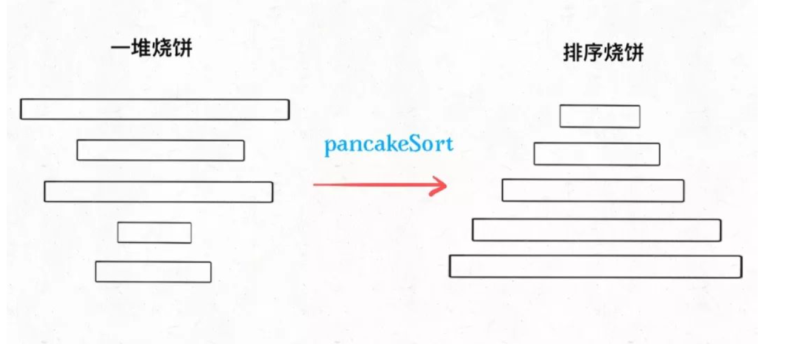

## 递归思想：用锅铲给烧饼排序 （学习链接：https://mp.weixin.qq.com/s?__biz=MzAxODQxMDM0Mw==&mid=2247484611&idx=1&sn=8c3b6c986830f4a801e9e237d9e1554d&scene=21#wechat_redirect）

烧饼排序是个很有意思的实际问题：假设盘子上有n块面积大小不一的烧饼，你如何用一把锅铲进行若干次翻转，让这些烧饼的大小有序（小的在上，大的在下）？

设想一下用锅铲翻转一堆烧饼的情景，其实是有一点限制的，**我们每次只能将最上面的若干块饼子同时翻转**：

我们的问题是，**如何使用算法得到一个翻转序列，使得烧饼堆变得有序？**

首先，这个问题可以抽象成一道算法题，用数组来表示烧饼堆：

