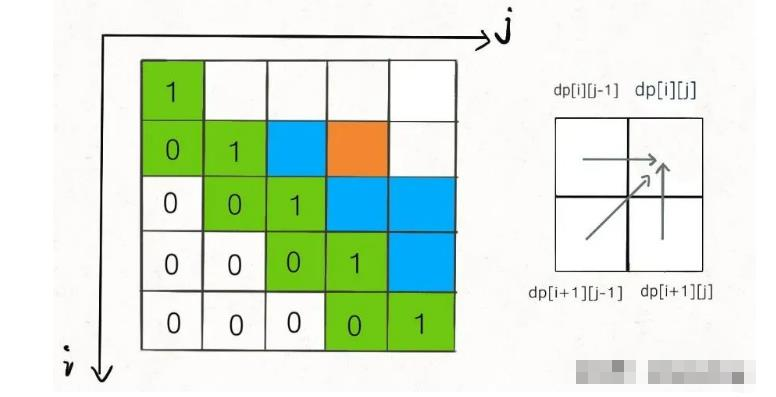
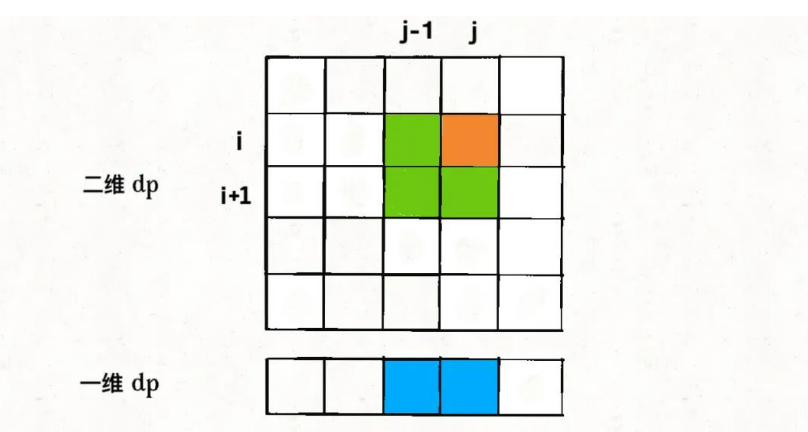
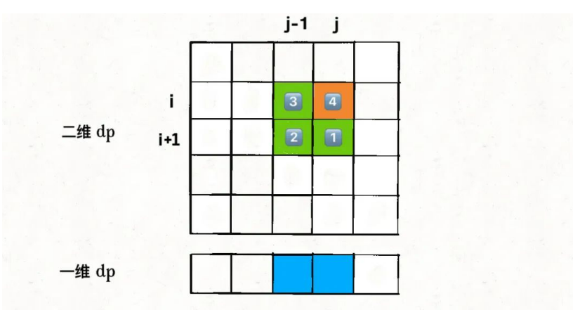
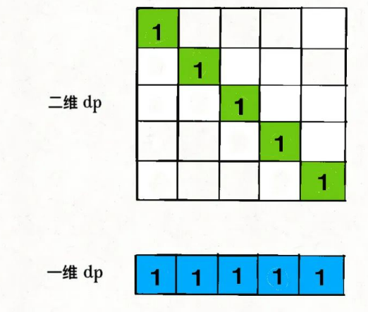

## 状态压缩技巧：动态规划的降维打击

之前写过十几篇动态规划文章，可以说动态规划技巧对于算法效率的提升非常可观，一般来说都能把指数级和阶乘级时间复杂度的算法优化成 O(N^2)，堪称算法界的二向箔，把各路魑魅魍魉统统打成二次元。

但是，动态规划本身也是可以进行阶段性优化的，比如说我们常听说的「状态压缩」技巧，就能够把很多动态规划解法的空间复杂度进一步降低，由 O(N^2) 降低到 O(N)，

能够使用状态压缩技巧的动态规划都是二维dp问题，**你看它的状态转移方程，如果计算状态dp[i][j]需要的都是dp[i][j]相邻的状态，那么就可以使用状态压缩技巧，将二维的dp数组转化成一维，将空间复杂度从 O(N^2) 降低到 O(N)。**

什么叫「和dp[i][j]相邻的状态」呢，比如前文 最长回文子序列(longest-palindrome-subseq(516)) 中，最终的代码如下：

```
int longestPalindromeSubseq(string s) {
  int n = s.size();
  // dp 数组全部初始化为 0
  vector<vector<int>> dp(n, vector<int>(n, 0));
  // base case
  for (int i = 0; i < n; i++)
    dp[i][i] = 1;
  // 反着遍历保证正确的状态转移
  for (int i = n - 2; i >= 0; i--) {
    for (int j = i + 1; j < n; j++) {
      // 状态转移方程
      if (s[i] == s[j])
        dp[i][j] = dp[i + 1][j - 1] + 2;
      else
        dp[i][j] = max(dp[i + 1][j], dp[i][j - 1]);
    }
  }
  // 整个 s 的最长回文子串长度
  return dp[0][n - 1];
}
```

PS：我们本文不探讨如何推状态转移方程，**只探讨对二维 DP 问题进行状态压缩的技巧。技巧都是通用的，所以如果你没看过前文，不明白这段代码的逻辑也无妨，完全不会阻碍你学会状态压缩。**

你看我们对dp[i][j]的更新，其实只依赖于dp[i+1][j-1], dp[i][j-1], dp[i+1][j]这三个状态：



这就叫和dp[i][j]相邻，反正你计算dp[i][j]只需要这三个相邻状态，其实根本不需要那么大一个二维的 dp table 对不对？

**状态压缩的核心思路就是，将二维数组「投影」到一维数组：**



思路很直观，但是也有一个明显的问题，图中dp[i][j-1]和dp[i+1][j-1]这两个状态处在同一列，而一维数组中只能容下一个，那么当我计算dp[i][j]时，他俩必然有一个会被另一个覆盖掉，怎么办？

这就是状态压缩的难点，下面就来分析解决这个问题，还是拿「最长回文子序列」问题举例，它的状态转移方程主要逻辑就是如下这段代码：

```
for (int i = n - 2; i >= 0; i--) {
  for (int j = i + 1; j < n; j++) {
    // 状态转移方程
    if (s[i] == s[j])
      dp[i][j] = dp[i + 1][j - 1] + 2;
    else
      dp[i][j] = max(dp[i + 1][j], dp[i][j - 1]);
  }
}
```

**想把二维dp数组压缩成一维，一般来说是把第一个维度，也就是i这个维度去掉，只剩下j这个维度。压缩后的一维dp数组就是之前二维dp数组的dp[i][..]那一行。**

我们先将上述代码进行改造，直接无脑去掉i这个维度，把dp数组变成一维：

```
for (int i = n - 2; i >= 0; i--) {
  for (int j = i + 1; j < n; j++) {
    // 在这里，一维 dp 数组中的数是什么？
    if (s[i] == s[j])
      dp[j] = dp[j - 1] + 2;
    else
      dp[j] = max(dp[j], dp[j - 1]);
  }
}
```

上述代码的一维dp数组只能表示二维dp数组的一行dp[i][..]，那我怎么才能得到dp[i+1][j-1], dp[i][j-1], dp[i+1][j]这几个必要的的值，进行状态转移呢？

在代码中注释的位置，将要进行状态转移，更新dp[j]，那么我们要来思考两个问题：

1、在对dp[j]赋新值之前，dp[j]对应着二维dp数组中的什么位置？

2、dp[j-1]对应着二维dp数组中的什么位置？

**对于问题 1，在对dp[j]赋新值之前，dp[j]的值就是外层 for 循环上一次迭代算出来的值，也就是对应二维dp数组中dp[i+1][j]的位置。**

**对于问题 2，dp[j-1]的值就是内层 for 循环上一次迭代算出来的值，也就是对应二维dp数组中dp[i][j-1]的位置。**

那么问题已经解决了一大半了，只剩下二维dp数组中的dp[i+1][j-1]这个状态我们不能直接从一维dp数组中得到：

```
for (int i = n - 2; i >= 0; i--) {
  for (int j = i + 1; j < n; j++) {
    if (s[i] == s[j])
      // dp[i][j] = dp[i+1][j-1] + 2;
      dp[j] = ?? + 2;
    else
      // dp[i][j] = max(dp[i+1][j], dp[i][j-1]);
      dp[j] = max(dp[j], dp[j - 1]);
  }
```

因为 for 循环遍历i和j的顺序为从左向右，从下向上，所以可以发现，在更新一维dp数组的时候，dp[i+1][j-1]会被dp[i][j-1]覆盖掉，图中标出了这四个位置被遍历到的次序：



那么如果我们想得到dp[i+1][j-1]，**就必须在它被覆盖之前用一个临时变量temp把它存起来，并把这个变量的值保留到计算dp[i][j]的时候。为了达到这个目的，**结合上图，我们可以这样写代码：

```
for (int i = n - 2; i >= 0; i--) {
  // 存储 dp[i+1][j-1] 的变量
  int pre = 0;
  for (int j = i + 1; j < n; j++) {
    int temp = dp[j];
    if (s[i] == s[j])
      // dp[i][j] = dp[i+1][j-1] + 2;
      dp[j] = pre + 2;
    else
      dp[j] = max(dp[j], dp[j - 1]);
    // 到下一轮循环，pre 就是 dp[i+1][j-1] 了
    pre = temp;
  }
}
```

别小看这段代码，这是一维dp最精妙的地方，会者不难，难者不会。为了清晰起见，我用具体的数值来拆解这个逻辑：

假设现在i = 5, j = 7且s[5] == s[7]，那么现在会进入下面这个逻辑对吧：

```
if (s[5] == s[7])
  // dp[5][7] = dp[i+1][j-1] + 2;
  dp[7] = pre + 2;
```

我问你这个pre变量是什么？是内层 for 循环上一次迭代的temp值。

那我再问你内层 for 循环上一次迭代的temp值是什么？是dp[j-1]也就是dp[6]，但这是外层 for 循环上一次迭代对应的dp[6]，也就是二维dp数组中的dp[i+1][6] = dp[6][6]。

也就是说，pre变量就是dp[i+1][j-1] = dp[6][6]，也就是我们想要的结果。

那么现在我们成功对状态转移方程进行了降维打击，算是最硬的的骨头啃掉了，但注意到我们还有 base case 要处理呀：

```
// 二维 dp 数组全部初始化为 0
vector<vector<int>> dp(n, vector<int>(n, 0));
// base case
for (int i = 0; i < n; i++)
  dp[i][i] = 1;
```

如何把 base case 也打成一维呢？很简单，记住，状态压缩就是投影，我们把 base case 投影到一维看看：



二维dp数组中的 base case 全都落入了一维dp数组，不存在冲突和覆盖，所以说我们直接这样写代码就行了：

```
// 一维 dp 数组全部初始化为 1
vector<int> dp(n, 1);
```

至此，我们把 base case 和状态转移方程都进行了降维，实际上已经写出完整代码了：

```
int longestPalindromeSubseq(string s) {
  int n = s.size();
  // base case：一维 dp 数组全部初始化为 1
  vector<int> dp(n, 1);

  for (int i = n - 2; i >= 0; i--) {
    int pre = 0;
    for (int j = i + 1; j < n; j++) {
      int temp = dp[j];
      // 状态转移方程
      if (s[i] == s[j])
        dp[j] = pre + 2;
      else
        dp[j] = max(dp[j], dp[j - 1]);
      pre = temp;
    }
  }
  return dp[n - 1];
}
```

本文就结束了，不过状态压缩技巧再牛逼，也是基于常规动态规划思路之上的。

你也看到了，使用状态压缩技巧对二维dp数组进行降维打击之后，解法代码的可读性变得非常差了，如果直接看这种解法，任何人都是一脸懵逼的。

算法的优化就是这么一个过程，先写出可读性很好的暴力递归算法，然后尝试运用动态规划技巧优化重叠子问题，最后尝试用状态压缩技巧优化空间复杂度。

**也就是说，你最起码能够熟练运用我们前文 动态规划框架套路详解 的套路找出状态转移方程，写出一个正确的动态规划解法，然后才有可能观察状态转移的情况，分析是否可能使用状态压缩技巧来优化。**


